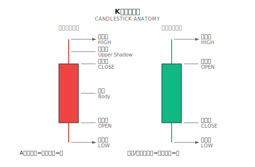

# K线形态与量价分析

> **核心观点**：K线形态和量价关系是传统技术分析的基石，但单独使用时预测能力有限。正确用法是将其作为特征工程的输入，而非直接的交易信号。

---

## 为什么要了解这些？

如果你使用过任何交易软件（TradingView、同花顺、thinkorswim），你一定见过各种 K 线形态的标注和成交量柱状图。很多交易者依赖这些视觉模式做决策。

**作为量化从业者，你需要理解这些概念的原因**：

1. **沟通语言**：和交易员、分析师交流时的共同语言
2. **特征工程**：这些模式可以被量化为 ML 模型的输入特征
3. **策略评估**：理解传统方法的局限性，才能设计更好的系统
4. **市场心理**：K线形态反映了买卖双方的博弈过程

---

## 1. K线基础

### 1.1 K线的构成

一根 K 线包含四个价格信息：



### 1.2 K线的信息含量

| K线部分 | 反映的信息 |
|--------|-----------|
| 实体长度 | 多空力量对比强度 |
| 上影线 | 上方抛压（卖方力量） |
| 下影线 | 下方支撑（买方力量） |
| 实体位置 | 当日多空博弈结果 |

---

## 2. 常见单根 K 线形态

### 2.1 十字星 (Doji)

```
    ┃
   ─┼─  ← 开盘价 ≈ 收盘价
    ┃
```

**特征**：实体极小或没有，上下影线可长可短

| 类型 | 形态 | 含义 |
|-----|------|------|
| 标准十字星 | 上下影线相近 | 多空平衡，犹豫不决 |
| 蜻蜓十字 | 长下影，无上影 | 下方有强支撑 |
| 墓碑十字 | 长上影，无下影 | 上方有强压力 |

**传统解读**：趋势可能反转的信号
**实际效果**：单独使用时预测准确率约 50-55%

### 2.2 锤子线与上吊线 (Hammer / Hanging Man)

```
   ┃
   █  ← 小实体在顶部
   ┃
   ┃ ← 长下影线（至少是实体的2倍）
```

**区别在于出现位置**：
- **锤子线**：出现在下跌趋势底部 → 可能反转向上
- **上吊线**：出现在上涨趋势顶部 → 可能反转向下

### 2.3 射击之星 (Shooting Star)

```
   ┃ ← 长上影线
   ┃
   █  ← 小实体在底部
```

**含义**：出现在上涨趋势顶部，暗示上方压力大，可能见顶

### 2.4 大阳线与大阴线

| 形态 | 特征 | 含义 |
|-----|------|------|
| 大阳线 | 实体长，影线短 | 多方强势控盘 |
| 大阴线 | 实体长，影线短 | 空方强势控盘 |

**量化定义**：实体长度 > 近期 ATR 的 1.5 倍

---

## 3. 常见组合 K 线形态

### 3.1 吞没形态 (Engulfing)

```
看涨吞没（出现在下跌趋势）：    看跌吞没（出现在上涨趋势）：

    █                              ┃
    █  第一根小阴线               ███ 第一根小阳线
   ┏━┓                            ┏━┓
   ┃ ┃ 第二根大阳线               █ █ 第二根大阴线
   ┃ ┃ 完全包住第一根             █ █ 完全包住第一根
   ┗━┛                            ┗━┛
```

**条件**：
1. 第二根 K 线实体完全覆盖第一根
2. 两根 K 线颜色相反
3. 出现在明确的趋势中

### 3.2 早晨之星与黄昏之星 (Morning Star / Evening Star)

```
早晨之星（底部反转）：

█     ← 第一根：大阴线
█
█
  ┼   ← 第二根：小实体（十字星或小K线），跳空低开
 ┏┓
 ┃┃   ← 第三根：大阳线，收盘深入第一根实体
 ┃┃
```

**黄昏之星**：早晨之星的镜像，出现在顶部

### 3.3 三只乌鸦与三白兵

| 形态 | 结构 | 含义 |
|-----|------|------|
| 三只乌鸦 | 连续三根大阴线，依次低开低收 | 强烈看跌 |
| 三白兵 | 连续三根大阳线，依次高开高收 | 强烈看涨 |

---

## 4. 量价分析基础

### 4.1 成交量的含义

成交量 = 买卖双方达成交易的数量

**核心原则**：价格是方向，成交量是动力

| 量价配合 | 含义 | 可靠性 |
|---------|------|--------|
| 价涨量增 | 上涨有资金支撑 | 趋势可能持续 |
| 价涨量缩 | 上涨动能不足 | 趋势可能衰竭 |
| 价跌量增 | 恐慌性抛售 | 可能加速下跌或接近底部 |
| 价跌量缩 | 下跌动能衰减 | 可能企稳 |

### 4.2 关键量价形态

#### 放量突破

```
价格 ─────────┐
              └──────── 突破
成交量       ████████ ← 成交量显著放大（>1.5倍均量）
```

**含义**：突破得到资金确认，可信度高

#### 缩量回调

```
价格    /\
       /  \  ← 回调
      /
成交量 ██  █ ← 回调时成交量萎缩
```

**含义**：回调是正常的获利了结，不是趋势反转

#### 量价背离

```
价格   /\  /\  /\ ← 价格创新高
      /  \/  \/
成交量 ██ █  ▪ ← 成交量递减
```

**含义**：上涨动能衰竭，可能见顶（与 MACD 背离类似）

### 4.3 常用成交量指标

| 指标 | 公式 | 用途 |
|-----|------|------|
| **量比** | 当前成交量 / 过去N日均量 | 判断当日交易活跃度 |
| **换手率** | 成交量 / 流通股本 | 判断筹码换手程度 |
| **OBV** | 累计成交量（上涨日加、下跌日减、平盘不变）| 资金流向 |
| **VWAP** | Σ(价格 × 成交量) / Σ成交量 | 机构交易基准价 |

---

## 5. 形态识别的实证研究

### 5.1 学术研究结论

多项学术研究对 K 线形态的预测能力进行了检验：

| 研究 | 样本 | 结论 |
|-----|------|------|
| Lo, Mamaysky & Wang (2000) | 美股 1962-1996 | 部分形态有统计显著性，但经济显著性有限 |
| Marshall, Young & Rose (2006) | DJIA 成分股 1992-2001 | 大多数形态无显著超额收益 |
| Caginalp & Laurent (1998) | S&P 500 成分股 | 某些形态在特定条件下有效 |

**总结**：
- 单独使用形态，胜率通常在 50-55% 之间
- 扣除交易成本后，大多数形态策略不盈利
- 形态的有效性可能随时间衰减（被市场学习）

### 5.2 为什么形态"看起来有效"？

1. **确认偏误**：人们记住成功案例，忘记失败案例
2. **后视偏差**：事后看图总能找到"完美"的形态
3. **幸存者偏差**：只看到成功的交易者在分享
4. **定义模糊**：什么算"标准"的锤子线？没有精确定义

### 5.3 形态何时可能有效？

研究表明，形态在以下条件下表现更好：

- **结合成交量**：有量配合的形态可靠性更高
- **关键位置**：出现在支撑/阻力位附近
- **市场环境**：在特定的波动率环境下
- **时间框架**：较长时间框架（日线、周线）比分钟线更可靠

---

## 6. 量化实现：形态作为特征

### 6.1 形态量化的挑战

传统形态分析是"模式匹配"，但定义模糊：
- "长下影线"具体多长算长？
- "小实体"多小算小？
- "趋势中"如何定义趋势？

**解决方案**：将形态转化为连续特征，而非离散信号

### 6.2 特征工程示例

```python
def calculate_candlestick_features(df):
    """
    将 K 线形态转化为连续特征
    df 需要包含: open, high, low, close, volume 列
    """
    # 基础计算
    df['body'] = df['close'] - df['open']
    df['body_abs'] = df['body'].abs()
    df['upper_shadow'] = df['high'] - df[['open', 'close']].max(axis=1)
    df['lower_shadow'] = df[['open', 'close']].min(axis=1) - df['low']
    df['range'] = df['high'] - df['low']

    # 特征1：实体占比（0=十字星，1=无影线）
    df['body_ratio'] = df['body_abs'] / df['range'].replace(0, np.nan)

    # 特征2：上影线占比
    df['upper_shadow_ratio'] = df['upper_shadow'] / df['range'].replace(0, np.nan)

    # 特征3：下影线占比
    df['lower_shadow_ratio'] = df['lower_shadow'] / df['range'].replace(0, np.nan)

    # 特征4：K线位置（收盘价在当日范围中的位置）
    df['close_position'] = (df['close'] - df['low']) / df['range'].replace(0, np.nan)

    # 特征5：相对实体大小（与近期ATR比较）
    atr = calculate_atr(df, period=14)
    df['relative_body'] = df['body_abs'] / atr

    # 特征6：吞没程度（当前实体覆盖前一根的比例）
    df['engulfing_ratio'] = df['body_abs'] / df['body_abs'].shift(1)

    return df

def calculate_volume_features(df, periods=[5, 20]):
    """
    计算成交量相关特征
    """
    for p in periods:
        # 量比
        df[f'volume_ratio_{p}'] = df['volume'] / df['volume'].rolling(p).mean()

    # OBV（处理首行 NaN）
    price_change = np.sign(df['close'].diff())
    df['obv'] = (price_change.fillna(0) * df['volume']).cumsum()

    # OBV 趋势（OBV 的移动平均斜率）
    df['obv_slope'] = df['obv'].rolling(10).apply(
        lambda x: np.polyfit(range(len(x)), x, 1)[0]
    )

    # 量价相关性（近期价格变化与成交量的相关性）
    df['price_volume_corr'] = df['close'].pct_change().rolling(20).corr(
        df['volume'].pct_change()
    )

    return df
```

### 6.3 特征使用建议

| 特征类型 | 适合的模型 | 注意事项 |
|---------|-----------|---------|
| 连续形态特征 | 树模型、神经网络 | 需要标准化 |
| 二元形态标签 | 逻辑回归、规则系统 | 定义需要一致 |
| 序列形态 | LSTM、Transformer | 需要时间窗口 |

---

## 7. 多智能体视角

在多智能体系统中，K线形态和量价分析可以这样定位：

| Agent | 使用方式 |
|-------|---------|
| **Trend Agent** | 使用大阳/大阴线判断趋势强度 |
| **Mean Reversion Agent** | 使用十字星、锤子线识别潜在反转点 |
| **Regime Agent** | 量价背离作为市场状态转换的信号之一 |
| **Risk Agent** | 异常放量作为风险预警信号 |

**关键原则**：
- 形态特征是输入之一，不是唯一依据
- 结合其他特征（MACD、RSI、基本面）综合判断
- Agent 输出的是概率，不是确定性信号

---

## 8. 常见误区

### 误区1：形态是"密码"

> "学会看 K 线形态就能稳定盈利"

**真相**：如果形态如此有效，使用它的人越多，有效性就越低（反身性）

### 误区2：形态放之四海皆准

> "锤子线一定是底部信号"

**真相**：相同形态在不同市场环境、不同标的上表现可能完全不同

### 误区3：成交量永远有效

> "放量就是主力进场"

**真相**：成交量可能是散户恐慌、算法交易、指数调仓等多种原因

### 误区4：形态可以精确预测

> "出现黄昏之星，明天一定跌"

**真相**：形态只提供概率优势（如果有的话），不是确定性预测

---

## 本文要点回顾

- [x] K线形态是买卖双方博弈的图形化表达
- [x] 单独使用形态的预测能力有限（50-55% 胜率）
- [x] 量价配合可以提高形态的可靠性
- [x] 正确用法是将形态量化为 ML 特征，而非直接信号
- [x] 在多智能体系统中，形态是多个输入之一

---

## 延伸阅读

- [第04课：技术指标的真实角色](../第04课：技术指标的真实角色.md) - MACD、RSI 等指标详解
- [第09课：监督学习在量化中的应用](../../Part3-机器学习/第09课：监督学习在量化中的应用.md) - 如何将特征输入 ML 模型
- [背景知识：特征工程常见陷阱](../../Part3-机器学习/背景知识/特征工程常见陷阱.md) - 避免特征工程中的错误

---

## 参考文献

- Nison, S. (1991). *Japanese Candlestick Charting Techniques*
- Lo, A., Mamaysky, H., & Wang, J. (2000). Foundations of Technical Analysis. *Journal of Finance*
- Murphy, J. (1999). *Technical Analysis of the Financial Markets*
