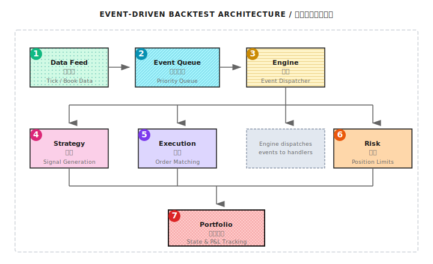
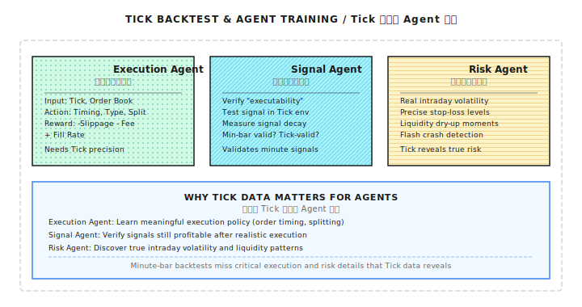

# 背景知识：Tick 级回测框架

> "用日线回测分钟策略，就像用世界地图导航城市街道——精度完全不够。"

---

## 一、为什么需要 Tick 级回测？

### 1.1 不同数据粒度的适用场景

| 数据粒度 | 适用策略 | 精度 | 数据量 |
|---------|---------|------|-------|
| 日线 | 趋势跟踪、价值投资 | 低 | 小 |
| 分钟线 | 日内动量、均值回归 | 中 | 中 |
| Tick/L2 | 做市、高频套利、精确执行 | 高 | 大 |

### 1.2 分钟线回测的局限

```
场景：5 分钟 K 线显示
  Open: $100.00
  High: $100.50
  Low:  $99.80
  Close: $100.20

问题：这 5 分钟内，价格走势是什么样的？

可能性 1: 先涨后跌再涨
  $100.00 → $100.50 → $99.80 → $100.20

可能性 2: 先跌后涨
  $100.00 → $99.80 → $100.50 → $100.20

可能性 3: 剧烈震荡
  多次触及高低点

你的止损在 $99.90 会被触发吗？用 K 线无法确定。
```

### 1.3 Tick 数据能回答的问题

| 问题 | K 线回测 | Tick 回测 |
|-----|---------|----------|
| 限价单能否成交？ | 只能猜测 | 精确判断 |
| 成交的具体时间？ | 不知道 | 毫秒级精度 |
| 排队位置影响？ | 无法模拟 | 可以估算 |
| 价格路径依赖的止损？ | 不准确 | 准确 |
| 滑点的真实分布？ | 固定假设 | 实际计算 |

---

## 二、Tick 数据结构

### 2.1 逐笔成交数据（Trade Tick）

```python
@dataclass
class TradeTick:
    """逐笔成交"""
    timestamp: float      # Unix 时间戳（秒，含小数部分表示毫秒）
    symbol: str           # 标的代码
    price: float          # 成交价
    size: float           # 成交量
    side: str             # 'buy' 或 'sell'（主动方向）
    trade_id: str         # 成交编号
```

**示例数据**：
```
timestamp,symbol,price,size,side,trade_id
1704067200.123,AAPL,185.50,100,buy,T001
1704067200.156,AAPL,185.51,50,buy,T002
1704067200.189,AAPL,185.50,200,sell,T003
1704067200.201,AAPL,185.49,150,sell,T004
```

### 2.2 订单簿快照（Order Book Snapshot）

```python
@dataclass
class OrderBookSnapshot:
    """订单簿快照"""
    timestamp: float
    symbol: str
    bids: List[Tuple[float, float]]  # [(价格, 数量), ...]
    asks: List[Tuple[float, float]]  # [(价格, 数量), ...]

    @property
    def mid_price(self) -> float:
        if self.bids and self.asks:
            return (self.bids[0][0] + self.asks[0][0]) / 2
        return 0.0

    @property
    def spread(self) -> float:
        if self.bids and self.asks:
            return self.asks[0][0] - self.bids[0][0]
        return float('inf')
```

### 2.3 订单簿增量更新（Order Book Delta）

```python
@dataclass
class OrderBookDelta:
    """订单簿增量更新"""
    timestamp: float
    symbol: str
    side: str           # 'bid' 或 'ask'
    price: float
    size: float         # 新数量（0 表示删除该价位）
    action: str         # 'add', 'modify', 'delete'
```

---

## 三、事件驱动 vs 向量化回测

### 3.1 向量化回测（Vectorized）

**特点**：
- 用 NumPy/Pandas 批量计算
- 速度快（秒级完成数年数据）
- 适合简单策略

**局限**：
- 难以模拟订单状态
- 无法处理复杂执行逻辑
- 路径依赖的逻辑难以表达

```python
# 向量化回测示例
import pandas as pd
import numpy as np

def vectorized_backtest(df: pd.DataFrame,
                        signal_col: str,
                        price_col: str = 'close') -> pd.Series:
    """
    简单向量化回测
    signal_col: 1=做多, -1=做空, 0=空仓
    """
    # 信号延迟一期（避免未来信息）
    position = df[signal_col].shift(1).fillna(0)

    # 计算收益
    returns = df[price_col].pct_change()
    strategy_returns = position * returns

    # 累计收益
    cumulative = (1 + strategy_returns).cumprod()

    return cumulative
```

### 3.2 事件驱动回测（Event-Driven）

**特点**：
- 逐事件处理
- 可以精确模拟订单生命周期
- 适合复杂策略和 Tick 数据

**代价**：
- 速度较慢
- 代码复杂度高

```
事件流:
  t=0.001: MarketData(AAPL, bid=185.50, ask=185.51)
  t=0.002: Signal(BUY, size=100)
  t=0.002: OrderSubmit(LIMIT, 185.50, 100)
  t=0.005: MarketData(AAPL, bid=185.49, ask=185.50)
  t=0.010: Trade(185.50, 50)  ← 部分成交
  t=0.015: MarketData(AAPL, bid=185.50, ask=185.51)
  t=0.020: Trade(185.50, 50)  ← 剩余成交
  t=0.020: OrderFilled(全部成交)
```

---

## 四、事件驱动框架实现

### 4.1 核心组件



### 4.2 事件类型定义

```python
from enum import Enum
from dataclasses import dataclass
from typing import Optional, List

class EventType(Enum):
    MARKET_DATA = "market_data"
    SIGNAL = "signal"
    ORDER = "order"
    FILL = "fill"
    CANCEL = "cancel"

@dataclass
class Event:
    """基础事件"""
    timestamp: float
    event_type: EventType

@dataclass
class MarketDataEvent(Event):
    """市场数据事件"""
    symbol: str
    bid: float
    ask: float
    bid_size: float
    ask_size: float
    last_price: Optional[float] = None
    last_size: Optional[float] = None

    def __post_init__(self):
        self.event_type = EventType.MARKET_DATA

@dataclass
class SignalEvent(Event):
    """策略信号事件"""
    symbol: str
    direction: int      # 1=买, -1=卖, 0=平仓
    strength: float     # 信号强度 [0, 1]

    def __post_init__(self):
        self.event_type = EventType.SIGNAL

@dataclass
class OrderEvent(Event):
    """订单事件"""
    symbol: str
    order_type: str     # 'market', 'limit'
    side: str           # 'buy', 'sell'
    quantity: float
    price: Optional[float] = None  # 限价单价格
    order_id: Optional[str] = None

    def __post_init__(self):
        self.event_type = EventType.ORDER

@dataclass
class FillEvent(Event):
    """成交事件"""
    symbol: str
    order_id: str
    side: str
    quantity: float
    price: float
    commission: float

    def __post_init__(self):
        self.event_type = EventType.FILL
```

### 4.3 事件队列

```python
import heapq
from typing import List

class EventQueue:
    """优先级事件队列（按时间排序）"""

    def __init__(self):
        self._queue: List[tuple] = []
        self._counter = 0  # 用于相同时间的事件排序

    def push(self, event: Event):
        """添加事件"""
        heapq.heappush(self._queue,
                       (event.timestamp, self._counter, event))
        self._counter += 1

    def pop(self) -> Optional[Event]:
        """取出最早的事件"""
        if self._queue:
            _, _, event = heapq.heappop(self._queue)
            return event
        return None

    def is_empty(self) -> bool:
        return len(self._queue) == 0

    def peek(self) -> Optional[Event]:
        """查看最早的事件（不移除）"""
        if self._queue:
            return self._queue[0][2]
        return None
```

### 4.4 执行模拟器

```python
class TickExecutionSimulator:
    """Tick 级执行模拟器"""

    def __init__(self,
                 commission_rate: float = 0.0003,
                 latency_ms: float = 1.0):
        self.commission_rate = commission_rate
        self.latency_ms = latency_ms
        self.pending_orders = {}
        self.order_counter = 0

    def submit_order(self, order: OrderEvent,
                     current_book: OrderBookSnapshot) -> List[Event]:
        """
        提交订单，返回产生的事件
        """
        events = []
        self.order_counter += 1
        order.order_id = f"ORD_{self.order_counter:06d}"

        # 模拟延迟
        exec_time = order.timestamp + self.latency_ms / 1000

        if order.order_type == 'market':
            # 市价单立即尝试成交
            fill = self._execute_market_order(order, current_book, exec_time)
            if fill:
                events.append(fill)
        else:
            # 限价单进入挂单队列
            self.pending_orders[order.order_id] = {
                'order': order,
                'remaining': order.quantity,
                'submit_time': order.timestamp
            }

        return events

    def on_market_data(self, md: MarketDataEvent) -> List[Event]:
        """
        市场数据更新时检查挂单
        """
        events = []

        for order_id, pending in list(self.pending_orders.items()):
            order = pending['order']
            remaining = pending['remaining']

            # 检查是否可成交
            fill_qty, fill_price = self._check_limit_fill(
                order, remaining, md
            )

            if fill_qty > 0:
                fill = FillEvent(
                    timestamp=md.timestamp,
                    symbol=order.symbol,
                    order_id=order_id,
                    side=order.side,
                    quantity=fill_qty,
                    price=fill_price,
                    commission=fill_qty * fill_price * self.commission_rate
                )
                events.append(fill)

                pending['remaining'] -= fill_qty
                if pending['remaining'] <= 0:
                    del self.pending_orders[order_id]

        return events

    def _execute_market_order(self, order: OrderEvent,
                              book: OrderBookSnapshot,
                              exec_time: float) -> Optional[FillEvent]:
        """执行市价单"""
        if order.side == 'buy':
            if not book.asks:
                return None
            # 简化：取卖一价
            fill_price = book.asks[0][0]
        else:
            if not book.bids:
                return None
            fill_price = book.bids[0][0]

        return FillEvent(
            timestamp=exec_time,
            symbol=order.symbol,
            order_id=order.order_id,
            side=order.side,
            quantity=order.quantity,
            price=fill_price,
            commission=order.quantity * fill_price * self.commission_rate
        )

    def _check_limit_fill(self, order: OrderEvent,
                          remaining: float,
                          md: MarketDataEvent) -> tuple:
        """检查限价单是否可成交"""
        if order.side == 'buy':
            # 买单：如果卖一价 <= 限价，可成交
            if md.ask <= order.price:
                fill_qty = min(remaining, md.ask_size)
                return fill_qty, md.ask
        else:
            # 卖单：如果买一价 >= 限价，可成交
            if md.bid >= order.price:
                fill_qty = min(remaining, md.bid_size)
                return fill_qty, md.bid

        return 0, 0
```

### 4.5 回测引擎

```python
class TickBacktestEngine:
    """Tick 级回测引擎"""

    def __init__(self, strategy, execution_sim: TickExecutionSimulator):
        self.strategy = strategy
        self.execution = execution_sim
        self.event_queue = EventQueue()
        self.portfolio = Portfolio()
        self.current_book = None

    def load_data(self, data_source):
        """加载 Tick 数据到事件队列"""
        for tick in data_source:
            if isinstance(tick, TradeTick):
                event = self._trade_to_event(tick)
            elif isinstance(tick, OrderBookSnapshot):
                event = self._book_to_event(tick)
            self.event_queue.push(event)

    def run(self) -> dict:
        """运行回测"""
        while not self.event_queue.is_empty():
            event = self.event_queue.pop()
            self._process_event(event)

        return self._calculate_results()

    def _process_event(self, event: Event):
        """处理单个事件"""
        if event.event_type == EventType.MARKET_DATA:
            self._on_market_data(event)
        elif event.event_type == EventType.SIGNAL:
            self._on_signal(event)
        elif event.event_type == EventType.ORDER:
            self._on_order(event)
        elif event.event_type == EventType.FILL:
            self._on_fill(event)

    def _on_market_data(self, md: MarketDataEvent):
        """处理市场数据"""
        # 更新当前订单簿
        self.current_book = md

        # 检查挂单成交
        fills = self.execution.on_market_data(md)
        for fill in fills:
            self.event_queue.push(fill)

        # 策略处理
        signal = self.strategy.on_data(md, self.portfolio)
        if signal:
            self.event_queue.push(signal)

    def _on_signal(self, signal: SignalEvent):
        """处理策略信号"""
        order = self.strategy.signal_to_order(signal, self.portfolio)
        if order:
            self.event_queue.push(order)

    def _on_order(self, order: OrderEvent):
        """处理订单"""
        fills = self.execution.submit_order(order, self.current_book)
        for fill in fills:
            self.event_queue.push(fill)

    def _on_fill(self, fill: FillEvent):
        """处理成交"""
        self.portfolio.update(fill)
        self.strategy.on_fill(fill)

    def _calculate_results(self) -> dict:
        """计算回测结果"""
        return {
            'total_return': self.portfolio.total_return,
            'sharpe_ratio': self.portfolio.sharpe_ratio,
            'max_drawdown': self.portfolio.max_drawdown,
            'total_trades': self.portfolio.trade_count,
            'total_commission': self.portfolio.total_commission,
            'equity_curve': self.portfolio.equity_curve
        }
```

---

## 五、订单排队模拟

### 5.1 为什么排队位置重要？

```
场景：你在 $100.00 挂了限价买单

盘口：
  买一: $100.00 × 10,000 股（你排在第 5,000 位）

成交流：
  卖方市价卖出 3,000 股 → 前 3,000 人成交，你还差 2,000
  卖方市价卖出 1,500 股 → 前 4,500 人成交，你还差 500
  价格跳到 $100.05     → 你的单子永远不会成交了

结论：即使价格"触达"你的限价，你也未必能成交
```

### 5.2 排队位置估算

```python
class QueuePositionEstimator:
    """排队位置估算器"""

    def __init__(self, queue_position_pct: float = 0.5):
        """
        queue_position_pct: 假设你在队列中的相对位置
                           0 = 队首, 1 = 队尾
        """
        self.queue_pct = queue_position_pct

    def estimate_queue_ahead(self,
                             order: OrderEvent,
                             book: OrderBookSnapshot) -> float:
        """估算排在你前面的订单量"""
        if order.side == 'buy':
            # 找到你的价位在买盘的位置
            for price, size in book.bids:
                if price == order.price:
                    return size * self.queue_pct
            # 价格不在当前盘口，可能全部在你前面
            return float('inf')
        else:
            for price, size in book.asks:
                if price == order.price:
                    return size * self.queue_pct
            return float('inf')

    def update_queue_on_trade(self,
                              queue_ahead: float,
                              trade: TradeTick,
                              order: OrderEvent) -> float:
        """根据成交更新排队位置"""
        if order.side == 'buy' and trade.side == 'sell':
            # 卖方主动成交，消耗买盘
            if trade.price == order.price:
                queue_ahead = max(0, queue_ahead - trade.size)
        elif order.side == 'sell' and trade.side == 'buy':
            if trade.price == order.price:
                queue_ahead = max(0, queue_ahead - trade.size)

        return queue_ahead

    def can_fill(self, queue_ahead: float, order_size: float) -> tuple:
        """判断是否可以成交"""
        if queue_ahead <= 0:
            fill_qty = order_size
            return True, fill_qty
        return False, 0
```

### 5.3 完整的限价单模拟

```python
class RealisticLimitOrderSimulator:
    """考虑排队的限价单模拟器"""

    def __init__(self,
                 queue_estimator: QueuePositionEstimator,
                 commission_rate: float = 0.0003):
        self.queue_est = queue_estimator
        self.commission = commission_rate
        self.orders = {}  # order_id -> order state

    def submit_limit_order(self,
                           order: OrderEvent,
                           book: OrderBookSnapshot) -> str:
        """提交限价单"""
        order_id = f"LMT_{len(self.orders):06d}"

        queue_ahead = self.queue_est.estimate_queue_ahead(order, book)

        self.orders[order_id] = {
            'order': order,
            'queue_ahead': queue_ahead,
            'remaining': order.quantity,
            'status': 'pending'
        }

        return order_id

    def on_trade(self, trade: TradeTick) -> List[FillEvent]:
        """处理市场成交，更新排队位置"""
        fills = []

        for order_id, state in list(self.orders.items()):
            if state['status'] != 'pending':
                continue

            order = state['order']

            # 更新排队位置
            state['queue_ahead'] = self.queue_est.update_queue_on_trade(
                state['queue_ahead'],
                trade,
                order
            )

            # 检查是否可以成交
            can_fill, fill_qty = self.queue_est.can_fill(
                state['queue_ahead'],
                state['remaining']
            )

            if can_fill and fill_qty > 0:
                # 实际成交数量取决于对手方
                actual_fill = min(fill_qty, trade.size)

                fill = FillEvent(
                    timestamp=trade.timestamp,
                    symbol=order.symbol,
                    order_id=order_id,
                    side=order.side,
                    quantity=actual_fill,
                    price=order.price,
                    commission=actual_fill * order.price * self.commission
                )
                fills.append(fill)

                state['remaining'] -= actual_fill
                if state['remaining'] <= 0:
                    state['status'] = 'filled'

        return fills
```

---

## 六、性能优化

### 6.1 数据存储格式

| 格式 | 读取速度 | 压缩率 | 随机访问 | 推荐场景 |
|-----|---------|-------|---------|---------|
| CSV | 慢 | 无 | 差 | 小数据、调试 |
| Parquet | 快 | 高 | 好 | 大规模回测 |
| HDF5 | 快 | 中 | 好 | 时序数据 |
| Arrow/Feather | 极快 | 中 | 好 | 内存映射 |

```python
# Parquet 示例
import pandas as pd

# 写入
df.to_parquet('ticks.parquet', compression='snappy')

# 读取（只加载需要的列）
df = pd.read_parquet('ticks.parquet',
                     columns=['timestamp', 'price', 'size'])
```

### 6.2 内存优化

```python
import numpy as np

# 使用更小的数据类型
dtype_mapping = {
    'price': np.float32,      # 4 bytes vs 8 bytes
    'size': np.int32,         # 4 bytes
    'side': np.int8,          # 1 byte (0=sell, 1=buy)
}

# 预分配数组
n_ticks = 1_000_000
prices = np.empty(n_ticks, dtype=np.float32)
sizes = np.empty(n_ticks, dtype=np.int32)
```

### 6.3 并行处理

```python
from concurrent.futures import ProcessPoolExecutor
from typing import List

def backtest_single_day(date: str, strategy_params: dict) -> dict:
    """单日回测"""
    # 加载当日数据
    # 运行回测
    # 返回结果
    pass

def parallel_backtest(dates: List[str],
                      strategy_params: dict,
                      n_workers: int = 4) -> List[dict]:
    """并行回测多日"""
    with ProcessPoolExecutor(max_workers=n_workers) as executor:
        futures = [
            executor.submit(backtest_single_day, date, strategy_params)
            for date in dates
        ]
        results = [f.result() for f in futures]

    return results
```

---

## 七、常见误区

**误区一：Tick 回测一定比分钟回测更准**

不一定。如果：
- 策略本身是分钟级的决策
- 没有正确模拟排队和滑点
- 数据质量有问题

那么 Tick 回测可能引入更多噪音而非更多精度。

**误区二：有了 Tick 数据就能做高频策略**

Tick 数据是必要条件，不是充分条件。还需要：
- 低延迟执行能力
- 正确的手续费/返佣假设
- 考虑你的订单对市场的影响

**误区三：忽略数据清洗**

Tick 数据常见问题：
- 重复记录
- 时间戳错误
- 价格异常（如负数、极端跳跃）
- 交易所维护期间的垃圾数据

```python
def clean_ticks(df: pd.DataFrame) -> pd.DataFrame:
    """清洗 Tick 数据"""
    # 去重
    df = df.drop_duplicates(subset=['timestamp', 'trade_id'])

    # 排序
    df = df.sort_values('timestamp')

    # 过滤异常价格
    median_price = df['price'].median()
    df = df[df['price'].between(median_price * 0.9,
                                 median_price * 1.1)]

    # 过滤异常成交量
    df = df[df['size'] > 0]

    return df
```

---

## 八、多智能体视角

Tick 级回测在多智能体系统中的角色：



---

## 九、实用建议

### 9.1 渐进式采用

```
阶段 1: 验证策略逻辑
  - 使用分钟/小时数据
  - 固定滑点假设
  - 快速迭代

阶段 2: 精细化执行假设
  - 使用 Tick 数据回测关键信号
  - 根号滑点模型
  - 验证策略是否仍然盈利

阶段 3: 完整 Tick 回测
  - 订单簿回放
  - 排队模拟
  - 与实盘数据对比校准
```

### 9.2 关键指标对比

```python
def compare_granularity(minute_result: dict,
                        tick_result: dict) -> dict:
    """对比不同粒度回测结果"""
    return {
        'return_diff': tick_result['return'] - minute_result['return'],
        'sharpe_diff': tick_result['sharpe'] - minute_result['sharpe'],
        'fill_rate': tick_result.get('fill_rate', 1.0),
        'avg_slippage': tick_result.get('avg_slippage', 0),
        'verdict': 'tick_worse' if tick_result['return'] < minute_result['return'] * 0.8 else 'acceptable'
    }
```

---

## 十、总结

| 要点 | 说明 |
|-----|------|
| 适用场景 | 高频策略、精确执行模拟、限价单策略 |
| 核心优势 | 模拟排队、精确滑点、路径依赖逻辑 |
| 实现方式 | 事件驱动架构 |
| 关键挑战 | 数据量大、排队模拟复杂、计算成本高 |
| 渐进采用 | 先分钟验证逻辑，再 Tick 验证执行 |

---

## 延伸阅读

- [背景知识：执行模拟器实现](../../Part5-生产与实战/背景知识/执行模拟器实现.md) - 执行模拟的详细实现
- [背景知识：交易所与订单簿机制](交易所与订单簿机制.md) - 订单簿基础
- [第 7 课：回测系统的陷阱](../第07课：回测系统的陷阱.md) - 回测常见问题
