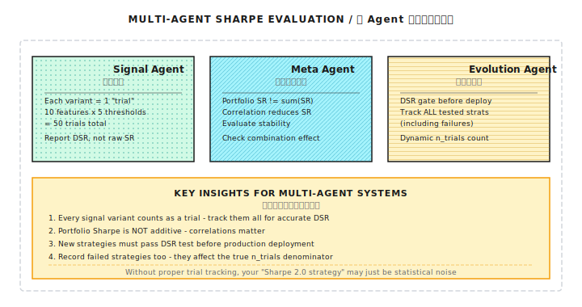

# 背景知识：夏普比率的统计陷阱

> "你的夏普 2.0 策略，可能只是统计噪声。"

---

## 一、夏普比率的估计误差

### 1.1 为什么样本夏普不可靠

夏普比率的定义很简单：

```
SR = (μ - rf) / σ

其中:
  μ  = 平均收益率
  rf = 无风险利率
  σ  = 收益率标准差
```

**问题**：μ 和 σ 都是从有限样本估计的，都有误差。

### 1.2 夏普比率的标准误差

Lo (2002) 推导了夏普比率的近似标准误差：

```
SE(SR) ≈ √[(1 + SR²/2) / N]

其中:
  N = 观测数量（如交易日数）
```

> **重要假设**：此公式假设收益率独立同分布（IID）。如果收益存在自相关（如动量效应），标准误差需要调整。Lo (2002) 论文中也讨论了自相关情况下的修正公式。

**纸上练习**：

| 真实夏普 | 观测天数 N | 标准误差 SE | 95% 置信区间 |
|---------|-----------|------------|-------------|
| 1.0 | 252 (1年) | 0.077 | [0.85, 1.15] |
| 1.0 | 756 (3年) | 0.045 | [0.91, 1.09] |
| 2.0 | 252 (1年) | 0.109 | [1.79, 2.21] |
| 2.0 | 756 (3年) | 0.063 | [1.88, 2.12] |

> **验算**：SE(SR=2, N=252) = √[(1 + 2²/2) / 252] = √[3/252] = 0.109

**关键发现**：
- 1 年数据的夏普估计误差约 ±0.15（95% 置信）
- 即使真实夏普为 0，样本夏普超过 0.06 的概率约 16%（超过 0.12 约 3%）

### 1.3 代码实现

```python
import numpy as np
from scipy import stats

def sharpe_ratio(returns: np.ndarray,
                 rf: float = 0.0,
                 periods_per_year: int = 252) -> float:
    """计算年化夏普比率"""
    excess_returns = returns - rf / periods_per_year
    return np.sqrt(periods_per_year) * excess_returns.mean() / excess_returns.std()


def sharpe_standard_error(sr: float, n: int) -> float:
    """计算夏普比率的标准误差"""
    return np.sqrt((1 + sr**2 / 2) / n)


def sharpe_confidence_interval(sr: float, n: int,
                                confidence: float = 0.95) -> tuple:
    """计算夏普比率的置信区间"""
    se = sharpe_standard_error(sr, n)
    z = stats.norm.ppf((1 + confidence) / 2)
    return (sr - z * se, sr + z * se)


def sharpe_p_value(sr: float, n: int) -> float:
    """
    检验夏普比率是否显著大于 0
    H0: 真实夏普 = 0
    """
    se = sharpe_standard_error(0, n)  # 在 H0 下的标准误差
    z = sr / se
    return 1 - stats.norm.cdf(z)
```

**使用示例**：

```python
# 假设你有 1 年的回测数据，样本夏普 = 1.5
sr = 1.5
n = 252

se = sharpe_standard_error(sr, n)
ci = sharpe_confidence_interval(sr, n)
p = sharpe_p_value(sr, n)

print(f"样本夏普: {sr:.2f}")
print(f"标准误差: {se:.3f}")
print(f"95% 置信区间: [{ci[0]:.2f}, {ci[1]:.2f}]")
print(f"p-value: {p:.4f}")

# 输出:
# 样本夏普: 1.50
# 标准误差: 0.092
# 95% 置信区间: [1.32, 1.68]
# p-value: 0.0000
```

---

## 二、多重检验问题

### 2.1 策略挖掘的诅咒

**场景**：你测试了 100 个策略，选择夏普最高的那个。

```
问题:
  - 每个策略独立，真实夏普都是 0
  - 测试 100 个后，期望最大样本夏普 ≈ 0.19（纯噪声！）

这就是"策略挖掘"的统计陷阱
```

### 2.2 数学原理

如果测试 K 个独立策略，最大夏普的期望值：

```
E[max(SR₁, SR₂, ..., SRₖ)] ≈ SE × √(2 × ln(K))

其中 SE 是单个夏普的标准误差
```

**纸上练习**：

| 测试策略数 K | SE = 0.063 时期望最大夏普 |
|-------------|-------------------------|
| 10 | 0.063 × √(2×ln(10)) = 0.135 |
| 100 | 0.063 × √(2×ln(100)) = 0.191 |
| 1,000 | 0.063 × √(2×ln(1000)) = 0.234 |
| 10,000 | 0.063 × √(2×ln(10000)) = 0.270 |

**结论**：测试越多策略，"最佳策略"的样本夏普越高——即使全是噪声。

---

## 三、Deflated Sharpe Ratio

### 3.1 什么是 Deflated Sharpe

Bailey & Lopez de Prado (2014) 提出的修正方法，考虑：

1. **多重检验**：测试了多少策略
2. **数据长度**：观测样本量
3. **偏度和峰度**：收益分布的非正态性

### 3.2 计算公式

```
DSR = Φ[(SR - SR* × √(1 + (γ₃/6)×SR + ((γ₄-3)/24)×SR²)) /
        √(1/N + (γ₃²/6)/N + ((γ₄-3)²/24)/N)]

其中:
  Φ = 标准正态 CDF
  SR = 样本夏普
  SR* = 基准夏普（考虑多重检验）
  γ₃ = 收益的偏度
  γ₄ = 收益的峰度
  N = 样本数量
```

**SR* 的计算**（期望最大夏普）：

```
SR* = √(2 × ln(K)) × √(1/N) × (1 - γ × √(2 × ln(K)) + ...)

简化版本:
SR* ≈ √(Var[SR]) × [(1-γ)×Z_K + γ×Z_K×exp(-Z_K²/2)]

其中 Z_K = Φ⁻¹(1 - 1/K)
```

### 3.3 完整实现

```python
import numpy as np
from scipy import stats

def deflated_sharpe_ratio(
    returns: np.ndarray,
    n_trials: int,
    rf: float = 0.0,
    periods_per_year: int = 252
) -> dict:
    """
    计算 Deflated Sharpe Ratio

    Parameters:
    -----------
    returns : 收益率序列
    n_trials : 测试的策略/参数组合数量
    rf : 无风险利率
    periods_per_year : 年化因子

    Returns:
    --------
    dict : 包含原始夏普、DSR、p-value 等
    """
    n = len(returns)
    excess = returns - rf / periods_per_year

    # 基本统计量
    mu = excess.mean()
    sigma = excess.std(ddof=1)
    skew = stats.skew(excess)
    kurt = stats.kurtosis(excess)  # 超额峰度

    # 年化夏普
    sr = np.sqrt(periods_per_year) * mu / sigma

    # 期望最大夏普（基于多重检验）
    if n_trials > 1:
        z = stats.norm.ppf(1 - 1 / n_trials)
        euler_gamma = 0.5772156649
        sr_star = np.sqrt(1/n) * (
            (1 - euler_gamma) * z +
            euler_gamma * z * np.exp(-z**2 / 2)
        ) * np.sqrt(periods_per_year)
    else:
        sr_star = 0

    # 夏普比率的标准误差（考虑非正态）
    # 注意：scipy.stats.kurtosis 返回的是超额峰度，所以直接用 kurt 而非 kurt-3
    sr_var = (1 + (skew/6)*sr + (kurt/24)*sr**2) / n
    sr_std = np.sqrt(sr_var) * np.sqrt(periods_per_year)

    # Deflated Sharpe 检验统计量
    if sr_std > 0:
        z_stat = (sr - sr_star) / sr_std
        p_value = 1 - stats.norm.cdf(z_stat)
    else:
        z_stat = np.nan
        p_value = 1.0

    # DSR = 策略夏普显著超过基准的概率
    dsr = 1 - p_value

    return {
        'sharpe_ratio': sr,
        'expected_max_sr': sr_star,
        'deflated_sr': dsr,
        'p_value': p_value,
        'z_statistic': z_stat,
        'n_observations': n,
        'n_trials': n_trials,
        'skewness': skew,
        'kurtosis': kurt,
        'is_significant': p_value < 0.05
    }
```

### 3.4 使用示例

```python
# 模拟策略收益
np.random.seed(42)
daily_returns = np.random.normal(0.0005, 0.01, 252)  # 1 年数据

# 假设测试了 50 个参数组合
result = deflated_sharpe_ratio(daily_returns, n_trials=50)

print(f"原始夏普: {result['sharpe_ratio']:.2f}")
print(f"期望最大夏普 (50 次试验): {result['expected_max_sr']:.2f}")
print(f"Deflated SR: {result['deflated_sr']:.2%}")
print(f"p-value: {result['p_value']:.4f}")
print(f"是否显著: {result['is_significant']}")
```

---

## 四、实践指南

### 4.1 何时应该担心

| 情况 | 风险程度 | 建议 |
|-----|---------|------|
| 样本夏普 < 1.0，测试 < 10 个策略 | 低 | 可能有效，继续验证 |
| 样本夏普 1.0-2.0，测试 10-100 个策略 | 中 | 计算 DSR，警惕过拟合 |
| 样本夏普 > 2.0，测试 > 100 个策略 | 高 | 几乎肯定是过拟合 |
| 样本夏普 > 3.0 | 极高 | 检查数据错误或未来信息泄漏 |

### 4.2 如何报告夏普比率

**错误做法**：
> "我的策略夏普 2.5"

**正确做法**：
> "基于 3 年日线数据（756 个观测），样本夏普 2.5，
> 95% 置信区间 [2.3, 2.7]，在测试 30 个参数组合后，
> Deflated SR = 0.92，p-value = 0.04"

### 4.3 减轻多重检验的方法

```
1. 事先确定测试策略数量
   - 写下要测试的策略列表
   - 不要边测边加

2. 样本外验证
   - 留出 20-30% 数据不参与开发
   - 只用最终策略在这部分数据上测试一次

3. Bonferroni 校正
   - 显著性水平 = 0.05 / K
   - K 个策略要求 p < 0.05/K 才算显著

4. 记录所有测试
   - 即使失败的策略也要记录
   - 用于计算真实的 n_trials
```

---

## 五、常见误区

**误区一：夏普越高越好**

超高夏普（>3）通常意味着：
- 数据错误（重复计算、未来信息）
- 过拟合
- 策略容量太小

**误区二：3 年数据足够准确估计夏普**

3 年数据（756 天）的标准误差约 0.04-0.05，这意味着：
- 真实夏普 1.0 的策略，样本夏普可能在 0.9-1.1 之间波动
- 要区分夏普 1.0 和 1.2 的策略，几乎不可能

**误区三：回测夏普 = 实盘夏普**

回测通常高估：
- 忽略滑点和市场冲击
- 未来信息泄漏（微妙的）
- 幸存者偏差

**经验法则**：实盘夏普 ≈ 回测夏普 × 0.5-0.7

---

## 六、多智能体视角

在多智能体架构中，夏普比率的统计问题需要特别关注：



---

## 七、总结

| 要点 | 说明 |
|-----|------|
| 估计误差 | 1 年数据的夏普标准误差 ≈ 0.07-0.08 |
| 多重检验 | 测试 100 个策略，期望最大夏普 ≈ 0.19（纯噪声） |
| Deflated SR | 考虑多重检验后的显著性检验 |
| 实践建议 | 报告置信区间，计算 DSR，保持怀疑 |

---

## 延伸阅读

- [第 3 课：数学与统计基础](../第03课：数学与统计基础.md) - 统计学基础
- [第 7 课：回测系统的陷阱](../第07课：回测系统的陷阱.md) - 回测中的其他偏差
- Bailey, D. H., & Lopez de Prado, M. (2014). *The Deflated Sharpe Ratio*
- Lo, A. W. (2002). *The Statistics of Sharpe Ratios*
