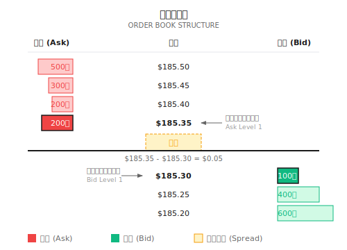

# 背景知识：高频市场微结构

> "在毫秒级别，市场不是随机游走，而是一场买卖双方的博弈。"
> 高频交易（HFT）是量化交易的极端形式。散户无法参与，但理解它能帮助你认清市场的真实运作方式。

---

## 一、什么是市场微结构？

**传统视角**：股价由基本面决定——财报、宏观经济、行业趋势

**微结构视角**：股价由订单流决定——谁在买、谁在卖、用什么价格挂单

```
时间尺度对比：

基本面分析：月 → 年
技术分析：日 → 周
市场微结构：毫秒 → 秒
```

---

## 二、核心概念：订单簿

**订单簿（Order Book）**：当前所有未成交的买卖挂单



### 关键术语

| 术语 | 定义 | 意义 |
|-----|------|------|
| Bid（买一） | 最高买价 | 现在能卖出的最高价 |
| Ask（卖一） | 最低卖价 | 现在能买入的最低价 |
| Spread（价差） | Ask - Bid | 交易的隐性成本 |
| Mid（中间价） | (Bid + Ask) / 2 | 公允价格估计 |
| Depth（深度） | 各价位挂单量 | 市场承接能力 |

### L1/L2/L3 数据层级

**L1 数据**：
- 最优买价（Best Bid）
- 最优卖价（Best Ask）
- 对应数量

**L2 数据**：
```
卖五: $100.10 x 500
卖四: $100.08 x 300
卖三: $100.06 x 200
卖二: $100.04 x 100
卖一: $100.02 x 50    ← Best Ask
---------------------
买一: $100.00 x 80    ← Best Bid
买二: $99.98  x 150
买三: $99.96  x 400
买四: $99.94  x 600
买五: $99.92  x 1000
```

**L3 数据**：每个价位的每一笔订单（订单 ID、时间戳）

---

## 三、订单类型

### 市价单（Market Order）

```
指令："立即买入 100 股，不管什么价格"

执行：
  - 按当前卖一价 $185.35 成交
  - 如果卖一只有 50 股，剩余 50 股按卖二 $185.40 成交

优点：确保成交
缺点：可能滑点（价格不利）
```

### 限价单（Limit Order）

```
指令："以 $185.30 或更低价格买入 100 股"

执行：
  - 如果当前有 ≤$185.30 的卖单 → 立即成交
  - 否则 → 挂入订单簿等待

优点：控制价格
缺点：可能不成交
```

### 其他订单类型

| 类型 | 作用 | 场景 |
|-----|------|------|
| Stop（止损单） | 价格触发后变市价单 | 风控 |
| Stop-Limit | 价格触发后变限价单 | 更精细止损 |
| IOC（立即或取消） | 能成交多少成交多少 | 紧急执行 |
| FOK（全部或取消） | 全部成交或全不成交 | 避免部分成交 |
| Iceberg（冰山单） | 只显示部分挂单量 | 隐藏大单意图 |

---

## 四、买卖价差与流动性

### 价差来源

| 成分 | 解释 | 占比 |
|-----|------|------|
| 存货成本 | 做市商持有库存的风险补偿 | 20-30% |
| 逆向选择 | 防范知情交易者的损失 | 40-50% |
| 订单处理成本 | 交易系统和人力成本 | 10-20% |

**逆向选择**是关键：做市商担心与知情交易者交易时亏损

```
场景：
  某人知道苹果即将发布利好，悄悄大量买入
  做市商不知情，以低价卖给他
  消息公布后，做市商亏损

应对：
  做市商通过扩大价差来弥补这种预期亏损
```

### 价差与流动性

```
流动性好：
  - 价差小（$0.01）
  - 挂单量大
  - 大单不影响价格
  - 代表：AAPL、MSFT、SPY

流动性差：
  - 价差大（$0.10+）
  - 挂单量小
  - 大单显著影响价格
  - 代表：小盘股、冷门 ETF
```

---

## 五、市场影响（Market Impact）

**定义**：你的交易对价格的影响

```
你想买入 10,000 股 AAPL
当前订单簿：
  卖一：$185.35 × 200 股
  卖二：$185.40 × 300 股
  卖三：$185.45 × 500 股
  ...

如果一次性买入：
  成交 200 @ $185.35
  成交 300 @ $185.40
  成交 500 @ $185.45
  ...

平均成交价可能是 $185.60
比中间价高 $0.25 → 市场影响成本
```

### 影响因素

| 因素 | 影响 | 原因 |
|-----|------|------|
| 订单大小 | 越大影响越大 | 消耗更多深度 |
| 市场流动性 | 流动性差影响更大 | 挂单薄 |
| 执行速度 | 越快影响越大 | 无法隐藏意图 |
| 信息含量 | 知情交易影响更持久 | 价格发现 |

### 市场影响模型

```
简化的平方根法则：

市场影响 ≈ σ × √(Q / V)

其中：
  σ = 日波动率
  Q = 交易数量
  V = 日均成交量

示例：
  波动率 = 2%
  交易量 = 日均成交量的 1%

  影响 ≈ 2% × √0.01 = 0.2%
```

---

## 六、做市商的角色

**做市商**：同时挂买单和卖单，赚取价差

```
做市商策略：
  挂买单 @ $185.30
  挂卖单 @ $185.35

  如果两边都成交：
    卖出价 - 买入价 = $0.05 利润

  风险：
    只有一边成交 → 暴露库存风险
    方向性行情 → 亏损
```

### 做市商 vs 方向性交易者

| 维度 | 做市商 | 方向性交易者 |
|-----|-------|------------|
| 目标 | 赚价差 | 赚价格变动 |
| 持仓时间 | 极短（秒/分钟） | 较长（小时/天） |
| 风险敞口 | 尽量中性 | 有方向敞口 |
| 盈利来源 | 价差 − 逆向选择 − 库存成本 | 预测准确性 |

---

## 七、价格发现过程

**价格发现**：市场如何把信息反映到价格中

```
信息发布 → 知情交易者下单 → 订单流变化 → 价格调整

时间线示例：
  T+0ms：利好消息发布
  T+1ms：高速交易者检测到消息
  T+5ms：大量买单涌入
  T+10ms：卖一被吃掉，价格上涨
  T+100ms：价格基本反映新信息
  T+1000ms：普通投资者看到价格变化
```

### 订单流毒性

**毒性订单流**：知情交易者主导的订单流

```
指标：VPIN（Volume-Synchronized Probability of Informed Trading）

高 VPIN → 知情交易者活跃 → 做市商风险大
低 VPIN → 噪音交易者主导 → 做市商安全

应用：
  - 做市商根据 VPIN 调整价差
  - 预警市场压力（高 VPIN 可能预示暴跌）
```

---

## 八、订单流与 Kyle's Lambda

### 8.1 订单流失衡（Order Flow Imbalance）

**定义**：单位时间内买单与卖单的净差额

```
OFI = 买方发起的成交量 - 卖方发起的成交量

OFI > 0: 买压占优，价格倾向上涨
OFI < 0: 卖压占优，价格倾向下跌
```

**如何判断成交方向？**

使用 Lee-Ready 算法：
```
如果成交价 > 中间价: 买方发起（Taker 是买方）
如果成交价 < 中间价: 卖方发起（Taker 是卖方）
如果成交价 = 中间价: 用上一笔的方向
```

**直觉解释**：

> 想象订单簿是一条街道。买一到卖一之间是"无人区"（价差）。
> 如果有人愿意"跨过无人区"去买卖一的货，说明他很急迫——通常是知情交易者。
> 他的方向往往代表真实的价格压力。

### 8.2 Kyle's Lambda（λ）

**来源**：Albert Kyle 1985 年的经典论文

**核心思想**：价格对订单流的敏感度

```
ΔP = λ × OrderFlow

其中：
  ΔP = 价格变化
  λ  = 价格冲击系数（Kyle's Lambda）
  OrderFlow = 签名订单流（买 - 卖）
```

**λ 的含义**：

| λ 值 | 市场状态 | 交易者应对 |
|-----|---------|----------|
| λ 小 | 流动性好，大单冲击小 | 可以下大单 |
| λ 大 | 流动性差，大单冲击大 | 应拆小单执行 |

### 8.3 λ 的估算方法

**方法一：线性回归**

```
收集一段时间的数据:
  - 每 5 分钟的价格变化 ΔP
  - 每 5 分钟的净订单流 OFI

回归: ΔP = α + λ × OFI + ε

λ 就是回归系数
```

**纸上练习**：

假设收集了以下数据：

| 时段 | OFI（百万$） | ΔP（%） |
|-----|-------------|--------|
| 09:30-09:35 | +2.0 | +0.10% |
| 09:35-09:40 | -1.5 | -0.08% |
| 09:40-09:45 | +3.0 | +0.14% |
| 09:45-09:50 | -0.5 | -0.02% |
| 09:50-09:55 | +1.0 | +0.06% |

简单估算：λ ≈ 0.05% / $1M = **5 bps per million**

解读：每 $100 万的净买入，推动价格上涨约 5 个基点。

**方法二：从订单簿深度估算**

```
λ ≈ Spread / (2 × Depth)

其中:
  Spread = 买卖价差
  Depth  = 盘口深度（如买一 + 卖一的总量）
```

**示例**：
```
Spread = $0.02
买一 = 5000 股 × $100 = $500,000
卖一 = 5000 股 × $100 = $500,000
Depth = $1,000,000

λ ≈ $0.02 / (2 × $1,000,000)
  ≈ 0.00001 per dollar
  ≈ 1 bp per $100,000
```

### 8.4 λ 的应用

**应用一：执行成本预估**

```
预期执行 $500,000 的买单
λ = 1 bp / $100,000

预期冲击 = λ × OrderSize
         = 1 bp × 5
         = 5 bps = 0.05%

如果股价 $100，预期成交价 ≈ $100.05
```

**应用二：最优执行策略**

```
大单拆分原则:

单笔订单大小 < Depth × (可接受冲击 / λ)

示例：
  - 可接受冲击: 10 bps
  - λ = 2 bps / $100,000
  - 单笔上限 = 10 / 2 × $100,000 = $500,000
```

**应用三：流动性监控**

```python
def calculate_lambda(price_changes: list,
                     order_flows: list) -> float:
    """
    用线性回归估算 Kyle's Lambda
    """
    import numpy as np
    from scipy import stats

    # 过滤异常值
    valid = [(dp, of) for dp, of in zip(price_changes, order_flows)
             if abs(of) > 0]

    if len(valid) < 10:
        return float('nan')

    dp = np.array([v[0] for v in valid])
    of = np.array([v[1] for v in valid])

    slope, intercept, r_value, p_value, std_err = stats.linregress(of, dp)

    return slope  # 这就是 λ


def monitor_liquidity(historical_lambda: float,
                      current_lambda: float,
                      threshold: float = 2.0) -> dict:
    """
    监控流动性变化
    """
    ratio = current_lambda / historical_lambda

    return {
        'lambda_ratio': ratio,
        'liquidity_warning': ratio > threshold,
        'suggested_action': 'reduce_order_size' if ratio > threshold else 'normal'
    }
```

### 8.5 λ 与市场状态

| 市场事件 | λ 变化 | 原因 |
|---------|-------|------|
| 财报发布前 | ↑ 上升 | 做市商撤单，深度下降 |
| 高波动期 | ↑ 上升 | 不确定性增加 |
| 开盘/收盘 | ↑ 上升 | 流动性集中 |
| 平稳交易日 | ↓ 下降 | 做市商报价激进 |
| 指数成分调整 | ↑↑ 显著上升 | 被动基金大单涌入 |

### 8.6 常见误区

**误区一：λ 是常数**

λ 会随时间变化：
- 日内变化：开盘高，盘中低，收盘高
- 事件驱动：新闻发布时飙升
- 季节性：财报季整体偏高

**误区二：只看 λ 忽略 Spread**

完整的交易成本 = Spread + λ × OrderSize

小单主要受 Spread 影响，大单主要受 λ 影响。

**误区三：用日频数据估算 λ**

λ 是微观结构概念，应用 Tick 或分钟数据估算。日频数据会丢失日内信息。

---

## 九、高频交易策略

### HFT vs 普通量化

| 维度 | HFT | 普通量化 |
|-----|-----|---------|
| 持仓时间 | 毫秒-秒 | 分钟-天-周 |
| 延迟要求 | 微秒级 | 秒级可接受 |
| 资金门槛 | $10M+ | $10K+ |
| 技术门槛 | 极高（FPGA、微波） | 中等（Python） |
| 竞争对手 | 顶级机构 | 市场全体参与者 |
| 信息优势 | 速度优势 | 分析优势 |

### 核心策略类型

| 策略类型 | 描述 | 盈利来源 |
|---------|------|---------|
| 做市 | 双向挂单赚价差 | 价差收益 − 逆向选择 − 库存风险 |
| 统计套利* | 利用价格偏离均值回归 | 价格失调修正 |
| 新闻交易 | 快速解读新闻（毫秒至分钟级） | 信息优势 |
| 延迟套利 | 利用交易所间延迟 | 速度优势 |
| 结构套利 | 利用市场结构机制（返佣、集合竞价、ETF申赎等） | 系统理解 |

> **\* 关于统计套利**：统计套利并非高频专属策略。按持仓周期可分为：
> - **高频统计套利**（毫秒～秒）：跨交易所微结构信号
> - **日内统计套利**（分钟～小时）：配对交易、ETF-成分股套利
> - **中低频统计套利**（天～周）：多因子、行业中性策略
>
> 是否需要高频取决于：**信号衰减速度 vs 交易成本**。信号衰减快才"被迫"高频。

**延迟套利示例**：

```
NYSE 价格：$185.35
BATS 价格：$185.30（延迟更新）

策略：
  在 BATS 买入 @ $185.30
  在 NYSE 卖出 @ $185.35
  理论价差 $0.05

⚠️ 现实风险：
  - 腿风险：可能只成交一边
  - 排队风险：挂到的价未必轮到成交
  - 逆向选择：价格瞬间反向变化
  - 费用/滑点：可能吃掉利润

前提：速度比其他人快，且利润需覆盖费用与滑点
```

---

## 十、高频交易基础设施

### 延迟层级

| 级别 | 延迟 | 技术 | 成本 |
|-----|------|-----|------|
| 秒级 | 1000+ ms | 云服务器 + Python | $ |
| 毫秒级 | 1-100 ms | 专用服务器 + C++ | $$ |
| 微秒级 | 1-1000 μs | Co-location + C++ | $$$ |
| 纳秒级 | < 1000 ns | FPGA + 微波 | $$$$ |

### Co-location

**机房托管**：将服务器放在交易所机房内

- 物理距离：几米 vs 几千公里
- 延迟差异：微秒 vs 毫秒
- 成本：$10,000-$100,000/月

### 网络优化

**传统光纤** vs **微波通信**：

```
芝加哥 → 纽约
光纤: ~14.5 ms
微波: ~8.5 ms（光速的 99%）

6ms 差距 = 巨大优势
```

**激光通信**：与微波各有权衡——激光带宽更高但受雾/雨影响大，微波更耐候但带宽较低。两者都用于不同场景。

### 硬件加速

**FPGA（现场可编程门阵列）**：
- 直接用硬件电路处理交易逻辑
- 延迟：纳秒级
- 开发成本：$1M+
- 维护团队：硬件工程师 + 量化交易员

**GPU**：
- 并行计算大量策略
- 机器学习模型推理
- 延迟：微秒级

---

## 十一、交易成本分解

一笔交易的总成本（2024-2025）：

```
总成本 = 显性成本 + 隐性成本

显性成本：
  - 佣金：零（零售券商，2019年后）
        或 ~$0.003-0.005/股（机构投资者）
  - 交易所费用（$0.003/股，make/take 费率因交易所而异）
  - SEC 费（~$27.80/百万美元卖出）

隐性成本：
  - 买卖价差（$0.01-0.02/股）
  - 市场影响（$0.02-0.10/股，视订单大小）
  - 时机成本（决策到执行的价格变化）
  - PFOF 执行质量损失（零佣金的代价）

示例（零售）：
  买入 1,000 股 @ $230
  佣金：$0（但有 PFOF）
  价差成本：$10-20
  影响成本：$20-50

  总成本：$30-70 ≈ 0.02-0.03%
```

> **零佣金模式注意**：券商通过 PFOF（订单流支付）将订单卖给做市商，可能导致执行价格略差于 NBBO。

---

## 十二、为什么散户无法做 HFT

### 速度差距

```
你: 100ms 延迟（很快了）
HFT: 0.01ms 延迟

当你的订单到达时，市场已经变化了 10000 次
```

### 成本差距

| 项目 | HFT 机构 | 散户 |
|-----|---------|------|
| Co-location | $50K/月 | 无法获得 |
| 数据费用 | $100K/年 | 免费延迟数据 |
| 技术团队 | $5M/年 | 自己 |
| 资金规模 | $100M+ | $10K |

### 信息差距

- L3 数据：机构独有
- 暗池数据：机构独有
- 订单流数据：做市商独有

### 实际影响

**HFT 对散户的影响**：
- 正面：提供流动性，缩小价差
- 负面：被"收税"（价格略微不利）

**应对策略**：
- 使用限价单而非市价单
- 避免在开盘/收盘高波动时段交易
- 不做日内超短线

---

## 十三、HFT 的历史与争议

### 关键事件

| 年份 | 事件 |
|-----|------|
| 2005 | Reg NMS 实施，碎片化交易开始 |
| 2010 | 闪电崩盘（Flash Crash），道指 5 分钟跌 1000 点 |
| 2012 | Knight Capital 45 分钟亏损 $4.6 亿 |
| 2014 | 《Flash Boys》出版，HFT 争议白热化 |
| 2015 | Citadel 成为最大做市商 |

### 监管与争议

**支持者观点**：
- 提供流动性
- 缩小买卖价差
- 提高市场效率

**批评者观点**：
- 系统性风险
- 对普通投资者不公平
- 闪电崩盘风险

**监管趋势**：
- 熔断机制
- 最小报价单位
- 订单取消费

---

## 十四、多智能体视角

市场微结构知识在多智能体架构中的应用：

```
Execution Agent（执行智能体）
  │
  ├─ 监控订单簿深度
  ├─ 评估市场影响成本
  ├─ 决定执行策略：
  │    - 大单 → 分批执行
  │    - 小单 → 立即执行
  │    - 紧急 → 接受滑点
  │
  ↓
Risk Agent
  │
  ├─ 监控 VPIN 等毒性指标
  ├─ 高毒性时暂停交易
  └─ 流动性枯竭时发出预警

Market State Agent（市场状态）
  │
  ├─ 追踪价差变化
  ├─ 识别流动性 Regime
  └─ 调整策略参数
```

---

## 十五、常见误区

**误区一：成交价就是真实成本**

不完整。真实成本包括：
- 你把价格推高的部分（影响成本）
- 你挂单等待时价格变化的部分（时机成本）

**误区二：流动性总是可用的**

危机时流动性消失：
- 做市商撤单
- 价差急剧扩大
- 订单无法成交

2010 年闪崩时，部分股票价差扩大到几美元。

**误区三：高频交易都是操纵**

大部分高频策略是提供流动性：
- 做市商缩小价差
- 套利者消除价格偏离
- 增加市场效率

当然也存在掠夺性策略，但不是全部。

---

## 十六、实用建议

### 对低频交易者

```
1. 避免市价单大额交易
   - 分批执行
   - 使用限价单

2. 避开高波动时段
   - 开盘和收盘半小时价差大
   - 重大新闻发布时流动性差

3. 关注流动性
   - 单笔交易量 < 日均成交量的 1%
   - 否则市场影响成本过高
```

### 对策略开发者

```
1. 在回测中加入真实成本
   - 不只是佣金
   - 包括价差和影响

2. 监控成交量
   - 策略容量 = 日均成交量的 1-5%
   - 超过后收益显著下降

3. 使用滑点模型
   - 简单：固定百分比滑点
   - 进阶：基于订单簿模拟
```

---

## 十七、延伸阅读

### 书籍
- *Flash Boys* - Michael Lewis（通俗读物）
- *Trading and Exchanges* - Larry Harris（市场微结构经典）
- *Algorithmic and High-Frequency Trading* - Cartea, Jaimungal, Penalva（学术专著）

### 数据源
- Lobster（学术订单簿数据）
- TAQ（NYSE 交易和报价数据）
- 各交易所 L2/L3 数据订阅

---

## 总结

| 要点 | 说明 |
|-----|------|
| 核心概念 | 订单簿、买卖价差、市场深度 |
| 关键成本 | 价差 + 市场影响 + 时机成本 |
| 做市商角色 | 提供流动性，赚取价差 |
| 价格发现 | 订单流反映信息 |
| Kyle's Lambda | 衡量价格对订单流的敏感度 |
| HFT 特点 | 速度竞争、高资本门槛、散户无法参与 |
| 多智能体应用 | Execution Agent 优化执行 |

> **核心认知**：HFT 是技术和资本的极限竞赛。散户的正确策略不是试图加入这场竞赛，而是选择 HFT 无法竞争的时间尺度——用耐心和分析能力取胜。
