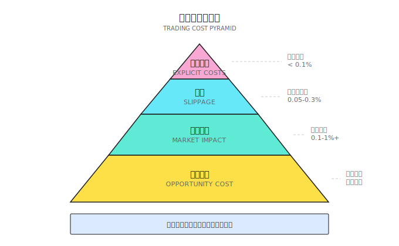
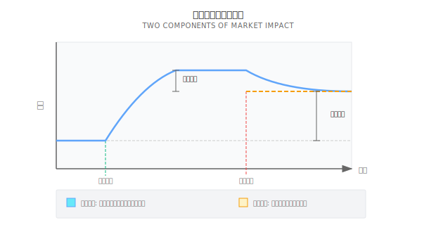
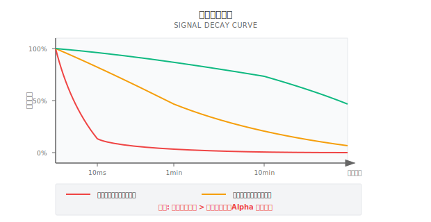
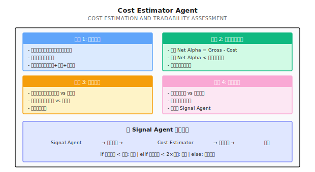

# 第 18 课：交易成本建模与可交易性

> **Alpha 是否存在 = (Gross Alpha − Cost) > 0**

---

## 一个典型场景（示意）

> 注：以下为合成示例，用于说明常见现象；数字为示意，不对应任何具体团队/账户。

2019 年，一个量化团队向我展示了他们的机器学习策略：

```
回测结果（2015-2019）:
- 年化收益: 45%
- 夏普比率: 2.3
- 最大回撤: 8%
- 月胜率: 78%
```

"这是我们见过最好的策略！"他们兴奋地说。

我问了一个问题："你们的日均换手率是多少？"

答案：**300%**。

这意味着每天要买卖相当于 3 倍本金的股票。

我让他们重新计算，加入以下现实成本：
- 交易佣金：0.03%（双边）
- 市场冲击：0.1%（保守估计）
- 滑点：0.05%

```
成本计算:
- 每日成本 = 300% × (0.03% + 0.1% + 0.05%) = 0.54%
- 年化成本 = 0.54% × 252 = 136%

调整后回测:
- 毛收益: 45%
- 成本: -136%
- 净收益: -91%
```

他们的"印钞机"变成了"碎钞机"。

**这就是为什么交易成本建模如此重要**——它决定了你的 Alpha 是真的还是幻觉。

---

## 18.1 成本的真实构成

### 18.1.1 显性成本 vs 隐性成本



### 18.1.2 显性成本详解

| 成本类型 | 美股 | A股 | 加密货币 |
|---------|------|-----|---------|
| **佣金** | 0-0.005% | 0.03% | 0.02-0.1% |
| **印花税** | 无 | 0.1%（卖出） | 无 |
| **交易所费用** | 0.001% | 含在佣金 | 含在佣金 |
| **SEC 费用** | 0.00008% | 无 | 无 |
| **过户费** | 无 | 0.001% | 无 |

**美股显性成本示例**：
```
买入 $100,000 的 AAPL:
- 佣金: $0-5（取决于券商）
- 交易所费用: ~$1
- 总计: ~$5 = 0.005%

卖出时相同，双边约 0.01%
```

### 18.1.3 隐性成本：看不见的杀手

#### 滑点 (Slippage)

**定义**：你期望的成交价与实际成交价的差异

```
期望以 $100.00 买入 AAPL
实际成交价 $100.05
滑点 = $0.05 = 0.05%
```

**滑点来源**：

| 来源 | 解释 | 影响因素 |
|-----|------|---------|
| **买卖价差** | Bid-Ask Spread | 流动性、波动率 |
| **价格移动** | 下单到成交的时间差 | 市场波动、网络延迟 |
| **部分成交** | 订单被拆分成交 | 订单大小、盘口深度 |

#### 市场冲击 (Market Impact)

**定义**：你的交易本身推动价格向不利方向移动

```
场景: 你要买入 10,000 股 AAPL

盘口:
  卖一: $100.00 × 2,000 股
  卖二: $100.02 × 3,000 股
  卖三: $100.05 × 5,000 股

如果用市价单一次买入:
  前 2,000 股: $100.00
  接下来 3,000 股: $100.02
  最后 5,000 股: $100.05

加权平均价: $100.029
理想价格: $100.00
市场冲击: 0.029%

而且: 你把买二、买三的单子都吃掉了
      下一个买家只能以更高价格买入
      这就是"永久冲击"
```

#### 机会成本

**定义**：因为无法成交或延迟成交而损失的潜在收益

```
场景:
  信号发出时价格: $100
  你下限价单: $99.50
  价格直接涨到 $105
  你的单子永远不会成交

机会成本 = $105 - $100 = 5%
```

---

## 18.2 滑点建模

### 18.2.1 线性模型

最简单的模型假设滑点与订单大小成正比：

```
Slippage = k × OrderSize / ADV

其中:
- k = 经验系数（通常 0.1-0.5）
- OrderSize = 订单金额
- ADV = 日均成交量（Average Daily Volume）
```

**纸上练习**：

你要买入 $500,000 的股票，假设 k = 0.3

| 股票 | ADV | 订单占比 | 预期滑点 |
|-----|-----|---------|---------|
| AAPL | $10B | 0.005% | 0.3 × 0.005% = 0.0015% |
| TSLA | $3B | 0.017% | 0.3 × 0.017% = 0.005% |
| 小盘股 X | $10M | 5% | 0.3 × 5% = **1.5%** |

**发现**：在小盘股上，$50 万的订单可能产生 $7,500 的滑点！

### 18.2.2 根号模型（Square-Root Model）

更精确的模型考虑非线性关系：

```
Slippage = k × σ × √(OrderSize / ADV)

其中:
- σ = 日波动率
- k = 经验系数（通常 0.5-1.5）
```

**纸上练习**：

| 股票 | 波动率 σ | ADV | 订单 | 滑点（k=1） |
|-----|---------|-----|------|-----------|
| AAPL | 1.5% | $10B | $1M | 1.5% × √(1M/10B) = 0.015% |
| AAPL | 1.5% | $10B | $100M | 1.5% × √(100M/10B) = 0.15% |
| 小盘股 | 3% | $10M | $1M | 3% × √(1M/10M) = 0.95% |

**关键发现**：
- 滑点随订单大小次线性增长（根号关系）
- 波动率高的股票滑点更大
- 小盘股的滑点可能是大盘股的 60 倍

### 18.2.3 用 Tick 数据估算滑点

如果有 Level-2 数据，可以更精确地估算：

```
方法: 模拟订单穿透盘口

1. 获取历史盘口快照
2. 模拟市价单逐档成交
3. 计算加权平均价 vs 中间价
4. 统计不同订单大小的滑点分布
```

<details>
<summary>💻 代码框架（工程师参考）</summary>

```python
def estimate_slippage(order_size: float,
                     order_book: dict,
                     side: str = 'buy') -> float:
    """
    基于盘口数据估算滑点

    order_book = {
        'bids': [(price1, size1), (price2, size2), ...],
        'asks': [(price1, size1), (price2, size2), ...]
    }
    """
    if side == 'buy':
        levels = order_book['asks']  # 买入吃 ask
    else:
        levels = order_book['bids']  # 卖出吃 bid

    mid_price = (order_book['bids'][0][0] + order_book['asks'][0][0]) / 2
    filled = 0
    cost = 0

    for price, size in levels:
        if filled >= order_size:
            break
        fill_amount = min(size, order_size - filled)
        cost += fill_amount * price
        filled += fill_amount

    if filled < order_size:
        # 盘口深度不够，无法完全成交
        return float('inf')

    avg_price = cost / order_size
    slippage = (avg_price - mid_price) / mid_price

    return slippage if side == 'buy' else -slippage
```

</details>

---

## 18.3 市场冲击建模

### 18.3.1 临时冲击 vs 永久冲击



### 18.3.2 Almgren-Chriss 模型

这是最著名的市场冲击模型：

```
总成本 = 临时冲击 + 永久冲击 + 波动风险

其中:
  临时冲击 ∝ 交易速度（单位时间交易量）
  永久冲击 ∝ 总交易量
  波动风险 ∝ 执行时间 × 波动率

权衡:
  交易快 → 临时冲击大，但波动风险小
  交易慢 → 临时冲击小，但波动风险大
```

**直觉解释**：

> 想象你要把一桶水倒进池塘。
> 倒得快（一次倒完）→ 水花大（临时冲击），但水面很快平静
> 倒得慢（一滴一滴）→ 水花小，但期间可能刮风下雨（波动风险）

### 18.3.3 纸上练习：执行策略选择

你要买入 $10M 的 AAPL（ADV = $10B），波动率 = 1.5%/天

| 执行策略 | 执行时间 | 临时冲击 | 波动风险 | 总成本 |
|---------|---------|---------|---------|--------|
| 一次市价单 | 瞬间 | 高 | 无 | 高 |
| 分 10 笔（1天） | 1 天 | 低 | 1.5% | 中 |
| 分 50 笔（5天） | 5 天 | 极低 | 3.4% | 可能更高 |

**最优解**：根据紧急程度和风险偏好权衡

---

## 18.4 可交易性评估

### 18.4.1 成交概率建模

**限价单的问题**：你挂的单不一定能成交

```
成交概率 P(fill) 取决于:
1. 限价 vs 当前价的距离
2. 盘口排队深度
3. 价格波动幅度
4. 等待时间

估算公式（简化）:
P(fill) ≈ 1 - exp(-λ × 时间)

其中 λ 与价格距离、波动率相关
```

**纸上练习**：

你在 $100 的股票上挂 $99 的限价买单（低于市价 1%）

| 场景 | 日波动率 | 预期成交概率 |
|-----|---------|------------|
| 低波动 | 0.5% | ~20%（很难触达 -1%）|
| 中波动 | 1.5% | ~60%（经常触达）|
| 高波动 | 3% | ~85%（几乎肯定触达）|

**问题**：高成交概率意味着价格经常下跌，可能不是好信号

### 18.4.2 流动性成本指标

| 指标 | 公式 | 含义 |
|-----|------|------|
| **订单占比** | Order / ADV | 越小越好 |
| **流动性消耗** | Order / 盘口深度 | 越小越好 |
| **等待成本** | 信号衰减 × 等待时间 | 越小越好 |
| **综合成本** | 滑点 + 冲击 + 机会成本 | 总成本 |

### 18.4.3 Alpha 净化：从 Gross 到 Net

```
Gross Alpha: 预测收益（回测得到）

减去:
  - 显性成本（佣金、税）
  - 滑点（Bid-Ask + 延迟）
  - 市场冲击
  - 机会成本

等于:
  Net Alpha: 实际可获得收益

关键公式:
  策略可行 ⟺ Net Alpha > 0
  策略可行 ⟺ Gross Alpha > Total Cost
```

**纸上练习**：

| 策略 | 毛 Alpha | 换手率 | 单次成本 | 年化成本 | 净 Alpha |
|-----|---------|-------|---------|---------|---------|
| A | 15% | 50% | 0.2% | 2% | 13% ✓ |
| B | 20% | 200% | 0.2% | 8% | 12% ✓ |
| C | 30% | 500% | 0.2% | 20% | 10% ✓ |
| D | 40% | 1000% | 0.2% | 40% | 0% ✗ |
| E | 50% | 2000% | 0.2% | 80% | -30% ✗ |

**发现**：
- 策略 E 毛 Alpha 最高，但净收益最低
- 策略 A 毛 Alpha 最低，但净收益最高
- **高换手率是收益的杀手**

---

## 18.5 策略同质化：当所有人交易同一信号

> **当所有人持有相同头寸，退出通道只有一个。**

2024 年 2 月，中国 A 股市场上演了一场典型的策略同质化危机。大量量化私募超配小微盘股，使用相似的因子暴露（小市值 + 动量），导致信号高度相关。当市场下行叠加监管收紧时，集体止损引发正反馈螺旋：下跌触发止损，止损加剧下跌，流动性迅速枯竭。

**头部机构年内回撤**（截至 2024 年 6 月）：

| 机构 | 产品 | 年内收益 |
|-----|------|---------|
| 九坤投资 | 500 指增 | -13.67% |
| 灵均投资 | 500 指增 | -12.64% |
| 幻方量化 | 500 指增 | -8.96% |

这些都是管理数百亿的头部机构。它们的策略在正常市场中表现优异，但同质化暴露让它们在危机中同时失血。

**对交易成本的启示**：策略同质化不仅是 Alpha 衰减问题，更是**成本放大器**——当所有人同时卖出，你的市场冲击和滑点会成倍增加。成本建模必须包含"拥挤度"这个维度。

> 更多细节参见 [背景知识：策略同质化与容量瓶颈](背景知识/策略同质化与容量瓶颈.md)

---

## 18.6 为什么很多 ML Alpha 不可交易

### 18.6.1 信号衰减速度 vs 执行延迟



### 18.6.2 高频 Alpha 的容量约束

| Alpha 类型 | 典型衰减 | 容量 | 可行性 |
|-----------|---------|------|-------|
| 做市价差 | 毫秒 | $1-10M | 需要 HFT 基础设施 |
| 统计套利 | 秒-分钟 | $10-100M | 需要低延迟 |
| 技术动量 | 分钟-小时 | $100M-1B | 散户可能可行 |
| 基本面因子 | 天-周 | $1B+ | 容量充足 |

**关键洞察**：

> ML 模型很容易发现短期 Alpha（因为信号噪音比高）
> 但这些 Alpha 往往衰减太快，散户根本来不及执行

### 18.6.3 案例：高胜率策略的实盘崩溃

**回测结果**：
- 日胜率 65%
- 日均收益 0.3%
- 夏普 3.0

**策略特征**：
- 信号衰减半衰期：2 分钟
- 平均执行延迟：5 分钟

**问题**：

```
信号发出时: 预期收益 +0.5%
2 分钟后: 预期收益 +0.25%（衰减 50%）
5 分钟后（实际执行）: 预期收益 +0.06%

减去成本 0.1%: 净收益 -0.04%

65% 胜率 × (-0.04%) = 持续亏损
```

---

## 18.7 多智能体视角

### 18.7.1 Cost Estimator Agent



### 18.7.2 成本意识的策略设计

| 设计原则 | 实现方式 |
|---------|---------|
| **降低换手率** | 延长持仓周期、提高信号阈值 |
| **选择高流动性标的** | 过滤 ADV < 阈值的股票 |
| **避开高波动时段** | 不在开盘/收盘/事件期交易 |
| **使用智能订单** | TWAP、VWAP、算法交易 |
| **容量管理** | 策略容量 = f(流动性, 冲击) |

---

## ✅ 验收标准

完成本课后，用以下标准检验学习效果：

| 验收项 | 达标标准 | 自测方法 |
|-------|---------|---------|
| 理解成本构成 | 能列举显性和隐性成本 | 画出成本金字塔 |
| 估算滑点 | 能用根号模型计算滑点 | 完成纸上练习 |
| 理解市场冲击 | 能解释临时和永久冲击 | 给出例子 |
| 评估可交易性 | 能计算 Net Alpha | 评估一个策略 |
| 理解 ML Alpha 陷阱 | 能解释信号衰减问题 | 分析高频策略 |

---

## 本课交付物

完成本课后，你将获得：

1. **成本分类框架** - 显性、隐性、机会成本
2. **滑点估算模型** - 线性和根号模型
3. **可交易性评估方法** - Gross Alpha → Net Alpha
4. **Cost Estimator Agent 设计** - 成本预估和决策协作

---

## 本课要点回顾

- [x] 交易成本 = 显性成本 + 滑点 + 市场冲击 + 机会成本
- [x] 滑点与订单大小/ADV 呈根号关系
- [x] 策略可行性 = Net Alpha > 0 = Gross Alpha > Total Cost
- [x] 高换手率是 Alpha 的杀手
- [x] ML Alpha 容易发现短期信号，但执行延迟可能导致无法捕获

---

## 延伸阅读

- [第 19 课：执行系统 - 从信号到真实成交](第19课：执行系统%20-%20从信号到真实成交.md) - 执行层面的更多细节
- [背景知识：高频交易与市场微结构](../Part2-量化基础/背景知识/高频交易与市场微结构.md) - 市场微结构基础、Kyle's Lambda
- [背景知识：执行模拟器实现](背景知识/执行模拟器实现.md) - 4 级执行模拟器的代码实现
- [附录 A：实盘交易记录标准指南](附录/附录A：实盘交易记录标准指南.md) - 记录什么数据

---

## 下一课预告

**第 19 课：执行系统 - 从信号到真实成交**

成本建模告诉我们"交易有多贵"，下一课我们深入执行层面：如何设计订单？如何处理滑点？如何在真实市场中把信号变成成交？
