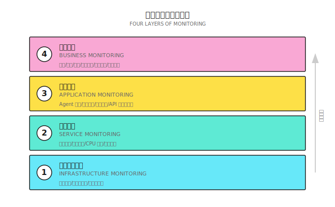
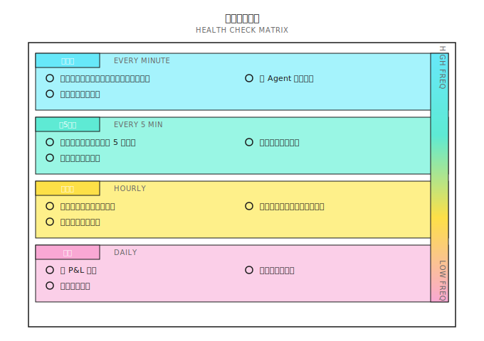
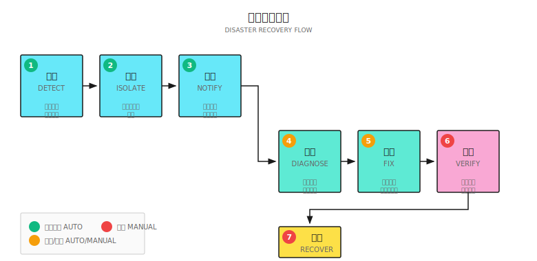
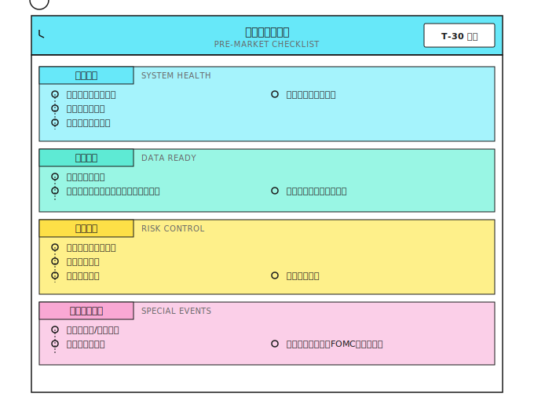
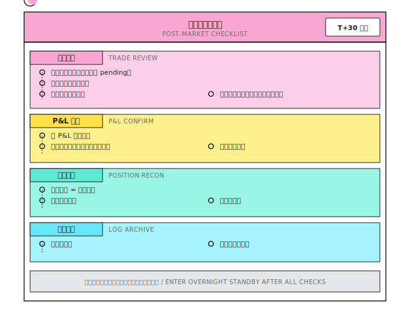
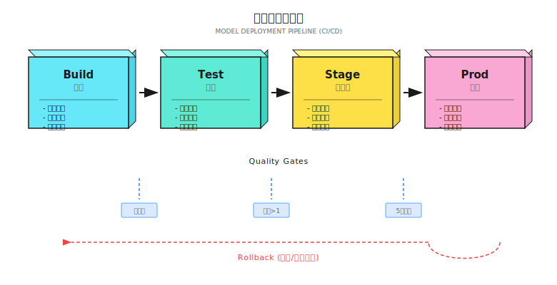
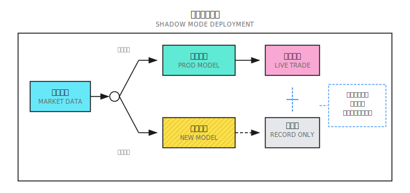
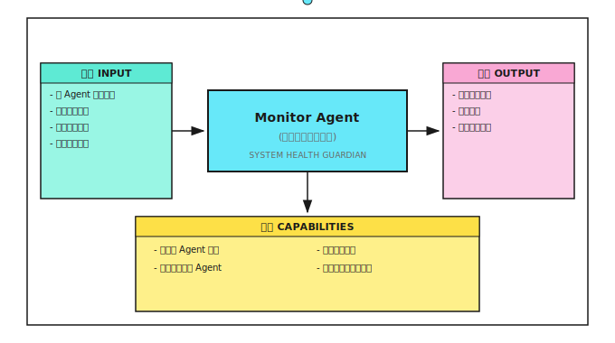

# 第 20 课：生产运维

> **目标**：让系统在没有你的时候也能正常运行，并在出问题时及时通知你。

---

## 一个典型场景（示意）

> 注：以下为合成示例，用于说明常见现象；数字为示意，不对应任何具体个人/账户。

2022 年，一位独立量化交易者上线了他精心打磨半年的自动交易系统。回测完美，模拟盘跑了三个月也很稳定。他信心满满地投入了 50 万美元实盘。

前两周，系统表现正常。第三周的周一凌晨，他被一条短信吵醒：账户余额不足。

检查发现：周五收盘后，数据源 API 改版，返回格式变了。系统解析失败，抛出异常，但异常被静默吞掉了。周末两天，系统没有任何日志输出（他以为周末不交易所以没关注）。周一开盘，系统恢复连接但状态混乱，执行了一系列荒谬的订单，包括一笔巨额做空。

等他发现时，账户已经亏损 40%。

**问题出在哪里？**
1. **没有健康检查**：数据源故障没有被发现
2. **异常被吞掉**：错误没有上报
3. **没有监控告警**：周末两天零日志却没人知道
4. **没有熔断机制**：状态异常时没有停止交易

这就是为什么"代码能跑"和"系统可靠"是两回事。运维不是事后补救，是系统设计的一部分。

---

## 20.1 监控体系

### 监控的四个层次



### 关键监控指标

| 层次 | 指标 | 阈值示例 | 告警级别 |
|-----|------|---------|---------|
| **基础设施** | 服务器存活 | 心跳超时 30s | 严重 |
| | 网络延迟 | > 200ms | 警告 |
| **服务** | CPU 使用率 | > 80% 持续 5 分钟 | 警告 |
| | 内存使用 | > 90% | 严重 |
| | 磁盘空间 | < 10GB | 警告 |
| **应用** | 数据源连接 | 断开 > 1 分钟 | 严重 |
| | API 成功率 | < 95% | 警告 |
| | 任务队列积压 | > 100 条 | 警告 |
| | Agent 响应延迟 | > 5s | 警告 |
| **业务** | 日回撤 | > 3% | 警告 |
| | 周回撤 | > 5% | 严重 |
| | 异常交易 | 单笔 > 10% 仓位 | 严重 |
| | 交易频率 | 偏离均值 3 倍 | 警告 |

### 健康检查设计



---

## 20.2 日志系统

### 日志的黄金法则

> **日志是产品，不是副产品。**

| 原则 | 解释 | 反例 |
|-----|------|------|
| **结构化** | JSON 格式，便于查询分析 | 自由文本 "买入成功" |
| **可追溯** | 每条日志包含 trace_id | 无法关联同一交易的多条日志 |
| **分级别** | DEBUG/INFO/WARN/ERROR | 全用 print() |
| **带上下文** | 包含时间、标的、价格、数量 | 只有 "Error occurred" |
| **不可篡改** | 写入后不能修改 | 日志存本地可编辑 |

### 日志分级

| 级别 | 用途 | 示例 |
|-----|------|------|
| **DEBUG** | 开发调试，生产环境关闭 | "Calculating RSI for AAPL..." |
| **INFO** | 正常业务流程 | "Order submitted: BUY AAPL 100@$180" |
| **WARN** | 异常但可恢复 | "API rate limited, retrying in 5s" |
| **ERROR** | 异常且需要关注 | "Order rejected: insufficient margin" |
| **CRITICAL** | 系统级故障 | "Database connection lost" |

### 交易日志标准格式

```json
{
  "timestamp": "2024-01-15T09:30:00.123Z",
  "level": "INFO",
  "service": "execution_agent",
  "trace_id": "tx_20240115_001",
  "event": "order_submitted",
  "data": {
    "symbol": "AAPL",
    "side": "BUY",
    "quantity": 100,
    "price": 180.50,
    "order_type": "LIMIT",
    "order_id": "ORD_12345"
  },
  "context": {
    "signal_id": "sig_20240115_001",
    "signal_strength": 0.75,
    "regime": "trending",
    "portfolio_value": 1000000
  }
}
```

**关键字段**：
- `trace_id`：贯穿从信号到成交的完整链路
- `event`：标准化事件名，便于统计分析
- `context`：决策依据，用于事后归因

---

## 20.3 告警系统

### 告警设计原则

| 原则 | 解释 |
|-----|------|
| **告警必须可行动** | 收到告警后知道该做什么 |
| **避免告警疲劳** | 太多告警 = 没有告警 |
| **分级处理** | 不同级别走不同通道 |
| **包含上下文** | 告警信息足够诊断问题 |

### 告警通道

| 级别 | 通道 | 响应时间要求 |
|-----|------|------------|
| **低** | 邮件、日报汇总 | 次日处理 |
| **中** | Slack/钉钉消息 | 1 小时内 |
| **高** | 短信 + 电话 | 5 分钟内 |
| **紧急** | 自动熔断 + 电话 | 立即 |

### 告警模板

```
🚨 [严重] 交易系统告警

时间: 2024-01-15 10:30:15 EST
服务: Risk Agent
事件: 回撤触发控制线

详情:
- 当前回撤: 10.2%
- 触发阈值: 10%
- 今日 P&L: -$52,000
- 账户净值: $948,000

已执行动作:
- 停止新开仓
- 开始减仓流程

需要你:
- 检查是否有异常交易
- 确认是否需要人工干预

仪表盘: https://dashboard.example.com/alerts/12345
```

### 告警抑制

| 问题 | 解决方案 |
|-----|---------|
| 同一问题重复告警 | 聚合：同类告警 5 分钟内只发一条 |
| 瞬时抖动触发告警 | 持续：阈值需持续 N 分钟才告警 |
| 夜间非交易时段 | 静默期：非交易时段降级为低优先级 |
| 已知维护窗口 | 屏蔽：预设的维护时段不告警 |

---

## 20.4 容灾与恢复

### 故障分类

| 故障类型 | 示例 | 影响 | 恢复策略 |
|---------|------|------|---------|
| **数据源故障** | API 不可用 | 无法获取行情 | 切换备用源 |
| **交易接口故障** | 券商系统维护 | 无法下单 | 暂停交易，记录待执行 |
| **本地服务故障** | Agent 进程崩溃 | 部分功能失效 | 自动重启 |
| **网络故障** | 网络中断 | 全部失效 | 等待恢复，人工确认状态 |
| **数据错误** | 行情异常跳动 | 错误决策 | 识别异常，暂停处理 |

### 恢复流程



### 状态一致性检查

恢复后必须验证：

| 检查项 | 方法 | 不一致时处理 |
|-------|------|------------|
| 持仓一致 | 对比系统记录与券商 | 以券商为准，更新本地 |
| 订单状态 | 查询所有 pending 订单 | 取消或确认 |
| 资金余额 | 对比计算值与实际值 | 重新计算 |
| 数据完整 | 检查行情数据缺失 | 补充缺失数据 |

---

## 20.5 交易时段自动化

> **生产系统不应该依赖人类记得按"启动"按钮。**

交易系统的运行不是 24/7 的 Web 服务，而是严格与市场交易时段绑定的。这一点经常被忽略，却是生产可靠性的关键环节。

### 20.5.1 时段调度设计

```
美股交易日调度（东部时间 ET）：

09:15  系统自动启动
       ├── 数据源连接检查
       ├── 券商 API 心跳验证
       ├── 持仓状态同步
       └── 开盘前检查清单自动执行

09:30  交易窗口开启
       └── Agent 开始接收信号并执行

16:00  交易窗口关闭
       └── 停止新开仓

16:05  收盘后处理
       ├── 收盘后检查自动执行
       ├── 日度 P&L 结算
       ├── 日志归档
       └── 日报推送

16:30  系统自动停止
```

### 20.5.2 关键要求

| 要求 | 说明 |
|-----|------|
| **仅工作日运行** | 排除周末和法定假日（注意不同市场假日不同） |
| **时区正确性** | 内部统一用 UTC，显示层转换为当地时间 |
| **优雅启停** | 启动时恢复状态，停止时确认无 pending 订单 |
| **假日日历** | 维护交易所假日表，避免假日误启动 |

**常见事故**：系统在美国独立纪念日（7 月 4 日）尝试连接已关闭的交易所，触发大量告警。看似简单，却是生产环境中反复出现的问题。

---

## 20.6 日常运维清单

### 开盘前检查（每日必做）



### 收盘后检查（每日必做）



### 周度/月度检查

| 频率 | 检查项 | 目的 |
|-----|-------|------|
| **周度** | 策略表现回顾 | 识别异常趋势 |
| | 系统资源使用趋势 | 预防资源不足 |
| | 告警汇总分析 | 发现系统性问题 |
| **月度** | 完整 P&L 归因 | 策略评估 |
| | 模型漂移检测 | 识别失效信号 |
| | 基础设施评估 | 成本和性能优化 |
| | 灾难恢复演练 | 验证恢复流程 |

---

## 20.7 Provider 抽象模式

> **好的架构让你换掉数据源或券商时，只改配置不改代码。**

生产系统应当为外部依赖定义清晰的接口抽象，使核心逻辑与具体供应商解耦：

```
数据源接口:
  Connect()     → 建立连接
  Subscribe()   → 订阅标的
  Stream()      → 接收实时行情

执行通道接口:
  SubmitOrder()  → 提交订单
  CancelOrder()  → 撤销订单
  QueryStatus()  → 查询状态
```

每个具体供应商（IB、Alpaca、Databento 等）实现这些接口。当你需要增加港股通道或切换数据源时，只需实现一个新的适配器，不需要修改策略逻辑、风控规则或监控系统。这也是实现多市场交易的前提条件。

---

## 20.8 模型部署与 CI/CD

### 20.8.1 为什么交易系统需要 CI/CD

> **每一次上线都是风险事件。CI/CD 让这个风险可控。**

传统做法的问题：

| 问题 | 后果 |
|-----|------|
| 手动部署 | 容易遗漏步骤、配置错误 |
| 没有版本追溯 | 出问题时无法回滚到已知好的版本 |
| 环境不一致 | "在我机器上能跑"，生产环境却挂了 |
| 测试不充分 | 新代码引入 bug，上线后才发现 |
| 模型更新无记录 | 不知道什么时候、为什么更新了模型 |

### 20.8.2 交易系统的 CI/CD 流水线



### 20.8.3 各阶段详解

**阶段一：Build（构建）**

```yaml
# 示例：GitHub Actions 配置
build:
  steps:
    - name: 检出代码
      uses: actions/checkout@v3

    - name: 安装依赖
      run: pip install -r requirements.txt

    - name: 类型检查
      run: mypy src/ --strict

    - name: 代码规范
      run: ruff check src/

    - name: 打包模型
      run: |
        python -m src.models.package \
          --model-path models/signal_v3.pkl \
          --output artifacts/
```

**阶段二：Test（测试）**

| 测试类型 | 内容 | 通过标准 |
|---------|------|---------|
| **单元测试** | 函数逻辑正确 | 100% 通过 |
| **集成测试** | Agent 间协作正常 | 100% 通过 |
| **回测验证** | 历史数据上的表现 | 夏普 > 阈值，回撤 < 阈值 |
| **健全性检查** | 无明显过拟合 | 样本外夏普 > 样本内 × 0.7 |

**双层回测验证（Quality Gate）**：

交易系统的回测验证不能只跑一种回测。建议在 CI/CD 流水线中强制执行**双层验证**：

| 层次 | 方法 | 验证目标 | 速度 |
|-----|------|---------|------|
| **第一层** | 向量化回测 | 信号逻辑正确性、因子有效性 | 快（秒级） |
| **第二层** | OMS 集成回测 | 执行真实性（滑点、部分成交、延迟） | 慢（分钟级） |

第一层用于快速筛选：跑不过信号层面的策略直接淘汰，不浪费执行模拟的计算资源。第二层用于确认可交易性：通过了信号验证的策略，必须在包含订单管理、滑点模拟和成交概率的环境中再跑一遍。**两层都通过才允许部署。**

```python
# 回测验证示例
def test_model_performance():
    """确保新模型在回测中达到最低标准"""
    results = run_backtest(
        model='models/signal_v3.pkl',
        start_date='2022-01-01',
        end_date='2023-12-31'
    )

    assert results['sharpe'] >= 1.0, f"夏普比率不足: {results['sharpe']}"
    assert results['max_drawdown'] <= 0.15, f"回撤过大: {results['max_drawdown']}"
    assert results['win_rate'] >= 0.45, f"胜率不足: {results['win_rate']}"

    # 过拟合检查
    in_sample_sr = results['in_sample_sharpe']
    out_sample_sr = results['out_sample_sharpe']
    assert out_sample_sr >= in_sample_sr * 0.7, "样本外表现衰减过大，可能过拟合"
```

**阶段三：Stage（预发布）**

影子模式（Shadow Mode）：



影子模式运行标准：

| 指标 | 通过标准 | 检查周期 |
|-----|---------|---------|
| 信号一致性 | 新旧信号相关性 > 0.9 或改进明显 | 实时 |
| 延迟 | 新模型延迟 < 生产模型 × 1.2 | 每小时 |
| 资源使用 | CPU/内存在预算内 | 每 5 分钟 |
| 异常信号 | 无极端信号（> 3 标准差） | 实时 |
| 运行时长 | 至少 5 个交易日 | - |

**阶段四：Prod（生产）**

灰度发布策略：

| 策略 | 适用场景 | 风险控制 |
|-----|---------|---------|
| **Canary（金丝雀）** | 小比例资金先上新模型 | 5% → 25% → 50% → 100% |
| **Blue-Green** | 瞬间切换，保留回滚能力 | 随时可切回旧版本 |
| **Rolling** | 逐步替换 Agent 实例 | 一次替换一个 |

```python
class CanaryDeployment:
    """金丝雀部署控制器"""

    def __init__(self, old_model, new_model):
        self.old_model = old_model
        self.new_model = new_model
        self.canary_weight = 0.05  # 从 5% 开始

    def get_signal(self, market_data: dict) -> dict:
        # 按权重分配流量
        if random.random() < self.canary_weight:
            signal = self.new_model.predict(market_data)
            signal['model_version'] = 'canary'
        else:
            signal = self.old_model.predict(market_data)
            signal['model_version'] = 'stable'
        return signal

    def promote_canary(self, new_weight: float):
        """提升金丝雀权重，逐步放量"""
        if new_weight > self.canary_weight:
            log.info(f"提升金丝雀权重: {self.canary_weight:.0%} → {new_weight:.0%}")
            self.canary_weight = new_weight

    def rollback(self):
        """回滚到稳定版本"""
        log.warning("金丝雀回滚！切回稳定版本")
        self.canary_weight = 0.0
```

### 20.8.4 模型版本管理

**版本命名规范**：

```
模型版本格式: v{major}.{minor}.{patch}-{timestamp}

示例:
  v2.3.1-20240115  # 2024年1月15日的 v2.3.1 版本

版本规则:
  major: 模型架构变化（如从 XGBoost 换成神经网络）
  minor: 特征或参数调整
  patch: bug 修复
```

**模型注册表**：

| 字段 | 示例 | 说明 |
|-----|------|------|
| `model_id` | `signal_v2.3.1` | 唯一标识 |
| `created_at` | `2024-01-15 10:30:00` | 创建时间 |
| `created_by` | `auto_train_pipeline` | 创建者（人或流水线） |
| `metrics` | `{"sharpe": 1.5, "drawdown": 0.08}` | 验证指标 |
| `status` | `staging` / `production` / `retired` | 当前状态 |
| `artifact_path` | `s3://models/signal_v2.3.1.pkl` | 存储位置 |
| `config_hash` | `a1b2c3d4...` | 配置文件哈希 |
| `data_hash` | `e5f6g7h8...` | 训练数据哈希（可复现性） |

### 20.8.5 自动回滚

```python
class AutoRollback:
    """自动回滚控制器"""

    def __init__(self, rollback_thresholds: dict):
        self.thresholds = rollback_thresholds
        self.metrics_buffer = []

    def check_and_rollback(self, current_metrics: dict) -> bool:
        """检查是否需要回滚"""

        # 即时回滚条件（单次触发）
        if current_metrics.get('error_rate', 0) > self.thresholds['max_error_rate']:
            self.trigger_rollback("错误率过高")
            return True

        if current_metrics.get('latency_p99', 0) > self.thresholds['max_latency']:
            self.trigger_rollback("延迟过高")
            return True

        # 累积回滚条件（趋势判断）
        self.metrics_buffer.append(current_metrics)
        if len(self.metrics_buffer) >= 10:  # 足够样本
            recent_sharpe = np.mean([m['sharpe'] for m in self.metrics_buffer[-10:]])
            if recent_sharpe < self.thresholds['min_sharpe']:
                self.trigger_rollback(f"夏普下降: {recent_sharpe:.2f}")
                return True

        return False

    def trigger_rollback(self, reason: str):
        """执行回滚"""
        log.error(f"触发自动回滚: {reason}")

        # 1. 切换到上一个稳定版本
        model_registry.activate('last_stable')

        # 2. 发送告警
        alert_system.send(
            level='critical',
            title='模型自动回滚',
            message=f'原因: {reason}'
        )

        # 3. 记录回滚事件
        audit_log.record('rollback', {'reason': reason})
```

### 20.8.6 CI/CD 实践清单

```
┌─────────────────────────────────────────────────────────────┐
│               CI/CD 实施检查清单                             │
├─────────────────────────────────────────────────────────────┤
│                                                             │
│  □ 版本控制                                                 │
│    ├─ 所有代码在 Git                                        │
│    ├─ 模型文件有版本号                                       │
│    ├─ 配置与代码分离                                         │
│    └─ 训练数据有快照                                         │
│                                                             │
│  □ 自动化测试                                               │
│    ├─ 单元测试覆盖核心逻辑                                   │
│    ├─ 回测作为 CI 的一部分                                   │
│    ├─ 性能基准测试                                           │
│    └─ 过拟合检测                                             │
│                                                             │
│  □ 部署流程                                                 │
│    ├─ 一键部署（无手动步骤）                                 │
│    ├─ 影子模式验证                                           │
│    ├─ 灰度发布机制                                           │
│    └─ 一键回滚                                               │
│                                                             │
│  □ 可观测性                                                 │
│    ├─ 部署事件记录                                           │
│    ├─ 版本与性能关联                                         │
│    ├─ 回滚自动触发                                           │
│    └─ 变更审计追溯                                           │
│                                                             │
└─────────────────────────────────────────────────────────────┘
```

---

## 20.9 多智能体视角

### Monitor Agent 的角色



### Agent 间的健康协作

| Agent | 向 Monitor 报告 | 接收 Monitor 指令 |
|-------|----------------|------------------|
| Signal Agent | 信号生成延迟、成功率 | 暂停/恢复 |
| Risk Agent | 风控触发次数、状态 | 强制熔断 |
| Execution Agent | 订单状态、成交质量 | 取消待执行订单 |
| Regime Agent | 检测延迟、置信度 | 切换到默认状态 |
| Data Agent | 数据更新时间、质量 | 切换数据源 |

---

## ✅ 验收标准

完成本课后，用以下标准检验学习效果：

| 验收项 | 达标标准 | 自测方法 |
|-------|---------|---------|
| 理解监控层次 | 能描述四层监控的内容 | 列出每层的关键指标 |
| 设计日志格式 | 能设计结构化交易日志 | 写出一条完整的交易日志 JSON |
| 设计告警规则 | 能区分告警级别和通道 | 为你的系统设计告警矩阵 |
| 理解恢复流程 | 能描述故障恢复步骤 | 画出恢复流程图 |
| 掌握日常清单 | 能列出开盘前/收盘后检查项 | 创建你的检查清单 |

### 综合练习

**设计你的运维体系**：

1. 列出你需要监控的关键指标（至少 10 个）
2. 设计日志格式（包含必要字段）
3. 设计告警规则（指标、阈值、级别、通道）
4. 编写开盘前检查清单
5. 设计一个故障场景的恢复流程

---

## 本课交付物

完成本课后，你将获得：

1. **四层监控框架** - 基础设施/服务/应用/业务
2. **日志标准模板** - 结构化交易日志格式
3. **告警设计指南** - 级别、通道、抑制策略
4. **运维清单** - 开盘前/收盘后检查项
5. **CI/CD 部署流水线** - 构建、测试、影子模式、灰度发布

---

## 本课要点回顾

- [x] 理解监控的四个层次及其关键指标
- [x] 掌握结构化日志的设计原则
- [x] 理解告警系统的设计要点
- [x] 掌握故障恢复流程和状态一致性检查
- [x] 建立日常运维检查的习惯
- [x] 设计 CI/CD 流水线实现模型安全部署

---

## 延伸阅读

- [第 19 课：执行系统](第19课：执行系统%20-%20从信号到真实成交.md) - 执行环节的监控重点
- [背景知识：执行模拟器实现](背景知识/执行模拟器实现.md) - 用于 CI/CD 测试的执行模拟
- [第 17 课：在线学习与策略进化](../Part4-多智能体/第17课：在线学习与策略进化.md) - 模型漂移检测的实现细节
- [附录 A：实盘交易记录标准指南](附录/附录A：实盘交易记录标准指南.md) - 详细的日志规范

---

## 下一课预告

**第 21 课：项目实战**

理论到此结束。下一课我们将从零开始，构建一个完整的多智能体交易系统——整合前 20 课的所有知识，从架构设计到代码实现，从回测验证到生产部署。
