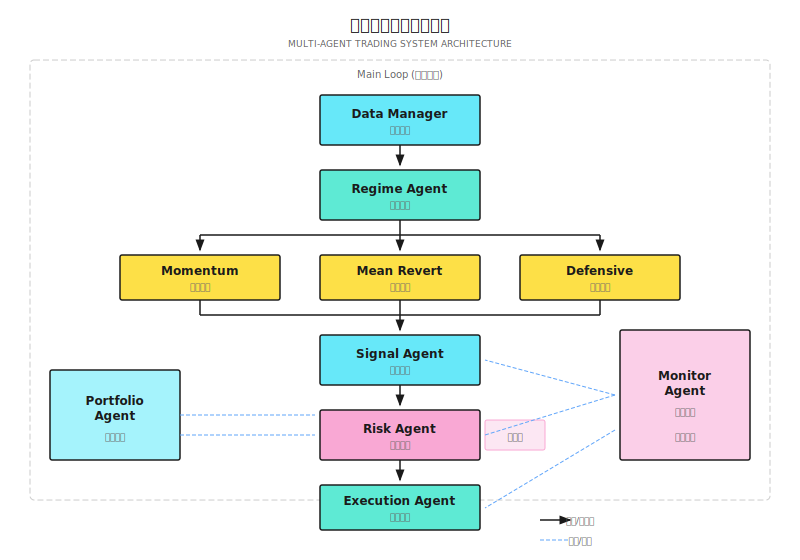

# 第 21 课：项目实战

> **目标**：整合前 20 课知识，从零构建一个可运行的多智能体交易系统原型。

---

## 项目概述

本课将带你完成一个**端到端的多智能体交易系统**。这不是一个玩具项目，而是一个可以扩展为真实交易系统的框架。

### 系统目标

| 维度 | 目标 | 非目标 |
|-----|------|-------|
| **功能** | 能识别市场状态、生成信号、控制风险、执行交易 | 高频交易、复杂衍生品 |
| **市场** | 美股日频策略 | 分钟级以下策略 |
| **规模** | 10-50 只股票的组合 | 千只股票的选股 |
| **运行** | 本地开发环境 + 模拟盘 | 直接实盘 |

### 最终交付物

```
multi-agent-trading-system/
├── agents/
│   ├── regime_agent.py      # 市场状态识别
│   ├── signal_agent.py      # 信号生成
│   ├── risk_agent.py        # 风险控制
│   ├── execution_agent.py   # 订单执行
│   └── monitor_agent.py     # 系统监控
├── core/
│   ├── data_manager.py      # 数据管理
│   ├── portfolio.py         # 组合管理
│   └── order.py             # 订单模型
├── strategies/
│   ├── momentum.py          # 动量策略
│   └── mean_revert.py       # 均值回归策略
├── config/
│   └── settings.yaml        # 配置文件
├── tests/
│   └── ...                  # 测试用例
└── main.py                  # 入口
```

---

## 21.1 系统架构

### 整体架构图



### 数据流

```
行情数据 ─────────► Data Manager ─────────► 各 Agent
                         │
                         ▼
持仓/余额 ◄──────── Portfolio ◄───────── Execution Agent
                         │
                         ▼
日志/指标 ─────────► Monitor Agent ─────────► 告警
```

> **从教学代码到生产系统**
> 本课使用 Python 实现所有智能体，便于理解和学习。生产环境中，不同组件通常使用不同语言：
> - 风控引擎 → Rust（不可变硬编码限制，纳秒级延迟）
> - 订单管理 → Go（高并发，goroutine 模型）
> - 研究/ML → Python（丰富的 ML 生态）
>
> 关键不是语言选择，而是**清晰的模块边界和标准化的通信协议**（如 gRPC + Protobuf）。本课的代码结构刻意保持了这种边界清晰性——每个 Agent 都有明确的输入输出接口，未来替换实现语言时只需保持接口不变。

### 架构演进：模块化单体优先

> **先在一个进程里把事做对，再考虑拆分。**

本课的多智能体系统在概念上是"多个独立 Agent 协作"，但这**不意味着你需要从第一天就部署多个独立服务**。过早微服务化会带来分布式系统的全部复杂性（网络故障、数据一致性、部署编排），却不会带来任何收益。

推荐的演进路径：

```
阶段 1：模块化单体（Modular Monolith）
├── 所有 Agent 在同一进程内运行
├── 通过函数调用通信（零延迟）
├── 共享 Proto 定义约束接口
└── 适合: 单市场、<$1M 资金

阶段 2：选择性拆分
├── 将延迟敏感组件独立（如风控引擎）
├── 用 gRPC 替代函数调用
├── 核心逻辑仍在主进程
└── 适合: 多市场、不同延迟要求

阶段 3：完全分布式
├── 每个 Agent 独立部署
├── 消息队列解耦
└── 适合: 团队协作、独立扩缩容
```

**关键原则**：模块边界从第一天就要清晰（每个 Agent 有明确的输入/输出 Proto 定义），但部署边界可以延后决定。本课的代码结构已经遵循了这个原则——你可以直接在单进程中运行全部 Agent，也可以未来将任何一个 Agent 拆分为独立服务。

---

## 21.2 分步实现

### Step 1: 数据管理器

**目标**：获取和管理市场数据。

```
Data Manager 职责:
- 获取历史行情（用于回测）
- 获取实时行情（用于实盘）
- 数据清洗和标准化
- 计算技术指标
```

**纸上设计：数据接口**

| 方法 | 输入 | 输出 | 用途 |
|-----|------|------|------|
| `get_history` | symbol, days | DataFrame | 获取历史数据 |
| `get_latest` | symbols | Dict | 获取最新价格 |
| `calculate_indicators` | df | df with indicators | 计算技术指标 |
| `validate` | df | bool, errors | 数据质量检查 |

<details>
<summary>💻 代码框架（工程师参考）</summary>

```python
import yfinance as yf
import pandas as pd
import numpy as np
from typing import List, Dict, Optional

class DataManager:
    """数据管理器"""

    def __init__(self, cache_dir: str = "./data_cache"):
        self.cache_dir = cache_dir

    def get_history(
        self,
        symbol: str,
        days: int = 252,
        end_date: Optional[str] = None
    ) -> pd.DataFrame:
        """获取历史行情数据"""
        ticker = yf.Ticker(symbol)
        df = ticker.history(period=f"{days}d")

        # 标准化列名
        df = df.rename(columns={
            "Open": "open",
            "High": "high",
            "Low": "low",
            "Close": "close",
            "Volume": "volume"
        })

        return df[["open", "high", "low", "close", "volume"]]

    def calculate_indicators(self, df: pd.DataFrame) -> pd.DataFrame:
        """计算技术指标"""
        # 移动平均
        df["sma_20"] = df["close"].rolling(20).mean()
        df["sma_50"] = df["close"].rolling(50).mean()

        # 波动率
        df["volatility"] = df["close"].pct_change().rolling(20).std() * np.sqrt(252)

        # RSI
        delta = df["close"].diff()
        gain = delta.where(delta > 0, 0).rolling(14).mean()
        loss = (-delta.where(delta < 0, 0)).rolling(14).mean()
        df["rsi"] = 100 - (100 / (1 + gain / loss))

        # ATR
        high_low = df["high"] - df["low"]
        high_close = (df["high"] - df["close"].shift()).abs()
        low_close = (df["low"] - df["close"].shift()).abs()
        tr = pd.concat([high_low, high_close, low_close], axis=1).max(axis=1)
        df["atr"] = tr.rolling(14).mean()

        return df

    def validate(self, df: pd.DataFrame) -> tuple:
        """数据质量检查"""
        errors = []

        if df.empty:
            errors.append("DataFrame is empty")

        if df["close"].isnull().any():
            errors.append(f"Missing close prices: {df['close'].isnull().sum()}")

        if (df["close"] <= 0).any():
            errors.append("Invalid prices (<=0)")

        return len(errors) == 0, errors
```

</details>

### Step 2: Regime Agent

**目标**：识别当前市场状态。

```
Regime Agent 输出:
- regime: "trending" | "mean_reverting" | "crisis" | "uncertain"
- confidence: 0.0 - 1.0
- regime_weights: {"trending": 0.6, "mean_reverting": 0.3, "crisis": 0.1}
```

**纸上设计：状态判断规则**

| 条件 | 状态 | 权重分配 |
|-----|------|---------|
| ADX > 25 且 Vol < 25% | 趋势 | 趋势 80%, 均值回归 15%, 防守 5% |
| ADX < 20 且 Vol < 20% | 震荡 | 趋势 20%, 均值回归 70%, 防守 10% |
| Vol > 30% 且 Corr > 0.7 | 危机 | 趋势 10%, 均值回归 10%, 防守 80% |
| 其他 | 不确定 | 各 33% |

<details>
<summary>💻 代码框架（工程师参考）</summary>

```python
from dataclasses import dataclass
from typing import Dict

@dataclass
class RegimeState:
    regime: str
    confidence: float
    weights: Dict[str, float]

class RegimeAgent:
    """市场状态识别 Agent"""

    def __init__(self, config: dict = None):
        self.config = config or {}
        self.adx_threshold = self.config.get("adx_threshold", 25)
        self.vol_crisis = self.config.get("vol_crisis", 0.30)

    def detect(self, market_data: dict) -> RegimeState:
        """
        检测市场状态

        market_data: {
            "adx": float,
            "volatility": float,
            "correlation": float,
            "trend_strength": float
        }
        """
        adx = market_data.get("adx", 20)
        vol = market_data.get("volatility", 0.15)
        corr = market_data.get("correlation", 0.5)

        # 危机检测优先
        if vol > self.vol_crisis and corr > 0.7:
            return RegimeState(
                regime="crisis",
                confidence=0.8,
                weights={"momentum": 0.1, "mean_revert": 0.1, "defensive": 0.8}
            )

        # 趋势检测
        if adx > self.adx_threshold and vol < 0.25:
            return RegimeState(
                regime="trending",
                confidence=0.7,
                weights={"momentum": 0.7, "mean_revert": 0.2, "defensive": 0.1}
            )

        # 震荡检测
        if adx < 20 and vol < 0.20:
            return RegimeState(
                regime="mean_reverting",
                confidence=0.6,
                weights={"momentum": 0.2, "mean_revert": 0.7, "defensive": 0.1}
            )

        # 不确定
        return RegimeState(
            regime="uncertain",
            confidence=0.3,
            weights={"momentum": 0.33, "mean_revert": 0.33, "defensive": 0.34}
        )
```

</details>

### Step 3: Signal Agent

**目标**：根据策略生成交易信号。

```
Signal Agent 输出:
- signals: [
    {"symbol": "AAPL", "direction": "long", "strength": 0.7, "source": "momentum"},
    {"symbol": "MSFT", "direction": "short", "strength": 0.5, "source": "mean_revert"}
  ]
```

**纸上设计：信号汇总逻辑**

| 场景 | 处理方式 |
|-----|---------|
| 单一策略信号 | 直接输出，强度 = 策略信号 × 状态权重 |
| 多策略一致 | 增强信号强度，取加权平均 |
| 多策略冲突 | 取权重更高的策略，或不交易 |

<details>
<summary>💻 代码框架（工程师参考）</summary>

```python
from dataclasses import dataclass
from typing import List, Optional

@dataclass
class Signal:
    symbol: str
    direction: str  # "long" | "short" | "close"
    strength: float  # 0.0 - 1.0
    source: str
    timestamp: str

class SignalAgent:
    """信号生成 Agent"""

    def __init__(self, strategies: list):
        self.strategies = strategies

    def generate_signals(
        self,
        market_data: dict,
        regime_weights: dict
    ) -> List[Signal]:
        """汇总各策略信号"""
        all_signals = {}

        for strategy in self.strategies:
            strategy_name = strategy.name
            weight = regime_weights.get(strategy_name, 0.33)

            raw_signals = strategy.generate(market_data)

            for sig in raw_signals:
                key = (sig.symbol, sig.direction)
                weighted_strength = sig.strength * weight

                if key in all_signals:
                    # 同方向信号叠加
                    all_signals[key].strength += weighted_strength
                else:
                    all_signals[key] = Signal(
                        symbol=sig.symbol,
                        direction=sig.direction,
                        strength=weighted_strength,
                        source=strategy_name,
                        timestamp=sig.timestamp
                    )

        # 过滤弱信号
        return [s for s in all_signals.values() if s.strength > 0.3]
```

</details>

### Step 4: Risk Agent

**目标**：审核信号，控制风险。

```
Risk Agent 决策:
- APPROVE: 通过，可执行
- REDUCE: 通过但缩小仓位
- REJECT: 拒绝
```

**纸上设计：审核规则**

| 规则 | 检查内容 | 触发动作 |
|-----|---------|---------|
| 单笔上限 | 仓位 > 10% | 缩小至 10% |
| 标的上限 | 同标的 > 20% | 拒绝或缩小 |
| 总仓位上限 | 总仓位 > 80% | 拒绝 |
| 回撤控制 | 当前回撤 > 10% | 拒绝所有开仓 |
| 熔断 | 回撤 > 15% | 强制减仓 |

<details>
<summary>💻 代码框架（工程师参考）</summary>

```python
from enum import Enum
from dataclasses import dataclass
from typing import Optional

class Decision(Enum):
    APPROVE = "approve"
    REDUCE = "reduce"
    REJECT = "reject"

@dataclass
class RiskDecision:
    decision: Decision
    reason: str
    adjusted_size: Optional[float] = None

class RiskAgent:
    """风险控制 Agent"""

    def __init__(self, config: dict):
        self.max_single = config.get("max_single_position", 0.10)
        self.max_symbol = config.get("max_symbol_exposure", 0.20)
        self.max_total = config.get("max_total_exposure", 0.80)
        self.drawdown_stop = config.get("drawdown_stop", 0.10)
        self.drawdown_circuit = config.get("drawdown_circuit", 0.15)

    def check(
        self,
        signal: Signal,
        proposed_size: float,
        portfolio: dict,
        current_drawdown: float
    ) -> RiskDecision:
        """审核交易信号"""

        # 熔断检查
        if current_drawdown >= self.drawdown_circuit:
            return RiskDecision(Decision.REJECT, "Circuit breaker active")

        # 回撤控制
        if current_drawdown >= self.drawdown_stop:
            if signal.direction != "close":
                return RiskDecision(Decision.REJECT, "Drawdown limit reached")

        # 单笔上限
        if proposed_size > self.max_single:
            return RiskDecision(
                Decision.REDUCE,
                f"Size exceeds single limit",
                adjusted_size=self.max_single
            )

        # 标的上限
        current_exposure = portfolio.get(signal.symbol, 0)
        if current_exposure + proposed_size > self.max_symbol:
            allowed = self.max_symbol - current_exposure
            if allowed <= 0:
                return RiskDecision(Decision.REJECT, "Symbol limit reached")
            return RiskDecision(
                Decision.REDUCE,
                "Symbol limit",
                adjusted_size=allowed
            )

        # 总仓位上限
        total_exposure = sum(portfolio.values()) + proposed_size
        if total_exposure > self.max_total:
            return RiskDecision(Decision.REJECT, "Total exposure limit")

        return RiskDecision(Decision.APPROVE, "Passed all checks")
```

</details>

### Step 5: Execution Agent

**目标**：执行交易订单。

```
Execution Agent 职责:
- 将信号转换为订单
- 选择订单类型（市价/限价）
- 管理订单状态
- 记录成交结果
```

<details>
<summary>💻 代码框架（工程师参考）</summary>

```python
from dataclasses import dataclass
from enum import Enum
from datetime import datetime
import uuid

class OrderStatus(Enum):
    PENDING = "pending"
    SUBMITTED = "submitted"
    FILLED = "filled"
    CANCELLED = "cancelled"
    REJECTED = "rejected"

@dataclass
class Order:
    order_id: str
    symbol: str
    side: str  # "buy" | "sell"
    quantity: int
    order_type: str  # "market" | "limit"
    limit_price: float = None
    status: OrderStatus = OrderStatus.PENDING
    filled_price: float = None
    filled_time: str = None

class ExecutionAgent:
    """订单执行 Agent"""

    def __init__(self, broker_client=None, is_paper: bool = True):
        self.broker = broker_client
        self.is_paper = is_paper
        self.orders = {}

    def create_order(
        self,
        symbol: str,
        direction: str,
        size: float,
        portfolio_value: float,
        current_price: float
    ) -> Order:
        """创建订单"""
        # 计算股数
        dollar_amount = portfolio_value * size
        quantity = int(dollar_amount / current_price)

        if quantity <= 0:
            return None

        side = "buy" if direction == "long" else "sell"

        order = Order(
            order_id=str(uuid.uuid4())[:8],
            symbol=symbol,
            side=side,
            quantity=quantity,
            order_type="market"
        )

        self.orders[order.order_id] = order
        return order

    def submit_order(self, order: Order) -> bool:
        """提交订单"""
        if self.is_paper:
            # 模拟成交
            order.status = OrderStatus.FILLED
            order.filled_time = datetime.now().isoformat()
            # 模拟盘假设以当前价成交
            return True

        # 实盘调用 broker API
        # response = self.broker.submit_order(order)
        # ...
        return True
```

</details>

### Step 6: 主循环

**目标**：串联所有 Agent。

```python
# 主循环伪代码
def main_loop():
    # 1. 获取数据
    market_data = data_manager.get_latest(symbols)

    # 2. 识别状态
    regime_state = regime_agent.detect(market_data)

    # 3. 生成信号
    signals = signal_agent.generate(market_data, regime_state.weights)

    # 4. 风控审核
    for signal in signals:
        proposed_size = calculate_position_size(signal)
        decision = risk_agent.check(signal, proposed_size, portfolio, drawdown)

        if decision.decision == Decision.APPROVE:
            size = proposed_size
        elif decision.decision == Decision.REDUCE:
            size = decision.adjusted_size
        else:
            continue

        # 5. 执行订单
        order = execution_agent.create_order(
            signal.symbol, signal.direction, size, portfolio_value, current_price
        )
        execution_agent.submit_order(order)

    # 6. 更新组合
    portfolio.update()

    # 7. 记录日志
    monitor_agent.log_daily_summary()
```

---

## 21.3 回测验证

### 回测框架

```
回测不是为了证明策略有效，而是为了发现策略的问题。
```

**回测清单**（参考第 7 课 Quality Gate）：

| 检查项 | 通过标准 |
|-------|---------|
| 无未来数据泄漏 | 所有数据 T+1 可用 |
| 成本建模真实 | 包含滑点、手续费 |
| 样本外验证 | OOS 夏普 > IS 夏普 × 0.7 |
| 参数稳定性 | 参数 ±20% 策略不崩溃 |
| 极端情况测试 | 2008、2020 年单独测试 |

### 关键回测指标

| 指标 | 目标值 | 警戒值 |
|-----|-------|-------|
| 年化收益 | > 15% | < 10% |
| 夏普比率 | > 1.0 | < 0.5 |
| 最大回撤 | < 20% | > 30% |
| 胜率 | > 50% | < 40% |
| 盈亏比 | > 1.5 | < 1.0 |
| 换手率 | < 500%/年 | > 1000%/年 |

---

## 21.4 从模拟到实盘

### 阶段性验证

```
Stage 1: 历史回测 (2-4 周)
├── 验证策略逻辑正确
├── 验证系统能完整运行
└── 目标: 回测指标达标

Stage 2: 纸上交易 (2-4 周)
├── 用真实行情，假的交易
├── 验证实时数据处理
└── 目标: 执行无误

Stage 3: 小资金实盘 (4-8 周)
├── 投入 5-10% 计划资金
├── 验证真实成交
└── 目标: 实盘表现与回测接近

Stage 4: 逐步加仓 (持续)
├── 每月评估，逐步增加资金
├── 持续监控和调优
└── 目标: 稳定盈利
```

### 实盘前检查清单

```
□ 系统检查
  ├── 所有 Agent 进程稳定运行 > 1 周
  ├── 告警系统测试通过
  ├── 日志记录完整
  └── 灾难恢复流程验证

□ 策略检查
  ├── 回测通过 Quality Gate
  ├── 模拟盘运行 > 2 周
  ├── 滑点估计合理
  └── 极端情况有预案

□ 运维检查
  ├── 开盘前/收盘后检查清单就绪
  ├── 联系方式更新
  ├── 备用方案准备
  └── 资金划转确认

□ 心理准备
  ├── 明确风险承受能力
  ├── 设定明确的止损线
  └── 准备好面对回撤
```

---

## 21.5 项目扩展方向

### 可选增强

| 方向 | 描述 | 复杂度 |
|-----|------|-------|
| **多市场** | 支持 A 股、港股、加密货币 | 中 |
| **多时间框架** | 支持分钟级策略 | 高 |
| **LLM 集成** | 新闻分析、研报解读 | 中 |
| **在线学习** | 策略自动进化 | 高 |
| **Web 界面** | 可视化监控 | 中 |
| **分布式部署** | 多服务器运行 | 高 |

### 持续改进循环

```
┌────────────────────────────────────────────────────────────┐
│                                                            │
│    监控 ──────► 发现问题 ──────► 分析原因                  │
│      ▲                              │                      │
│      │                              ▼                      │
│    部署 ◄────── 测试验证 ◄────── 改进方案                  │
│                                                            │
└────────────────────────────────────────────────────────────┘
```

---

## ✅ 验收标准

### 项目验收清单

| 阶段 | 验收项 | 通过标准 |
|-----|-------|---------|
| **代码** | 系统能运行 | `python main.py` 无报错 |
| | 各 Agent 正常工作 | 日志显示各 Agent 输出 |
| | 配置可修改 | 修改 settings.yaml 生效 |
| **回测** | 回测能跑通 | 生成回测报告 |
| | 指标计算正确 | 手工验证 2-3 个交易 |
| | 无明显 bug | 回测曲线合理 |
| **模拟** | 能获取实时数据 | 日志显示最新价格 |
| | 能生成信号 | 信号列表非空 |
| | 风控生效 | 超限订单被拒绝 |
| **文档** | 有 README | 他人能看懂如何运行 |
| | 有配置说明 | 参数含义清晰 |

### 自评问题

完成项目后，回答以下问题：

1. 你的系统在什么市场状态下表现最好/最差？
2. 回撤最大的一次是什么原因？
3. 如果明天上实盘，你最担心什么？
4. 系统还有哪些可以改进的地方？

---

## 本课交付物

完成本课后，你将获得：

1. **完整的代码框架** - 可运行的多智能体系统
2. **回测验证结果** - 策略表现评估
3. **上线前检查清单** - 从模拟到实盘的路径
4. **扩展方向指南** - 后续改进思路

---

## 本课要点回顾

- [x] 理解多智能体系统的整体架构
- [x] 掌握各 Agent 的职责和接口设计
- [x] 能够将前 20 课知识整合到一个系统中
- [x] 理解从回测到实盘的验证路径

---

## 延伸阅读

- [第 01 课：量化交易全景图](../Part1-快速体验/第01课：量化交易全景图.md) - 回顾起点
- [第 07 课：回测系统的陷阱](../Part2-量化基础/第07课：回测系统的陷阱.md) - 回测质量门
- [第 20 课：生产运维](第20课：生产运维.md) - 运维最佳实践

---

## 下一课预告

**第 22 课：总结与进阶方向**

本课程即将结束。最后一课，我们回顾整个学习旅程，总结核心收获，并展望进阶方向——从个人项目到职业发展，从技术深度到行业视野。
