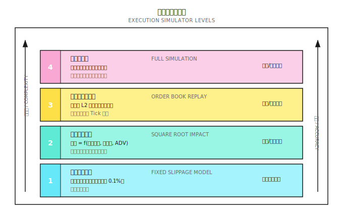
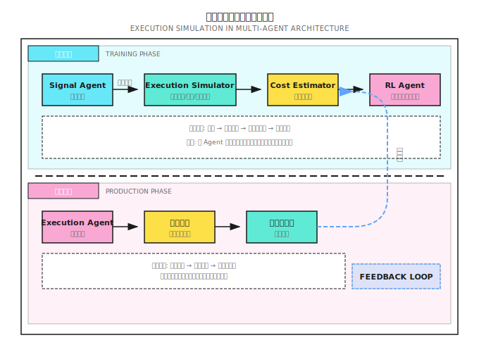

# 背景知识：执行模拟器实现

> "回测用 K 线收盘价成交，就像用地图上的直线距离规划徒步路线——忽略了所有真实的障碍。"

---

## 一、为什么需要执行模拟器？

### 1.1 回测与实盘的鸿沟

| 回测假设 | 实盘现实 |
|---------|---------|
| 信号发出即成交 | 信号到成交有延迟 |
| 以 Close 价成交 | 需要穿透订单簿多档 |
| 无限流动性 | 盘口深度有限 |
| 订单不影响市场 | 大单推动价格 |
| 100% 成交 | 限价单可能不成交 |

**执行模拟器的目标**：在回测阶段就模拟这些现实约束，筛掉那些"只在理想世界盈利"的策略。

### 1.2 模拟器的层次



---

## 二、Level 1：固定滑点模型

### 2.1 原理

最简单的模拟：每笔交易扣除固定成本。

```
实际成交价 = 理论价格 × (1 + 滑点方向 × 滑点率)

买入: 实际价 = 理论价 × (1 + slippage)
卖出: 实际价 = 理论价 × (1 - slippage)
```

### 2.2 典型参数

| 市场 | 建议滑点 | 适用场景 |
|-----|---------|---------|
| 美股大盘股 | 0.02-0.05% | AAPL, MSFT, SPY |
| 美股小盘股 | 0.1-0.3% | 日均成交量 < $10M |
| A 股 | 0.05-0.1% | 沪深 300 成分股 |
| 加密货币主流 | 0.03-0.1% | BTC, ETH |
| 加密货币山寨 | 0.3-1% | 小市值币种 |

### 2.3 代码实现

```python
class FixedSlippageSimulator:
    """固定滑点执行模拟器"""

    def __init__(self, slippage_rate: float = 0.001,
                 commission_rate: float = 0.0003):
        self.slippage_rate = slippage_rate
        self.commission_rate = commission_rate

    def execute(self, order: dict) -> dict:
        """
        模拟订单执行

        order = {
            'symbol': 'AAPL',
            'side': 'buy',  # 'buy' or 'sell'
            'quantity': 100,
            'price': 185.0,  # 理论价格（如 Close）
        }
        """
        price = order['price']
        quantity = order['quantity']

        # 滑点调整
        if order['side'] == 'buy':
            exec_price = price * (1 + self.slippage_rate)
        else:
            exec_price = price * (1 - self.slippage_rate)

        # 计算成本
        notional = exec_price * quantity
        commission = notional * self.commission_rate
        slippage_cost = abs(exec_price - price) * quantity

        return {
            'exec_price': exec_price,
            'exec_quantity': quantity,
            'fill_rate': 1.0,  # 固定模型假设 100% 成交
            'commission': commission,
            'slippage_cost': slippage_cost,
            'total_cost': commission + slippage_cost
        }
```

### 2.4 局限性

- 不反映订单大小的影响
- 不区分流动性好坏
- 不模拟部分成交
- 过于乐观或过于悲观（取决于参数设置）

---

## 三、Level 2：根号冲击模型

### 3.1 理论基础

根据 Almgren-Chriss 等研究，市场冲击与订单大小的平方根成正比：

```
滑点 = k × σ × √(Q / ADV)

其中:
  k   = 冲击系数（经验值 0.5-1.5）
  σ   = 日波动率
  Q   = 订单金额
  ADV = 日均成交额
```

**直觉解释**：
- 订单越大，"吃"掉的盘口越深
- 但关系不是线性的——第一层的影响比后面的大
- 波动率高时，市场对冲击更敏感

### 3.2 代码实现

```python
import numpy as np

class SquareRootImpactSimulator:
    """根号冲击模型执行模拟器"""

    def __init__(self,
                 impact_coef: float = 1.0,
                 commission_rate: float = 0.0003,
                 min_slippage: float = 0.0001):
        self.impact_coef = impact_coef
        self.commission_rate = commission_rate
        self.min_slippage = min_slippage

    def execute(self, order: dict, market_data: dict) -> dict:
        """
        order = {
            'symbol': 'AAPL',
            'side': 'buy',
            'quantity': 100,
            'price': 185.0,
        }

        market_data = {
            'volatility': 0.015,   # 日波动率
            'adv': 10_000_000_000, # 日均成交额
            'spread': 0.0001,     # 买卖价差率
        }
        """
        price = order['price']
        quantity = order['quantity']
        notional = price * quantity

        vol = market_data['volatility']
        adv = market_data['adv']
        spread = market_data.get('spread', 0.0001)

        # 根号冲击模型
        participation = notional / adv
        impact = self.impact_coef * vol * np.sqrt(participation)

        # 加上半个价差（crossing the spread）
        total_slippage = max(impact + spread / 2, self.min_slippage)

        # 执行价格
        if order['side'] == 'buy':
            exec_price = price * (1 + total_slippage)
        else:
            exec_price = price * (1 - total_slippage)

        # 成本计算
        commission = notional * self.commission_rate
        slippage_cost = abs(exec_price - price) * quantity

        return {
            'exec_price': exec_price,
            'exec_quantity': quantity,
            'fill_rate': 1.0,
            'commission': commission,
            'slippage_cost': slippage_cost,
            'total_cost': commission + slippage_cost,
            'impact_bps': impact * 10000,  # 冲击（基点）
        }
```

### 3.3 纸上练习

**场景**：买入 $1,000,000 的股票

| 股票 | 波动率 | ADV | 参与率 | 预期滑点 |
|-----|-------|-----|-------|---------|
| AAPL | 1.5% | $10B | 0.01% | 1.5% × √0.0001 = 0.015% |
| TSLA | 3% | $3B | 0.033% | 3% × √0.00033 = 0.055% |
| 小盘股 X | 4% | $10M | 10% | 4% × √0.1 = **1.26%** |

**发现**：同样 $100 万的订单，在小盘股的滑点是 AAPL 的 84 倍！

---

## 四、Level 3：订单簿回放模型

### 4.1 原理

使用真实的历史 Level-2 数据，模拟订单"穿透"订单簿的过程。

```
订单簿快照 (t=09:30:01.123):

卖五: $100.10 × 500
卖四: $100.08 × 300
卖三: $100.06 × 200
卖二: $100.04 × 100
卖一: $100.02 × 50
---------------------
买一: $100.00 × 80
买二: $99.98  × 150
...

市价买入 400 股:
  50 股 @ $100.02  (清空卖一)
  100 股 @ $100.04 (清空卖二)
  200 股 @ $100.06 (清空卖三)
  50 股 @ $100.08  (部分卖四)

加权平均价 = (50×100.02 + 100×100.04 + 200×100.06 + 50×100.08) / 400
           = $100.055

中间价 = ($100.02 + $100.00) / 2 = $100.01
滑点 = ($100.055 - $100.01) / $100.01 = 0.045%
```

### 4.2 完整实现

```python
from typing import List, Tuple, Optional
from dataclasses import dataclass

@dataclass
class OrderBookLevel:
    """订单簿单档"""
    price: float
    size: float  # 股数或金额

@dataclass
class OrderBook:
    """订单簿快照"""
    timestamp: float
    bids: List[OrderBookLevel]  # 买盘，价格降序
    asks: List[OrderBookLevel]  # 卖盘，价格升序

    @property
    def mid_price(self) -> float:
        if self.bids and self.asks:
            return (self.bids[0].price + self.asks[0].price) / 2
        return 0.0

    @property
    def spread(self) -> float:
        if self.bids and self.asks:
            return self.asks[0].price - self.bids[0].price
        return float('inf')

class OrderBookReplaySimulator:
    """订单簿回放执行模拟器"""

    def __init__(self,
                 commission_rate: float = 0.0003,
                 partial_fill_enabled: bool = True):
        self.commission_rate = commission_rate
        self.partial_fill_enabled = partial_fill_enabled

    def execute_market_order(self,
                             order_book: OrderBook,
                             side: str,
                             quantity: float) -> dict:
        """
        模拟市价单穿透订单簿
        """
        if side == 'buy':
            levels = order_book.asks
        else:
            levels = order_book.bids

        if not levels:
            return self._empty_fill(quantity)

        mid_price = order_book.mid_price
        remaining = quantity
        total_cost = 0.0
        filled = 0.0
        fills = []

        for level in levels:
            if remaining <= 0:
                break

            fill_qty = min(remaining, level.size)
            fill_price = level.price

            fills.append({
                'price': fill_price,
                'quantity': fill_qty
            })

            total_cost += fill_qty * fill_price
            filled += fill_qty
            remaining -= fill_qty

        if filled == 0:
            return self._empty_fill(quantity)

        # 计算结果
        avg_price = total_cost / filled

        if side == 'buy':
            slippage = (avg_price - mid_price) / mid_price
        else:
            slippage = (mid_price - avg_price) / mid_price

        commission = total_cost * self.commission_rate
        slippage_cost = abs(avg_price - mid_price) * filled

        return {
            'exec_price': avg_price,
            'exec_quantity': filled,
            'fill_rate': filled / quantity,
            'unfilled': remaining,
            'commission': commission,
            'slippage_cost': slippage_cost,
            'total_cost': commission + slippage_cost,
            'slippage_bps': slippage * 10000,
            'fills': fills,
            'levels_consumed': len(fills),
        }

    def execute_limit_order(self,
                            order_book: OrderBook,
                            side: str,
                            quantity: float,
                            limit_price: float,
                            queue_position: float = 0.5) -> dict:
        """
        模拟限价单执行

        queue_position: 在该价位的排队位置 (0=队首, 1=队尾)
        """
        if side == 'buy':
            # 买单：如果限价 >= 卖一，立即成交部分
            if order_book.asks and limit_price >= order_book.asks[0].price:
                return self.execute_market_order(order_book, side, quantity)
            # 否则进入排队
            return self._simulate_queue(order_book, side, quantity,
                                        limit_price, queue_position)
        else:
            # 卖单：如果限价 <= 买一，立即成交部分
            if order_book.bids and limit_price <= order_book.bids[0].price:
                return self.execute_market_order(order_book, side, quantity)
            return self._simulate_queue(order_book, side, quantity,
                                        limit_price, queue_position)

    def _simulate_queue(self, order_book: OrderBook, side: str,
                        quantity: float, limit_price: float,
                        queue_position: float) -> dict:
        """
        模拟限价单排队（简化版）

        实际中需要后续的订单流数据来判断是否成交
        这里返回一个估计的成交概率
        """
        mid = order_book.mid_price
        spread = order_book.spread

        if side == 'buy':
            # 买单挂在 limit_price
            distance_from_mid = (mid - limit_price) / mid
        else:
            distance_from_mid = (limit_price - mid) / mid

        # 简化的成交概率估计
        # 距离越远，成交概率越低
        fill_prob = max(0, 1 - distance_from_mid * 100)
        fill_prob *= (1 - queue_position * 0.5)  # 排队位置惩罚

        return {
            'exec_price': limit_price,
            'exec_quantity': 0,  # 未立即成交
            'fill_rate': 0,
            'fill_probability': fill_prob,
            'status': 'pending',
            'queue_position': queue_position,
        }

    def _empty_fill(self, quantity: float) -> dict:
        return {
            'exec_price': 0,
            'exec_quantity': 0,
            'fill_rate': 0,
            'unfilled': quantity,
            'commission': 0,
            'slippage_cost': 0,
            'total_cost': 0,
            'error': 'no_liquidity'
        }
```

### 4.3 使用示例

```python
# 构造订单簿
order_book = OrderBook(
    timestamp=1704067200.123,
    bids=[
        OrderBookLevel(100.00, 80),
        OrderBookLevel(99.98, 150),
        OrderBookLevel(99.96, 400),
    ],
    asks=[
        OrderBookLevel(100.02, 50),
        OrderBookLevel(100.04, 100),
        OrderBookLevel(100.06, 200),
        OrderBookLevel(100.08, 300),
        OrderBookLevel(100.10, 500),
    ]
)

simulator = OrderBookReplaySimulator()

# 小单：只吃卖一
result_small = simulator.execute_market_order(order_book, 'buy', 30)
print(f"小单 30 股: 成交价 ${result_small['exec_price']:.4f}, "
      f"滑点 {result_small['slippage_bps']:.2f} bps")

# 中单：吃掉前三档
result_medium = simulator.execute_market_order(order_book, 'buy', 300)
print(f"中单 300 股: 成交价 ${result_medium['exec_price']:.4f}, "
      f"滑点 {result_medium['slippage_bps']:.2f} bps")

# 大单：吃穿所有档位仍不够
result_large = simulator.execute_market_order(order_book, 'buy', 2000)
print(f"大单 2000 股: 成交 {result_large['exec_quantity']} 股, "
      f"成交率 {result_large['fill_rate']:.1%}")
```

**输出**：
```
小单 30 股: 成交价 $100.0200, 滑点 1.00 bps
中单 300 股: 成交价 $100.0467, 滑点 3.67 bps
大单 2000 股: 成交 1150 股, 成交率 57.5%
```

---

## 五、Level 4：全仿真环境

### 5.1 额外考虑的因素

| 因素 | 说明 | 实现复杂度 |
|-----|------|----------|
| 排队位置 | 你的订单在该价位排第几 | 高 |
| 时间衰减 | 排队时间越长，前面人越可能被成交 | 中 |
| 撤单模拟 | 其他人可能撤单，你的位置前移 | 高 |
| 隐藏单 | 冰山单、暗池单不可见 | 很高 |
| 自身冲击 | 你的订单影响后续价格 | 高 |

### 5.2 设计框架

```python
class FullSimulationEngine:
    """
    全仿真执行引擎（框架示意）

    实际实现需要：
    - 完整的 Tick 数据流
    - 事件驱动架构
    - 订单状态机
    """

    def __init__(self):
        self.order_book = None
        self.pending_orders = {}
        self.fills = []
        self.clock = 0

    def on_market_data(self, event: dict):
        """处理市场数据更新"""
        if event['type'] == 'order_book_update':
            self._update_order_book(event)
            self._check_pending_fills()
        elif event['type'] == 'trade':
            self._process_trade(event)

    def submit_order(self, order: dict) -> str:
        """提交订单，返回订单 ID"""
        order_id = self._generate_order_id()
        order['status'] = 'pending'
        order['submit_time'] = self.clock
        order['queue_position'] = self._estimate_queue_position(order)
        self.pending_orders[order_id] = order
        return order_id

    def _check_pending_fills(self):
        """检查挂单是否可以成交"""
        for order_id, order in list(self.pending_orders.items()):
            fill = self._try_fill(order)
            if fill:
                self.fills.append(fill)
                if fill['remaining'] == 0:
                    del self.pending_orders[order_id]

    def _try_fill(self, order: dict) -> Optional[dict]:
        """尝试成交订单"""
        # 检查价格是否触达
        # 检查排队位置是否轮到
        # 计算可成交数量
        # 返回成交结果
        pass

    def _estimate_queue_position(self, order: dict) -> int:
        """估计在订单簿中的排队位置"""
        # 统计该价位已有的挂单量
        pass
```

---

## 六、模拟器校准

### 6.1 用实盘数据校准

最准确的模拟器参数来自你自己的实盘交易记录。

**校准流程**：

```
1. 收集实盘成交数据
   - 订单提交时间、价格、数量
   - 实际成交时间、价格、数量
   - 当时的盘口快照（如有）

2. 计算实际滑点分布
   - 滑点 = (实际成交价 - 订单提交时中间价) / 中间价
   - 按订单大小分组统计

3. 拟合模型参数
   - 对于根号模型：拟合 k 值
   - 对于订单簿模型：验证穿透逻辑

4. 验证模型预测 vs 实际
   - 计算预测误差分布
   - 迭代调整参数
```

### 6.2 保守原则

在参数不确定时，宁可高估成本：

```python
class ConservativeSimulator:
    """保守模拟器：宁可高估成本"""

    def __init__(self,
                 base_simulator,
                 safety_margin: float = 1.5):
        self.base = base_simulator
        self.margin = safety_margin

    def execute(self, order: dict, market_data: dict) -> dict:
        result = self.base.execute(order, market_data)

        # 放大滑点
        result['slippage_cost'] *= self.margin

        # 降低成交率
        result['fill_rate'] = min(1.0, result['fill_rate'] / self.margin)

        # 重新计算总成本
        result['total_cost'] = (result['commission'] +
                                result['slippage_cost'])

        return result
```

---

## 七、多智能体视角

执行模拟器在多智能体系统中的位置：



---

## 八、常见误区

**误区一：模拟器越复杂越好**

不一定。复杂模拟器需要更多数据、更多参数，可能引入新的不确定性。选择与策略频率匹配的模拟器：

| 策略频率 | 推荐模拟器 |
|---------|----------|
| 日频/周频 | Level 2（根号模型） |
| 分钟频 | Level 2-3 |
| 秒频/Tick | Level 3-4 |

**误区二：模拟器参数一劳永逸**

市场流动性会变化：
- 市场恐慌时，滑点放大数倍
- 个股事件（财报、新闻）影响短期流动性
- 市场结构变化（如做市商策略调整）

**误区三：忽略部分成交**

限价单的部分成交是常态，不是例外。这意味着：
- 仓位可能不平衡
- 需要追单逻辑
- 风险敞口与预期不符

---

## 九、实用建议

### 9.1 分阶段实施

```
第一阶段：基础验证
  - 使用 Level 1（固定滑点）快速筛选策略
  - 淘汰毛利润低于 0.5%/笔的策略

第二阶段：精细化
  - 升级到 Level 2（根号模型）
  - 按标的流动性设置不同参数
  - 淘汰净利润 < 0 的策略

第三阶段：实盘校准
  - 小资金实盘采集数据
  - 用实盘数据校准模拟器
  - 形成闭环

第四阶段：持续优化
  - 定期用新的实盘数据更新参数
  - 监控模拟 vs 实际的偏差
  - 异常时触发警报
```

### 9.2 关键指标监控

```python
def compare_simulated_vs_actual(simulated: dict, actual: dict) -> dict:
    """对比模拟结果与实际成交"""

    slippage_error = (actual['slippage_bps'] -
                      simulated['slippage_bps'])

    fill_rate_error = (actual['fill_rate'] -
                       simulated['fill_rate'])

    return {
        'slippage_error_bps': slippage_error,
        'fill_rate_error': fill_rate_error,
        'is_conservative': slippage_error < 0,  # 模拟比实际悲观
        'needs_recalibration': abs(slippage_error) > 5,  # 超过 5bps 需校准
    }
```

---

## 十、总结

| 要点 | 说明 |
|-----|------|
| 核心目的 | 在回测阶段模拟真实执行约束 |
| 层次选择 | 策略频率越高，模拟器需要越精细 |
| 保守原则 | 参数不确定时，宁可高估成本 |
| 闭环校准 | 用实盘数据持续校准模拟器 |
| 最终目标 | 让回测结果接近实盘表现 |

---

## 延伸阅读

- [第 18 课：交易成本建模与可交易性](../第18课：交易成本建模与可交易性.md) - 成本模型理论
- [第 19 课：执行系统 - 从信号到真实成交](../第19课：执行系统%20-%20从信号到真实成交.md) - 执行系统设计
- [背景知识：Tick 级回测框架](../../Part2-量化基础/背景知识/Tick级回测框架.md) - 事件驱动回测与队列模拟
- [背景知识：高频交易与市场微结构](../../Part2-量化基础/背景知识/高频交易与市场微结构.md) - Kyle's Lambda 与订单流
- [背景知识：交易所与订单簿机制](../../Part2-量化基础/背景知识/交易所与订单簿机制.md) - 订单簿基础
