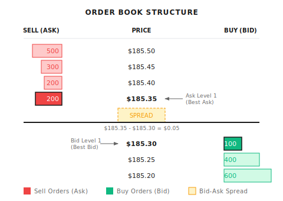

# Background: High-Frequency Market Microstructure

> "At the millisecond level, the market is not a random walk, but a battle between buyers and sellers."
> High-frequency trading (HFT) is an extreme form of quantitative trading. Retail traders cannot participate, but understanding it helps you recognize how markets actually work.

---

## 1. What is Market Microstructure?

**Traditional view**: Stock prices are determined by fundamentals—earnings, macroeconomics, industry trends

**Microstructure view**: Stock prices are determined by order flow—who's buying, who's selling, at what prices they're posting orders

```
Time scale comparison:

Fundamental Analysis: Months → Years
Technical Analysis: Days → Weeks
Market Microstructure: Milliseconds → Seconds
```

---

## 2. Core Concept: Order Book

**Order Book**: All currently unexecuted buy and sell orders



### Key Terminology

| Term | Definition | Significance |
|------|------------|--------------|
| Bid (Level 1) | Highest buy price | Best price to sell now |
| Ask (Level 1) | Lowest sell price | Best price to buy now |
| Spread | Ask - Bid | Implicit trading cost |
| Mid | (Bid + Ask) / 2 | Fair price estimate |
| Depth | Order quantity at each level | Market absorption capacity |

### L1/L2/L3 Data Levels

**L1 Data**:
- Best Bid
- Best Ask
- Corresponding sizes

**L2 Data**:
```
Ask Level 5: $100.10 x 500
Ask Level 4: $100.08 x 300
Ask Level 3: $100.06 x 200
Ask Level 2: $100.04 x 100
Ask Level 1: $100.02 x 50    ← Best Ask
-------------------------
Bid Level 1: $100.00 x 80    ← Best Bid
Bid Level 2: $99.98  x 150
Bid Level 3: $99.96  x 400
Bid Level 4: $99.94  x 600
Bid Level 5: $99.92  x 1000
```

**L3 Data**: Each individual order at each price level (Order ID, timestamp)

---

## 3. Order Types

### Market Order

```
Instruction: "Buy 100 shares immediately, any price"

Execution:
  - Fills at current ask level 1 price $185.35
  - If ask level 1 only has 50 shares, remaining 50 fills at ask level 2 $185.40

Pros: Guaranteed execution
Cons: May slip (adverse price)
```

### Limit Order

```
Instruction: "Buy 100 shares at $185.30 or lower"

Execution:
  - If there's a sell order at ≤$185.30 → Immediate fill
  - Otherwise → Enters order book and waits

Pros: Price control
Cons: May not execute
```

### Other Order Types

| Type | Function | Scenario |
|------|----------|----------|
| Stop | Becomes market order when price triggers | Risk control |
| Stop-Limit | Becomes limit order when triggered | Precise stop-loss |
| IOC (Immediate or Cancel) | Fill what you can | Urgent execution |
| FOK (Fill or Kill) | All or nothing | Avoid partial fills |
| Iceberg | Display only partial quantity | Hide large order intent |

---

## 4. Bid-Ask Spread and Liquidity

### Spread Components

| Component | Explanation | Proportion |
|-----------|-------------|------------|
| Inventory cost | Compensation for market maker holding inventory risk | 20-30% |
| Adverse selection | Protection against losses from informed traders | 40-50% |
| Order processing cost | Trading system and labor costs | 10-20% |

**Adverse selection** is key: Market makers worry about losing when trading with informed traders

```
Scenario:
  Someone knows Apple is about to release good news, quietly buys heavily
  Market maker doesn't know, sells to them at low price
  After news releases, market maker loses money

Response:
  Market makers widen spreads to compensate for these expected losses
```

### Spread and Liquidity

```
Good Liquidity:
  - Tight spread ($0.01)
  - Large order sizes
  - Large orders don't move price
  - Examples: AAPL, MSFT, SPY

Poor Liquidity:
  - Wide spread ($0.10+)
  - Small order sizes
  - Large orders significantly move price
  - Examples: Small caps, illiquid ETFs
```

---

## 5. Market Impact

**Definition**: The effect of your trade on price

```
You want to buy 10,000 shares of AAPL
Current order book:
  Ask Level 1: $185.35 × 200 shares
  Ask Level 2: $185.40 × 300 shares
  Ask Level 3: $185.45 × 500 shares
  ...

If buying all at once:
  Fill 200 @ $185.35
  Fill 300 @ $185.40
  Fill 500 @ $185.45
  ...

Average execution price might be $185.60
$0.25 higher than mid price → Market impact cost
```

### Impact Factors

| Factor | Impact | Reason |
|--------|--------|--------|
| Order size | Larger = bigger impact | Consumes more depth |
| Market liquidity | Low liquidity = bigger impact | Thin order book |
| Execution speed | Faster = bigger impact | Cannot hide intent |
| Information content | Informed trading = more persistent impact | Price discovery |

### Market Impact Model

```
Simplified square-root rule:

Market Impact ≈ σ × √(Q / V)

Where:
  σ = Daily volatility
  Q = Trade quantity
  V = Average daily volume

Example:
  Volatility = 2%
  Trade size = 1% of average daily volume

  Impact ≈ 2% × √0.01 = 0.2%
```

---

## 6. Role of Market Makers

**Market Maker**: Simultaneously places buy and sell orders, earns spread

```
Market Maker Strategy:
  Place buy order @ $185.30
  Place sell order @ $185.35

  If both sides fill:
    Sell price - Buy price = $0.05 profit

  Risks:
    Only one side fills → Inventory risk exposure
    Directional market → Losses
```

### Market Maker vs Directional Trader

| Dimension | Market Maker | Directional Trader |
|-----------|--------------|-------------------|
| Goal | Earn spread | Earn price movement |
| Holding period | Very short (seconds/minutes) | Longer (hours/days) |
| Risk exposure | Minimize directional | Has directional exposure |
| Profit source | Spread − Adverse selection − Inventory cost | Prediction accuracy |

---

## 7. Price Discovery Process

**Price Discovery**: How markets reflect information in prices

```
Information release → Informed traders order → Order flow changes → Price adjusts

Timeline example:
  T+0ms: Positive news released
  T+1ms: High-speed traders detect news
  T+5ms: Large buy orders flood in
  T+10ms: Ask level 1 consumed, price rises
  T+100ms: Price mostly reflects new information
  T+1000ms: Regular investors see price change
```

### Order Flow Toxicity

**Toxic Order Flow**: Order flow dominated by informed traders

```
Indicator: VPIN (Volume-Synchronized Probability of Informed Trading)

High VPIN → Informed traders active → High risk for market makers
Low VPIN → Noise traders dominate → Market makers safe

Applications:
  - Market makers adjust spreads based on VPIN
  - Warn of market stress (high VPIN may precede crash)
```

---

## 8. Order Flow and Kyle's Lambda

### 8.1 Order Flow Imbalance

**Definition**: Net difference between buy and sell orders per unit time

```
OFI = Buy-initiated volume - Sell-initiated volume

OFI > 0: Buy pressure dominates, price tends to rise
OFI < 0: Sell pressure dominates, price tends to fall
```

**How to determine trade direction?**

Use Lee-Ready algorithm:
```
If trade price > mid price: Buy-initiated (Taker is buyer)
If trade price < mid price: Sell-initiated (Taker is seller)
If trade price = mid price: Use previous trade's direction
```

**Intuitive explanation**:

> Imagine the order book as a street. Between bid level 1 and ask level 1 is "no man's land" (the spread).
> If someone is willing to "cross no man's land" to buy at the ask, they're urgent—usually informed traders.
> Their direction often represents true price pressure.

### 8.2 Kyle's Lambda (λ)

**Source**: Albert Kyle's classic 1985 paper

**Core idea**: Price sensitivity to order flow

```
ΔP = λ × OrderFlow

Where:
  ΔP = Price change
  λ  = Price impact coefficient (Kyle's Lambda)
  OrderFlow = Signed order flow (buys - sells)
```

**λ Interpretation**:

| λ Value | Market State | Trader Response |
|---------|--------------|-----------------|
| Low λ | Good liquidity, large orders have small impact | Can place large orders |
| High λ | Poor liquidity, large orders have big impact | Should slice orders |

### 8.3 λ Estimation Methods

**Method 1: Linear Regression**

```
Collect data over a period:
  - Price change ΔP every 5 minutes
  - Net order flow OFI every 5 minutes

Regression: ΔP = α + λ × OFI + ε

λ is the regression coefficient
```

**Paper exercise**:

Suppose you collected this data:

| Period | OFI ($Million) | ΔP (%) |
|--------|----------------|--------|
| 09:30-09:35 | +2.0 | +0.10% |
| 09:35-09:40 | -1.5 | -0.08% |
| 09:40-09:45 | +3.0 | +0.14% |
| 09:45-09:50 | -0.5 | -0.02% |
| 09:50-09:55 | +1.0 | +0.06% |

Simple estimate: λ ≈ 0.05% / $1M = **5 bps per million**

Interpretation: Every $1 million net buying pushes price up about 5 basis points.

**Method 2: Estimate from Order Book Depth**

```
λ ≈ Spread / (2 × Depth)

Where:
  Spread = Bid-ask spread
  Depth  = Order book depth (e.g., bid level 1 + ask level 1 total)
```

**Example**:
```
Spread = $0.02
Bid Level 1 = 5000 shares × $100 = $500,000
Ask Level 1 = 5000 shares × $100 = $500,000
Depth = $1,000,000

λ ≈ $0.02 / (2 × $1,000,000)
  ≈ 0.00001 per dollar
  ≈ 1 bp per $100,000
```

### 8.4 Applications of λ

**Application 1: Execution Cost Estimation**

```
Planning to execute $500,000 buy order
λ = 1 bp / $100,000

Expected impact = λ × OrderSize
         = 1 bp × 5
         = 5 bps = 0.05%

If stock price $100, expected execution price ≈ $100.05
```

**Application 2: Optimal Execution Strategy**

```
Large order slicing principle:

Single order size < Depth × (Acceptable impact / λ)

Example:
  - Acceptable impact: 10 bps
  - λ = 2 bps / $100,000
  - Single order limit = 10 / 2 × $100,000 = $500,000
```

**Application 3: Liquidity Monitoring**

```python
def calculate_lambda(price_changes: list,
                     order_flows: list) -> float:
    """
    Estimate Kyle's Lambda using linear regression
    """
    import numpy as np
    from scipy import stats

    # Filter outliers
    valid = [(dp, of) for dp, of in zip(price_changes, order_flows)
             if abs(of) > 0]

    if len(valid) < 10:
        return float('nan')

    dp = np.array([v[0] for v in valid])
    of = np.array([v[1] for v in valid])

    slope, intercept, r_value, p_value, std_err = stats.linregress(of, dp)

    return slope  # This is λ


def monitor_liquidity(historical_lambda: float,
                      current_lambda: float,
                      threshold: float = 2.0) -> dict:
    """
    Monitor liquidity changes
    """
    ratio = current_lambda / historical_lambda

    return {
        'lambda_ratio': ratio,
        'liquidity_warning': ratio > threshold,
        'suggested_action': 'reduce_order_size' if ratio > threshold else 'normal'
    }
```

### 8.5 λ and Market States

| Market Event | λ Change | Reason |
|--------------|----------|--------|
| Pre-earnings | ↑ Rises | Market makers withdraw, depth decreases |
| High volatility | ↑ Rises | Uncertainty increases |
| Open/Close | ↑ Rises | Liquidity concentrated |
| Calm trading day | ↓ Falls | Market makers quote aggressively |
| Index rebalancing | ↑↑ Significant rise | Passive fund large orders flood in |

### 8.6 Common Misconceptions

**Misconception 1: λ is constant**

λ varies with time:
- Intraday: High at open, low mid-day, high at close
- Event-driven: Spikes during news releases
- Seasonal: Generally higher during earnings season

**Misconception 2: Only look at λ, ignore Spread**

Complete trading cost = Spread + λ × OrderSize

Small orders mainly affected by Spread, large orders mainly by λ.

**Misconception 3: Estimate λ with daily data**

λ is a microstructure concept, should use tick or minute data. Daily data loses intraday information.

---

## 9. High-Frequency Trading Strategies

### HFT vs Regular Quant

| Dimension | HFT | Regular Quant |
|-----------|-----|---------------|
| Holding period | Milliseconds-seconds | Minutes-days-weeks |
| Latency requirement | Microsecond-level | Seconds acceptable |
| Capital threshold | $10M+ | $10K+ |
| Technical barrier | Extreme (FPGA, microwave) | Medium (Python) |
| Competitors | Top institutions | All market participants |
| Information advantage | Speed advantage | Analysis advantage |

### Core Strategy Types

| Strategy Type | Description | Profit Source |
|---------------|-------------|---------------|
| Market Making | Two-sided quotes earn spread | Spread revenue − Adverse selection − Inventory risk |
| Statistical Arbitrage* | Exploit price deviation mean reversion | Price dislocation correction |
| News Trading | Fast news interpretation (ms to minutes) | Information advantage |
| Latency Arbitrage | Exploit inter-exchange delays | Speed advantage |
| Structural Arbitrage | Exploit market structure mechanics (rebates, auctions, ETF creation/redemption) | System understanding |

> **\* About Statistical Arbitrage**: Stat arb is NOT exclusive to high-frequency trading. By holding period:
> - **High-frequency stat arb** (ms to seconds): Cross-exchange microstructure signals
> - **Intraday stat arb** (minutes to hours): Pairs trading, ETF-constituent arbitrage
> - **Medium/low-frequency stat arb** (days to weeks): Multi-factor, sector-neutral strategies
>
> Whether to go high-frequency depends on: **Signal decay speed vs. trading costs**. Fast decay "forces" high-frequency.

**Latency Arbitrage Example**:

```
NYSE Price: $185.35
BATS Price: $185.30 (delayed update)

Strategy:
  Buy on BATS @ $185.30
  Sell on NYSE @ $185.35
  Theoretical spread $0.05

⚠️ Real-world risks:
  - Leg risk: May only fill one side
  - Queue risk: Your order may not get filled at posted price
  - Adverse selection: Price may reverse instantly
  - Fees/slippage: May eat into profit

Prerequisite: Be faster than everyone else, and profit must cover fees and slippage
```

---

## 10. HFT Technical Infrastructure

### Latency Levels

| Level | Latency | Technology | Cost |
|-------|---------|------------|------|
| Seconds | 1000+ ms | Cloud server + Python | $ |
| Milliseconds | 1-100 ms | Dedicated server + C++ | $$ |
| Microseconds | 1-1000 μs | Co-location + C++ | $$$ |
| Nanoseconds | < 1000 ns | FPGA + Microwave | $$$$ |

### Co-location

**Data center colocation**: Place servers in exchange data center

- Physical distance: Meters vs thousands of kilometers
- Latency difference: Microseconds vs milliseconds
- Cost: $10,000-$100,000/month

### Network Optimization

**Traditional Fiber** vs **Microwave Communication**:

```
Chicago → New York
Fiber: ~14.5 ms
Microwave: ~8.5 ms (99% of light speed)

6ms difference = Huge advantage
```

**Laser Communication**: Has trade-offs with microwave—laser offers higher bandwidth but is more affected by fog/rain, while microwave is more weather-resistant but has lower bandwidth. Both are used for different scenarios.

### Hardware Acceleration

**FPGA (Field-Programmable Gate Array)**:
- Process trading logic directly in hardware circuits
- Latency: Nanosecond-level
- Development cost: $1M+
- Team required: Hardware engineers + Quant traders

**GPU**:
- Parallel computation for many strategies
- ML model inference
- Latency: Microsecond-level

---

## 11. Trading Cost Breakdown

Total cost of a trade (2024-2025):

```
Total Cost = Explicit Cost + Implicit Cost

Explicit Cost:
  - Commission: $0 for most US retail brokers (since 2019)
        or ~$0.003-0.005/share (institutional investors)
  - Exchange fees (~$0.003/share, make/take rates vary by exchange)
  - SEC fee (~$27.80/million sold)

Implicit Cost:
  - Bid-ask spread ($0.01-0.02/share)
  - Market impact ($0.02-0.10/share, depends on order size)
  - Timing cost (price change from decision to execution)
  - PFOF execution quality loss (cost of zero commission)

Example (Retail):
  Buy 1,000 shares @ $230
  Commission: $0 (but with PFOF)
  Spread cost: $10-20
  Impact cost: $20-50

  Total cost: $30-70 ≈ 0.02-0.03%
```

> **Note on Zero-Commission Model**: Brokers sell your order flow via PFOF (Payment for Order Flow) to market makers, which may result in execution prices slightly worse than NBBO.

---

## 12. Why Retail Cannot Do HFT

### Speed Gap

```
You: 100ms latency (already fast)
HFT: 0.01ms latency

By the time your order arrives, market has changed 10000 times
```

### Cost Gap

| Item | HFT Institution | Retail |
|------|-----------------|--------|
| Co-location | $50K/month | Cannot access |
| Data fees | $100K/year | Free delayed data |
| Tech team | $5M/year | Yourself |
| Capital | $100M+ | $10K |

### Information Gap

- L3 data: Institution exclusive
- Dark pool data: Institution exclusive
- Order flow data: Market maker exclusive

### Practical Impact

**HFT's impact on retail**:
- Positive: Provides liquidity, tightens spreads
- Negative: Gets "taxed" (slightly worse prices)

**Coping strategies**:
- Use limit orders instead of market orders
- Avoid trading during open/close volatility
- Don't do ultra-short-term intraday

---

## 13. History and Controversy of HFT

### Key Events

| Year | Event |
|------|-------|
| 2005 | Reg NMS implemented, fragmented trading begins |
| 2010 | Flash Crash, Dow drops 1000 points in 5 minutes |
| 2012 | Knight Capital loses $460M in 45 minutes |
| 2014 | *Flash Boys* published, HFT controversy peaks |
| 2015 | Citadel becomes largest market maker |

### Regulation and Controversy

**Supporters' view**:
- Provides liquidity
- Tightens bid-ask spreads
- Increases market efficiency

**Critics' view**:
- Systemic risk
- Unfair to regular investors
- Flash crash risk

**Regulatory trends**:
- Circuit breakers
- Minimum tick sizes
- Order cancellation fees

---

## 14. Multi-Agent Perspective

Market microstructure knowledge applied in multi-agent architecture:

```
Execution Agent
  │
  ├─ Monitor order book depth
  ├─ Evaluate market impact cost
  ├─ Decide execution strategy:
  │    - Large order → Split execution
  │    - Small order → Immediate execution
  │    - Urgent → Accept slippage
  │
  ↓
Risk Agent
  │
  ├─ Monitor toxicity indicators like VPIN
  ├─ Pause trading during high toxicity
  └─ Alert when liquidity dries up

Market State Agent
  │
  ├─ Track spread changes
  ├─ Identify liquidity regimes
  └─ Adjust strategy parameters
```

---

## 15. Common Misconceptions

**Misconception 1: Execution price is true cost**

Incomplete. True cost includes:
- The portion you pushed the price (impact cost)
- Price change while your order was resting (timing cost)

**Misconception 2: Liquidity is always available**

Liquidity disappears in crises:
- Market makers withdraw
- Spreads widen dramatically
- Orders cannot execute

During the 2010 Flash Crash, some stocks had spreads widen to several dollars.

**Misconception 3: All HFT is manipulation**

Most HFT strategies provide liquidity:
- Market makers tighten spreads
- Arbitrageurs eliminate price deviations
- Increase market efficiency

Of course predatory strategies exist, but not all.

---

## 16. Practical Advice

### For Low-Frequency Traders

```
1. Avoid large market orders
   - Split execution
   - Use limit orders

2. Avoid high-volatility periods
   - First and last half-hour have wide spreads
   - Major news releases have poor liquidity

3. Mind liquidity
   - Single trade size < 1% of daily volume
   - Otherwise market impact cost too high
```

### For Strategy Developers

```
1. Include realistic costs in backtests
   - Not just commission
   - Include spread and impact

2. Monitor volume
   - Strategy capacity = 1-5% of average daily volume
   - Returns degrade significantly beyond that

3. Use slippage models
   - Simple: Fixed percentage slippage
   - Advanced: Order book simulation
```

---

## 17. Further Reading

### Books
- *Flash Boys* - Michael Lewis (Popular read)
- *Trading and Exchanges* - Larry Harris (Market microstructure classic)
- *Algorithmic and High-Frequency Trading* - Cartea, Jaimungal, Penalva (Academic treatise)

### Data Sources
- Lobster (Academic order book data)
- TAQ (NYSE Trades and Quotes data)
- Exchange L2/L3 data subscriptions

---

## Summary

| Key Point | Description |
|-----------|-------------|
| Core concepts | Order book, Bid-ask spread, Market depth |
| Key costs | Spread + Market impact + Timing cost |
| Market maker role | Provide liquidity, earn spread |
| Price discovery | Order flow reflects information |
| Kyle's Lambda | Measures price sensitivity to order flow |
| HFT characteristics | Speed competition, high capital barrier, inaccessible to retail |
| Multi-agent application | Execution Agent optimizes execution |

> **Core Insight**: HFT is an extreme competition of technology and capital. The right strategy for retail is not to join this race, but to choose time scales where HFT cannot compete—win with patience and analytical ability.
