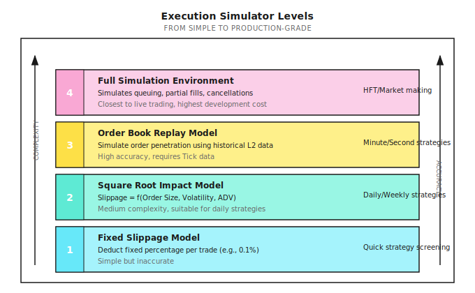
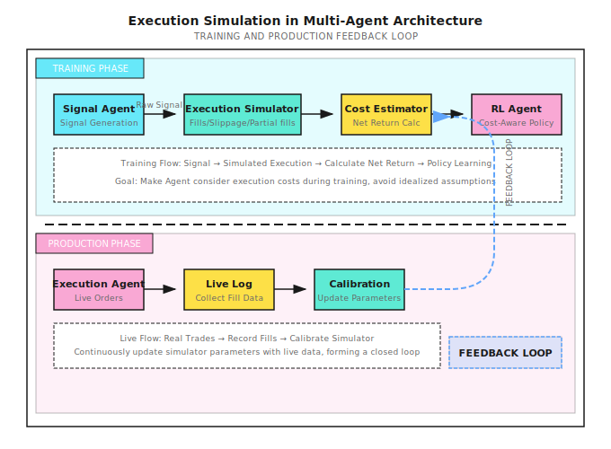

# Background: Execution Simulator Implementation

> "Backtesting with candle close prices is like planning a hiking route using straight-line distances on a map - ignoring all real obstacles."

---

## I. Why Do We Need an Execution Simulator?

### 1.1 The Gap Between Backtest and Live Trading

| Backtest Assumption | Live Reality |
|---------------------|--------------|
| Signal fires = instant execution | Delay from signal to execution |
| Execute at Close price | Must walk through order book levels |
| Unlimited liquidity | Order book depth is limited |
| Orders don't affect market | Large orders move prices |
| 100% fill rate | Limit orders may not fill |

**Execution Simulator Goal**: Simulate these real-world constraints during backtesting to filter out strategies that "only profit in an ideal world."

### 1.2 Simulator Levels



---

## II. Level 1: Fixed Slippage Model

### 2.1 Principle

The simplest simulation: deduct fixed cost per trade.

```
Actual execution price = Theoretical price x (1 + slippage direction x slippage rate)

Buy: Actual price = Theoretical price x (1 + slippage)
Sell: Actual price = Theoretical price x (1 - slippage)
```

### 2.2 Typical Parameters

| Market | Suggested Slippage | Applicable Scenario |
|--------|-------------------|---------------------|
| US Large Cap | 0.02-0.05% | AAPL, MSFT, SPY |
| US Small Cap | 0.1-0.3% | ADV < $10M |
| A-Shares | 0.05-0.1% | CSI 300 constituents |
| Crypto Major | 0.03-0.1% | BTC, ETH |
| Crypto Altcoins | 0.3-1% | Small market cap coins |

### 2.3 Code Implementation

```python
class FixedSlippageSimulator:
    """Fixed slippage execution simulator"""

    def __init__(self, slippage_rate: float = 0.001,
                 commission_rate: float = 0.0003):
        self.slippage_rate = slippage_rate
        self.commission_rate = commission_rate

    def execute(self, order: dict) -> dict:
        """
        Simulate order execution

        order = {
            'symbol': 'AAPL',
            'side': 'buy',  # 'buy' or 'sell'
            'quantity': 100,
            'price': 185.0,  # Theoretical price (e.g., Close)
        }
        """
        price = order['price']
        quantity = order['quantity']

        # Slippage adjustment
        if order['side'] == 'buy':
            exec_price = price * (1 + self.slippage_rate)
        else:
            exec_price = price * (1 - self.slippage_rate)

        # Calculate costs
        notional = exec_price * quantity
        commission = notional * self.commission_rate
        slippage_cost = abs(exec_price - price) * quantity

        return {
            'exec_price': exec_price,
            'exec_quantity': quantity,
            'fill_rate': 1.0,  # Fixed model assumes 100% fill
            'commission': commission,
            'slippage_cost': slippage_cost,
            'total_cost': commission + slippage_cost
        }
```

### 2.4 Limitations

- Doesn't reflect order size impact
- Doesn't differentiate liquidity quality
- Doesn't model partial fills
- Too optimistic or pessimistic (depends on parameter settings)

---

## III. Level 2: Square-Root Impact Model

### 3.1 Theoretical Basis

According to Almgren-Chriss and other research, market impact is proportional to the square root of order size:

```
Slippage = k x sigma x sqrt(Q / ADV)

Where:
  k   = impact coefficient (empirical value 0.5-1.5)
  sigma = daily volatility
  Q   = order amount
  ADV = Average Daily Volume
```

**Intuitive Explanation**:
- Larger orders "consume" deeper order book levels
- But relationship is not linear - first level's impact is larger than later ones
- Higher volatility makes market more sensitive to impact

### 3.2 Code Implementation

```python
import numpy as np

class SquareRootImpactSimulator:
    """Square-root impact model execution simulator"""

    def __init__(self,
                 impact_coef: float = 1.0,
                 commission_rate: float = 0.0003,
                 min_slippage: float = 0.0001):
        self.impact_coef = impact_coef
        self.commission_rate = commission_rate
        self.min_slippage = min_slippage

    def execute(self, order: dict, market_data: dict) -> dict:
        """
        order = {
            'symbol': 'AAPL',
            'side': 'buy',
            'quantity': 100,
            'price': 185.0,
        }

        market_data = {
            'volatility': 0.015,   # Daily volatility
            'adv': 10_000_000_000, # Average daily volume in dollars
            'spread': 0.0001,     # Bid-ask spread ratio
        }
        """
        price = order['price']
        quantity = order['quantity']
        notional = price * quantity

        vol = market_data['volatility']
        adv = market_data['adv']
        spread = market_data.get('spread', 0.0001)

        # Square-root impact model
        participation = notional / adv
        impact = self.impact_coef * vol * np.sqrt(participation)

        # Add half spread (crossing the spread)
        total_slippage = max(impact + spread / 2, self.min_slippage)

        # Execution price
        if order['side'] == 'buy':
            exec_price = price * (1 + total_slippage)
        else:
            exec_price = price * (1 - total_slippage)

        # Cost calculation
        commission = notional * self.commission_rate
        slippage_cost = abs(exec_price - price) * quantity

        return {
            'exec_price': exec_price,
            'exec_quantity': quantity,
            'fill_rate': 1.0,
            'commission': commission,
            'slippage_cost': slippage_cost,
            'total_cost': commission + slippage_cost,
            'impact_bps': impact * 10000,  # Impact in basis points
        }
```

### 3.3 Paper Exercise

**Scenario**: Buy $1,000,000 of stock

| Stock | Volatility | ADV | Participation | Expected Slippage |
|-------|------------|-----|---------------|-------------------|
| AAPL | 1.5% | $10B | 0.01% | 1.5% x sqrt(0.0001) = 0.015% |
| TSLA | 3% | $3B | 0.033% | 3% x sqrt(0.00033) = 0.055% |
| Small Cap X | 4% | $10M | 10% | 4% x sqrt(0.1) = **1.26%** |

**Discovery**: Same $1M order has 84x higher slippage on small caps vs. AAPL!

---

## IV. Level 3: Order Book Replay Model

### 4.1 Principle

Use real historical Level-2 data to simulate orders "walking through" the order book.

```
Order Book Snapshot (t=09:30:01.123):

Ask 5: $100.10 x 500
Ask 4: $100.08 x 300
Ask 3: $100.06 x 200
Ask 2: $100.04 x 100
Ask 1: $100.02 x 50
---------------------
Bid 1: $100.00 x 80
Bid 2: $99.98  x 150
...

Market Buy 400 shares:
  50 shares @ $100.02  (clear Ask 1)
  100 shares @ $100.04 (clear Ask 2)
  200 shares @ $100.06 (clear Ask 3)
  50 shares @ $100.08  (partial Ask 4)

VWAP = (50x100.02 + 100x100.04 + 200x100.06 + 50x100.08) / 400
     = $100.055

Mid price = ($100.02 + $100.00) / 2 = $100.01
Slippage = ($100.055 - $100.01) / $100.01 = 0.045%
```

### 4.2 Complete Implementation

```python
from typing import List, Tuple, Optional
from dataclasses import dataclass

@dataclass
class OrderBookLevel:
    """Single order book level"""
    price: float
    size: float  # Shares or dollar amount

@dataclass
class OrderBook:
    """Order book snapshot"""
    timestamp: float
    bids: List[OrderBookLevel]  # Buy side, price descending
    asks: List[OrderBookLevel]  # Sell side, price ascending

    @property
    def mid_price(self) -> float:
        if self.bids and self.asks:
            return (self.bids[0].price + self.asks[0].price) / 2
        return 0.0

    @property
    def spread(self) -> float:
        if self.bids and self.asks:
            return self.asks[0].price - self.bids[0].price
        return float('inf')

class OrderBookReplaySimulator:
    """Order book replay execution simulator"""

    def __init__(self,
                 commission_rate: float = 0.0003,
                 partial_fill_enabled: bool = True):
        self.commission_rate = commission_rate
        self.partial_fill_enabled = partial_fill_enabled

    def execute_market_order(self,
                             order_book: OrderBook,
                             side: str,
                             quantity: float) -> dict:
        """
        Simulate market order walking through order book
        """
        if side == 'buy':
            levels = order_book.asks
        else:
            levels = order_book.bids

        if not levels:
            return self._empty_fill(quantity)

        mid_price = order_book.mid_price
        remaining = quantity
        total_cost = 0.0
        filled = 0.0
        fills = []

        for level in levels:
            if remaining <= 0:
                break

            fill_qty = min(remaining, level.size)
            fill_price = level.price

            fills.append({
                'price': fill_price,
                'quantity': fill_qty
            })

            total_cost += fill_qty * fill_price
            filled += fill_qty
            remaining -= fill_qty

        if filled == 0:
            return self._empty_fill(quantity)

        # Calculate results
        avg_price = total_cost / filled

        if side == 'buy':
            slippage = (avg_price - mid_price) / mid_price
        else:
            slippage = (mid_price - avg_price) / mid_price

        commission = total_cost * self.commission_rate
        slippage_cost = abs(avg_price - mid_price) * filled

        return {
            'exec_price': avg_price,
            'exec_quantity': filled,
            'fill_rate': filled / quantity,
            'unfilled': remaining,
            'commission': commission,
            'slippage_cost': slippage_cost,
            'total_cost': commission + slippage_cost,
            'slippage_bps': slippage * 10000,
            'fills': fills,
            'levels_consumed': len(fills),
        }

    def execute_limit_order(self,
                            order_book: OrderBook,
                            side: str,
                            quantity: float,
                            limit_price: float,
                            queue_position: float = 0.5) -> dict:
        """
        Simulate limit order execution

        queue_position: Queue position at that price level (0=front, 1=back)
        """
        if side == 'buy':
            # Buy order: if limit >= ask 1, immediately fill part
            if order_book.asks and limit_price >= order_book.asks[0].price:
                return self.execute_market_order(order_book, side, quantity)
            # Otherwise enter queue
            return self._simulate_queue(order_book, side, quantity,
                                        limit_price, queue_position)
        else:
            # Sell order: if limit <= bid 1, immediately fill part
            if order_book.bids and limit_price <= order_book.bids[0].price:
                return self.execute_market_order(order_book, side, quantity)
            return self._simulate_queue(order_book, side, quantity,
                                        limit_price, queue_position)

    def _simulate_queue(self, order_book: OrderBook, side: str,
                        quantity: float, limit_price: float,
                        queue_position: float) -> dict:
        """
        Simulate limit order queue (simplified version)

        In practice, need subsequent order flow data to determine fill
        This returns an estimated fill probability
        """
        mid = order_book.mid_price
        spread = order_book.spread

        if side == 'buy':
            # Buy order at limit_price
            distance_from_mid = (mid - limit_price) / mid
        else:
            distance_from_mid = (limit_price - mid) / mid

        # Simplified fill probability estimate
        # Farther distance = lower fill probability
        fill_prob = max(0, 1 - distance_from_mid * 100)
        fill_prob *= (1 - queue_position * 0.5)  # Queue position penalty

        return {
            'exec_price': limit_price,
            'exec_quantity': 0,  # Not immediately filled
            'fill_rate': 0,
            'fill_probability': fill_prob,
            'status': 'pending',
            'queue_position': queue_position,
        }

    def _empty_fill(self, quantity: float) -> dict:
        return {
            'exec_price': 0,
            'exec_quantity': 0,
            'fill_rate': 0,
            'unfilled': quantity,
            'commission': 0,
            'slippage_cost': 0,
            'total_cost': 0,
            'error': 'no_liquidity'
        }
```

### 4.3 Usage Example

```python
# Construct order book
order_book = OrderBook(
    timestamp=1704067200.123,
    bids=[
        OrderBookLevel(100.00, 80),
        OrderBookLevel(99.98, 150),
        OrderBookLevel(99.96, 400),
    ],
    asks=[
        OrderBookLevel(100.02, 50),
        OrderBookLevel(100.04, 100),
        OrderBookLevel(100.06, 200),
        OrderBookLevel(100.08, 300),
        OrderBookLevel(100.10, 500),
    ]
)

simulator = OrderBookReplaySimulator()

# Small order: only consumes ask 1
result_small = simulator.execute_market_order(order_book, 'buy', 30)
print(f"Small order 30 shares: exec price ${result_small['exec_price']:.4f}, "
      f"slippage {result_small['slippage_bps']:.2f} bps")

# Medium order: consumes first 3 levels
result_medium = simulator.execute_market_order(order_book, 'buy', 300)
print(f"Medium order 300 shares: exec price ${result_medium['exec_price']:.4f}, "
      f"slippage {result_medium['slippage_bps']:.2f} bps")

# Large order: walks through all levels still not enough
result_large = simulator.execute_market_order(order_book, 'buy', 2000)
print(f"Large order 2000 shares: filled {result_large['exec_quantity']} shares, "
      f"fill rate {result_large['fill_rate']:.1%}")
```

**Output**:
```
Small order 30 shares: exec price $100.0200, slippage 1.00 bps
Medium order 300 shares: exec price $100.0467, slippage 3.67 bps
Large order 2000 shares: filled 1150 shares, fill rate 57.5%
```

---

## V. Level 4: Full Simulation Environment

### 5.1 Additional Factors Considered

| Factor | Description | Implementation Complexity |
|--------|-------------|---------------------------|
| Queue position | Your order's position at that price level | High |
| Time decay | Longer queue time = more people ahead get filled | Medium |
| Cancel simulation | Others may cancel, moving your position forward | High |
| Hidden orders | Iceberg orders, dark pool orders invisible | Very High |
| Self-impact | Your order affects subsequent prices | High |

### 5.2 Design Framework

```python
class FullSimulationEngine:
    """
    Full simulation execution engine (framework illustration)

    Actual implementation needs:
    - Complete tick data stream
    - Event-driven architecture
    - Order state machine
    """

    def __init__(self):
        self.order_book = None
        self.pending_orders = {}
        self.fills = []
        self.clock = 0

    def on_market_data(self, event: dict):
        """Process market data update"""
        if event['type'] == 'order_book_update':
            self._update_order_book(event)
            self._check_pending_fills()
        elif event['type'] == 'trade':
            self._process_trade(event)

    def submit_order(self, order: dict) -> str:
        """Submit order, return order ID"""
        order_id = self._generate_order_id()
        order['status'] = 'pending'
        order['submit_time'] = self.clock
        order['queue_position'] = self._estimate_queue_position(order)
        self.pending_orders[order_id] = order
        return order_id

    def _check_pending_fills(self):
        """Check if pending orders can fill"""
        for order_id, order in list(self.pending_orders.items()):
            fill = self._try_fill(order)
            if fill:
                self.fills.append(fill)
                if fill['remaining'] == 0:
                    del self.pending_orders[order_id]

    def _try_fill(self, order: dict) -> Optional[dict]:
        """Attempt to fill order"""
        # Check if price is reached
        # Check if queue position is reached
        # Calculate fillable quantity
        # Return fill result
        pass

    def _estimate_queue_position(self, order: dict) -> int:
        """Estimate queue position in order book"""
        # Count existing orders at that price level
        pass
```

---

## VI. Simulator Calibration

### 6.1 Calibrating with Live Data

The most accurate simulator parameters come from your own live trading records.

**Calibration Process**:

```
1. Collect live execution data
   - Order submit time, price, quantity
   - Actual execution time, price, quantity
   - Order book snapshot at time (if available)

2. Calculate actual slippage distribution
   - Slippage = (actual exec price - mid price at submit) / mid price
   - Group statistics by order size

3. Fit model parameters
   - For square-root model: fit k value
   - For order book model: validate walk-through logic

4. Validate model prediction vs. actual
   - Calculate prediction error distribution
   - Iteratively adjust parameters
```

### 6.2 Conservative Principle

When parameters are uncertain, prefer to overestimate costs:

```python
class ConservativeSimulator:
    """Conservative simulator: prefer to overestimate costs"""

    def __init__(self,
                 base_simulator,
                 safety_margin: float = 1.5):
        self.base = base_simulator
        self.margin = safety_margin

    def execute(self, order: dict, market_data: dict) -> dict:
        result = self.base.execute(order, market_data)

        # Amplify slippage
        result['slippage_cost'] *= self.margin

        # Reduce fill rate
        result['fill_rate'] = min(1.0, result['fill_rate'] / self.margin)

        # Recalculate total cost
        result['total_cost'] = (result['commission'] +
                                result['slippage_cost'])

        return result
```

---

## VII. Multi-Agent Perspective

The execution simulator's position in the multi-agent system:



---

## VIII. Common Misconceptions

**Misconception 1: More complex simulator is always better**

Not necessarily. Complex simulators need more data, more parameters, and may introduce new uncertainties. Choose a simulator that matches your strategy frequency:

| Strategy Frequency | Recommended Simulator |
|-------------------|----------------------|
| Daily/Weekly | Level 2 (Square-root model) |
| Minute-level | Level 2-3 |
| Second/Tick-level | Level 3-4 |

**Misconception 2: Simulator parameters are set once and done**

Market liquidity changes:
- During market panic, slippage multiplies several times
- Individual stock events (earnings, news) affect short-term liquidity
- Market structure changes (e.g., market maker strategy adjustments)

**Misconception 3: Ignoring partial fills**

Partial fills on limit orders are the norm, not the exception. This means:
- Positions may be unbalanced
- Need chase logic
- Risk exposure differs from expectation

---

## IX. Practical Recommendations

### 9.1 Phased Implementation

```
Phase 1: Basic Validation
  - Use Level 1 (fixed slippage) for quick strategy screening
  - Eliminate strategies with gross profit < 0.5%/trade

Phase 2: Refinement
  - Upgrade to Level 2 (square-root model)
  - Set different parameters by asset liquidity
  - Eliminate strategies with net profit < 0

Phase 3: Live Calibration
  - Small capital live trading to collect data
  - Use live data to calibrate simulator
  - Form closed loop

Phase 4: Continuous Optimization
  - Regularly update parameters with new live data
  - Monitor simulation vs. actual deviation
  - Trigger alerts on anomalies
```

### 9.2 Key Metric Monitoring

```python
def compare_simulated_vs_actual(simulated: dict, actual: dict) -> dict:
    """Compare simulated results with actual execution"""

    slippage_error = (actual['slippage_bps'] -
                      simulated['slippage_bps'])

    fill_rate_error = (actual['fill_rate'] -
                       simulated['fill_rate'])

    return {
        'slippage_error_bps': slippage_error,
        'fill_rate_error': fill_rate_error,
        'is_conservative': slippage_error < 0,  # Simulation more pessimistic than actual
        'needs_recalibration': abs(slippage_error) > 5,  # Over 5bps needs recalibration
    }
```

---

## X. Summary

| Key Point | Description |
|-----------|-------------|
| Core Purpose | Simulate real execution constraints during backtesting |
| Level Selection | Higher strategy frequency requires more refined simulator |
| Conservative Principle | When parameters uncertain, prefer to overestimate costs |
| Closed-Loop Calibration | Continuously calibrate simulator with live data |
| Ultimate Goal | Make backtest results approach live performance |

---

## Further Reading

- [Lesson 18: Trading Cost Modeling and Tradability](../Lesson-18-Trading-Costs-and-Tradability.md) - Cost model theory
- [Lesson 19: Execution System - From Signal to Real Fill](../Lesson-19-Execution-System.md) - Execution system design
- [Background: Tick-Level Backtest Framework](../../Part2-Quant-Fundamentals/Background/Tick-Level-Backtest-Framework.md) - Event-driven backtesting and queue simulation
- [Background: HFT and Market Microstructure](../../Part2-Quant-Fundamentals/Background/HFT-and-Market-Microstructure.md) - Kyle's Lambda and order flow
- [Background: Exchanges and Order Book Mechanics](../../Part2-Quant-Fundamentals/Background/Exchanges-and-Order-Book-Mechanics.md) - Order book fundamentals
