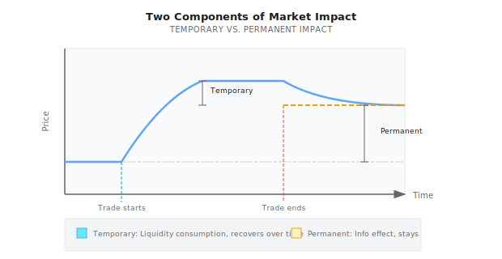
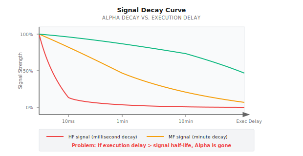
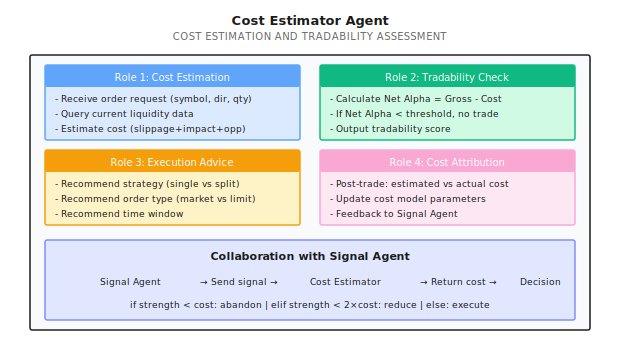

# Lesson 18: Trading Cost Modeling and Tradability

> **Alpha exists = (Gross Alpha - Cost) > 0**

---

## A Typical Scenario (Illustrative)

> Note: The following is a synthetic example to illustrate common phenomena; numbers are illustrative and do not correspond to any specific team/account.

In 2019, a quant team showed me their machine learning strategy:

```
Backtest Results (2015-2019):
- Annual Return: 45%
- Sharpe Ratio: 2.3
- Maximum Drawdown: 8%
- Monthly Win Rate: 78%
```

"This is the best strategy we've ever seen!" they said excitedly.

I asked one question: "What's your daily turnover rate?"

Answer: **300%**.

This means buying and selling stocks equivalent to 3 times the principal every day.

I asked them to recalculate, adding the following real-world costs:
- Trading commission: 0.03% (round trip)
- Market impact: 0.1% (conservative estimate)
- Slippage: 0.05%

```
Cost Calculation:
- Daily cost = 300% x (0.03% + 0.1% + 0.05%) = 0.54%
- Annual cost = 0.54% x 252 = 136%

Adjusted Backtest:
- Gross return: 45%
- Cost: -136%
- Net return: -91%
```

Their "money printer" turned into a "money shredder."

**This is why trading cost modeling is so important** - it determines whether your Alpha is real or an illusion.

---

## 18.1 The True Composition of Costs

### 18.1.1 Explicit Costs vs. Implicit Costs


### 18.1.2 Explicit Costs in Detail

| Cost Type | US Stocks | A-Shares | Cryptocurrency |
|-----------|-----------|----------|----------------|
| **Commission** | 0-0.005% | 0.03% | 0.02-0.1% |
| **Stamp Duty** | None | 0.1% (sell side) | None |
| **Exchange Fees** | 0.001% | Included in commission | Included in commission |
| **SEC Fees** | 0.00008% | None | None |
| **Transfer Fees** | None | 0.001% | None |

**US Stock Explicit Cost Example**:
```
Buying $100,000 of AAPL:
- Commission: $0-5 (depends on broker)
- Exchange fees: ~$1
- Total: ~$5 = 0.005%

Same for selling, round trip about 0.01%
```

### 18.1.3 Implicit Costs: The Invisible Killer

#### Slippage

**Definition**: The difference between your expected execution price and actual execution price

```
Expected to buy AAPL at $100.00
Actual execution price $100.05
Slippage = $0.05 = 0.05%
```

**Sources of Slippage**:

| Source | Explanation | Influencing Factors |
|--------|-------------|---------------------|
| **Bid-Ask Spread** | Gap between bid and ask | Liquidity, volatility |
| **Price Movement** | Time delay from order to execution | Market volatility, network latency |
| **Partial Fill** | Order split across multiple fills | Order size, order book depth |

#### Market Impact

**Definition**: Your trading itself pushes prices in an unfavorable direction

```
Scenario: You want to buy 10,000 shares of AAPL

Order Book:
  Ask 1: $100.00 x 2,000 shares
  Ask 2: $100.02 x 3,000 shares
  Ask 3: $100.05 x 5,000 shares

If you use a market order to buy all at once:
  First 2,000 shares: $100.00
  Next 3,000 shares: $100.02
  Last 5,000 shares: $100.05

Weighted average price: $100.029
Ideal price: $100.00
Market impact: 0.029%

Moreover: You've consumed Ask 2 and Ask 3
         The next buyer can only buy at higher prices
         This is "permanent impact"
```

#### Opportunity Cost

**Definition**: Potential returns lost due to inability to execute or delayed execution

```
Scenario:
  Price when signal fired: $100
  Your limit order: $99.50
  Price immediately rises to $105
  Your order never fills

Opportunity cost = $105 - $100 = 5%
```

---

## 18.2 Slippage Modeling

### 18.2.1 Linear Model

The simplest model assumes slippage is proportional to order size:

```
Slippage = k x OrderSize / ADV

Where:
- k = empirical coefficient (typically 0.1-0.5)
- OrderSize = order amount
- ADV = Average Daily Volume
```

**Paper Exercise**:

You want to buy $500,000 of stock, assuming k = 0.3

| Stock | ADV | Order Ratio | Expected Slippage |
|-------|-----|-------------|-------------------|
| AAPL | $10B | 0.005% | 0.3 x 0.005% = 0.0015% |
| TSLA | $3B | 0.017% | 0.3 x 0.017% = 0.005% |
| Small Cap X | $10M | 5% | 0.3 x 5% = **1.5%** |

**Discovery**: On small caps, a $500K order could generate $7,500 in slippage!

### 18.2.2 Square-Root Model

A more precise model considers nonlinear relationships:

```
Slippage = k x sigma x sqrt(OrderSize / ADV)

Where:
- sigma = daily volatility
- k = empirical coefficient (typically 0.5-1.5)
```

**Paper Exercise**:

| Stock | Volatility sigma | ADV | Order | Slippage (k=1) |
|-------|------------------|-----|-------|----------------|
| AAPL | 1.5% | $10B | $1M | 1.5% x sqrt(1M/10B) = 0.015% |
| AAPL | 1.5% | $10B | $100M | 1.5% x sqrt(100M/10B) = 0.15% |
| Small Cap | 3% | $10M | $1M | 3% x sqrt(1M/10M) = 0.95% |

**Key Findings**:
- Slippage grows sub-linearly with order size (square root relationship)
- High volatility stocks have larger slippage
- Small cap slippage can be 60x that of large caps

### 18.2.3 Estimating Slippage with Tick Data

With Level-2 data, you can estimate more precisely:

```
Method: Simulate order walking through the order book

1. Obtain historical order book snapshots
2. Simulate market order consuming each level
3. Calculate weighted average price vs. mid-price
4. Gather slippage distribution for different order sizes
```

<details>
<summary>Code Framework (Engineer Reference)</summary>

```python
def estimate_slippage(order_size: float,
                     order_book: dict,
                     side: str = 'buy') -> float:
    """
    Estimate slippage based on order book data

    order_book = {
        'bids': [(price1, size1), (price2, size2), ...],
        'asks': [(price1, size1), (price2, size2), ...]
    }
    """
    if side == 'buy':
        levels = order_book['asks']  # Buying consumes asks
    else:
        levels = order_book['bids']  # Selling consumes bids

    mid_price = (order_book['bids'][0][0] + order_book['asks'][0][0]) / 2
    filled = 0
    cost = 0

    for price, size in levels:
        if filled >= order_size:
            break
        fill_amount = min(size, order_size - filled)
        cost += fill_amount * price
        filled += fill_amount

    if filled < order_size:
        # Order book depth insufficient for full execution
        return float('inf')

    avg_price = cost / order_size
    slippage = (avg_price - mid_price) / mid_price

    return slippage if side == 'buy' else -slippage
```

</details>

---

## 18.3 Market Impact Modeling

### 18.3.1 Temporary Impact vs. Permanent Impact



### 18.3.2 Almgren-Chriss Model

This is the most famous market impact model:

```
Total Cost = Temporary Impact + Permanent Impact + Volatility Risk

Where:
  Temporary impact is proportional to trading speed (volume per unit time)
  Permanent impact is proportional to total trading volume
  Volatility risk is proportional to execution time x volatility

Trade-off:
  Trade fast -> High temporary impact, but low volatility risk
  Trade slow -> Low temporary impact, but high volatility risk
```

**Intuitive Explanation**:

> Imagine pouring a bucket of water into a pond.
> Pour fast (all at once) -> Big splash (temporary impact), but water settles quickly
> Pour slow (drop by drop) -> Small splash, but wind and rain may occur during (volatility risk)

### 18.3.3 Paper Exercise: Execution Strategy Selection

You want to buy $10M of AAPL (ADV = $10B), volatility = 1.5%/day

| Execution Strategy | Execution Time | Temporary Impact | Volatility Risk | Total Cost |
|-------------------|----------------|------------------|-----------------|------------|
| Single market order | Instant | High | None | High |
| 10 orders (1 day) | 1 day | Low | 1.5% | Medium |
| 50 orders (5 days) | 5 days | Very low | 3.4% | Potentially higher |

**Optimal Solution**: Balance based on urgency and risk preference

---

## 18.4 Tradability Assessment

### 18.4.1 Fill Probability Modeling

**The Limit Order Problem**: Your orders may not get filled

```
Fill probability P(fill) depends on:
1. Distance of limit price from current price
2. Queue depth at the price level
3. Price volatility range
4. Waiting time

Estimation formula (simplified):
P(fill) ~ 1 - exp(-lambda x time)

Where lambda relates to price distance and volatility
```

**Paper Exercise**:

You place a $99 limit buy order on a $100 stock (1% below market)

| Scenario | Daily Volatility | Expected Fill Probability |
|----------|------------------|---------------------------|
| Low volatility | 0.5% | ~20% (hard to reach -1%) |
| Medium volatility | 1.5% | ~60% (often reaches) |
| High volatility | 3% | ~85% (almost certainly reaches) |

**Problem**: High fill probability means prices often drop - might not be a good signal

### 18.4.2 Liquidity Cost Metrics

| Metric | Formula | Meaning |
|--------|---------|---------|
| **Order Ratio** | Order / ADV | Lower is better |
| **Liquidity Consumption** | Order / Order Book Depth | Lower is better |
| **Waiting Cost** | Signal Decay x Wait Time | Lower is better |
| **Total Cost** | Slippage + Impact + Opportunity Cost | Total cost |

### 18.4.3 Alpha Purification: From Gross to Net

```
Gross Alpha: Predicted return (from backtest)

Minus:
  - Explicit costs (commission, taxes)
  - Slippage (Bid-Ask + latency)
  - Market impact
  - Opportunity cost

Equals:
  Net Alpha: Actually achievable return

Key Formula:
  Strategy viable <=> Net Alpha > 0
  Strategy viable <=> Gross Alpha > Total Cost
```

**Paper Exercise**:

| Strategy | Gross Alpha | Turnover | Cost Per Trade | Annual Cost | Net Alpha |
|----------|-------------|----------|----------------|-------------|-----------|
| A | 15% | 50% | 0.2% | 2% | 13% |
| B | 20% | 200% | 0.2% | 8% | 12% |
| C | 30% | 500% | 0.2% | 20% | 10% |
| D | 40% | 1000% | 0.2% | 40% | 0% |
| E | 50% | 2000% | 0.2% | 80% | -30% |

**Findings**:
- Strategy E has highest gross Alpha but lowest net return
- Strategy A has lowest gross Alpha but highest net return
- **High turnover is the Alpha killer**

---

## 18.5 Strategy Crowding: When Everyone Trades the Same Signal

Cost modeling focuses on your own orders. But there is a systemic cost that no individual model can estimate: **what happens when hundreds of funds hold the same positions and try to exit at the same time.**

> **Case Study: 2024 China Small-Cap Quant Crisis**
>
> In early 2024, many of China's top quantitative funds suffered simultaneous drawdowns of 8-13% within weeks. Ubiquant, Lingjun, and High-Flyer -- firms managing tens of billions -- all posted double-digit losses in their CSI 500 enhanced products. The cause was not a single bad trade but **strategy homogenization**: most funds had overweighted small and micro-cap stocks using similar momentum and size factors. When regulatory tightening restricted micro-cap trading, forced liquidations triggered a positive feedback loop -- selling compressed liquidity, which forced more selling. Backtested slippage models, calibrated on normal conditions, wildly underestimated the impact.
>
> The lesson: your cost model must account for **crowding risk**. If your strategy uses widely published factors on capacity-constrained stocks, your true cost includes the tail risk of correlated unwinding.

For a deeper analysis of strategy homogenization dynamics, capacity estimation methods, and countermeasures, see [Background: Strategy Homogenization and Capacity Bottlenecks](Background/Strategy-Homogenization-and-Capacity-Bottlenecks.md).

---

## 18.6 Why Many ML Alphas Are Untradable

### 18.6.1 Signal Decay Rate vs. Execution Delay



### 18.6.2 Capacity Constraints of High-Frequency Alpha

| Alpha Type | Typical Decay | Capacity | Viability |
|------------|---------------|----------|-----------|
| Market Making | Milliseconds | $1-10M | Requires HFT infrastructure |
| Statistical Arbitrage | Seconds-minutes | $10-100M | Requires low latency |
| Technical Momentum | Minutes-hours | $100M-1B | Retail possibly viable |
| Fundamental Factors | Days-weeks | $1B+ | Ample capacity |

**Key Insight**:

> ML models easily discover short-term Alpha (because signal-to-noise ratio is high)
> But these Alphas often decay too fast for retail traders to execute

### 18.6.3 Case Study: High Win-Rate Strategy's Live Trading Collapse

**Backtest Results**:
- Daily win rate 65%
- Daily average return 0.3%
- Sharpe 3.0

**Strategy Characteristics**:
- Signal decay half-life: 2 minutes
- Average execution delay: 5 minutes

**Problem**:

```
When signal fires: Expected return +0.5%
After 2 minutes: Expected return +0.25% (50% decay)
After 5 minutes (actual execution): Expected return +0.06%

Minus 0.1% cost: Net return -0.04%

65% win rate x (-0.04%) = Continuous losses
```

---

## 18.7 Multi-Agent Perspective

### 18.7.1 Cost Estimator Agent



### 18.7.2 Cost-Aware Strategy Design

| Design Principle | Implementation |
|------------------|----------------|
| **Reduce turnover** | Extend holding period, raise signal threshold |
| **Select high liquidity assets** | Filter stocks with ADV < threshold |
| **Avoid high volatility periods** | No trading at open/close/events |
| **Use smart orders** | TWAP, VWAP, algorithmic trading |
| **Capacity management** | Strategy capacity = f(liquidity, impact) |

---

## Acceptance Criteria

After completing this lesson, use the following criteria to verify learning:

| Criterion | Standard | Self-Test Method |
|-----------|----------|------------------|
| Understand cost composition | Can list explicit and implicit costs | Draw cost pyramid |
| Estimate slippage | Can calculate slippage using square-root model | Complete paper exercises |
| Understand market impact | Can explain temporary and permanent impact | Give examples |
| Assess tradability | Can calculate Net Alpha | Evaluate a strategy |
| Understand ML Alpha traps | Can explain signal decay problem | Analyze a high-frequency strategy |

---

## Lesson Deliverables

After completing this lesson, you will have:

1. **Cost Classification Framework** - Explicit, implicit, opportunity costs
2. **Slippage Estimation Models** - Linear and square-root models
3. **Tradability Assessment Method** - Gross Alpha to Net Alpha
4. **Cost Estimator Agent Design** - Cost estimation and decision collaboration

---

## Key Takeaways

- [x] Trading cost = Explicit cost + Slippage + Market impact + Opportunity cost
- [x] Slippage has a square-root relationship with order size/ADV
- [x] Strategy viability = Net Alpha > 0 = Gross Alpha > Total Cost
- [x] High turnover is the Alpha killer
- [x] ML Alpha easily discovers short-term signals, but execution delay may make them uncapturable

---

## Further Reading

- [Lesson 19: Execution System - From Signal to Real Fill](Lesson-19-Execution-System.md) - More details on execution
- [Background: HFT and Market Microstructure](../Part2-Quant-Fundamentals/Background/HFT-and-Market-Microstructure.md) - Market microstructure basics, Kyle's Lambda
- [Background: Execution Simulator Implementation](Background/Execution-Simulator-Implementation.md) - Code implementation of 4-level execution simulator
- [Appendix A: Live Trading Logging Standards](Appendix/Appendix-A-Live-Trading-Logging-Standards.md) - What data to record

---

## Next Lesson Preview

**Lesson 19: Execution System - From Signal to Real Fill**

Cost modeling tells us "how expensive trading is." In the next lesson, we dive into execution: How to design orders? How to handle slippage? How to turn signals into actual fills in real markets?
