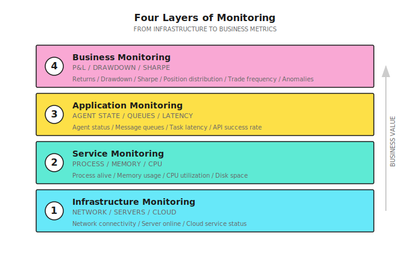
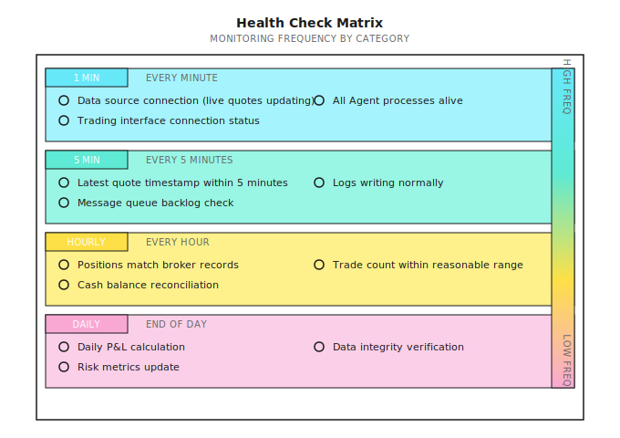
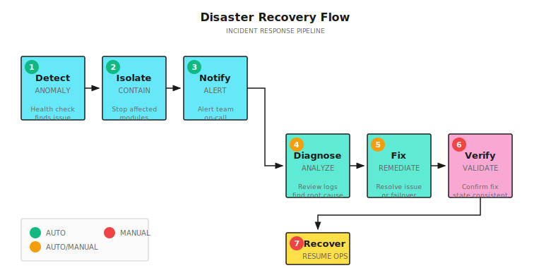
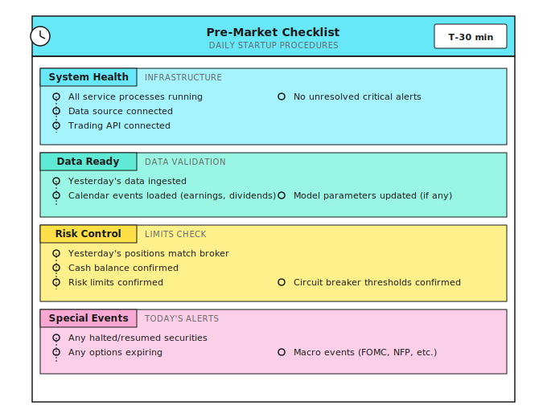
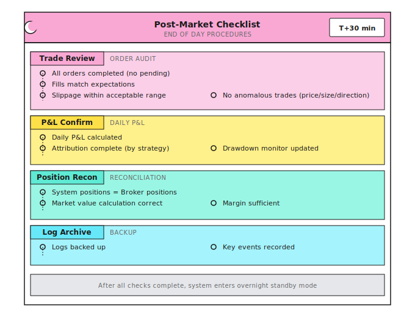
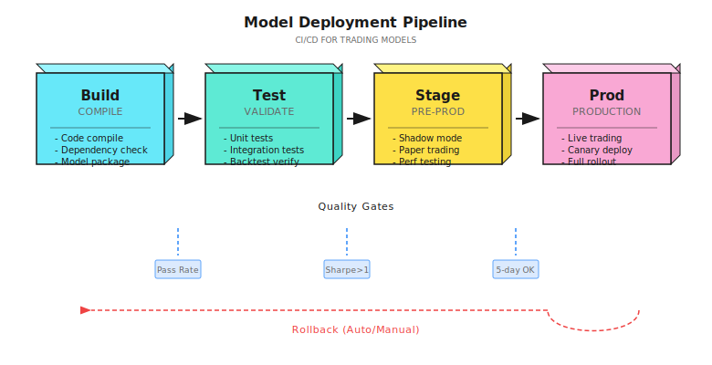
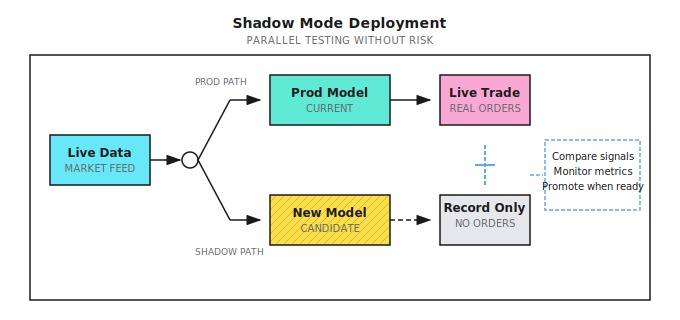
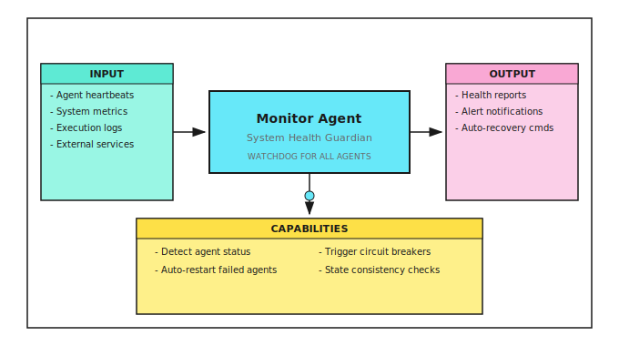

# Lesson 20: Production Operations

> **Goal**: Make the system run correctly even when you're not there, and notify you promptly when problems occur.

---

## A Typical Scenario (Illustrative)

> Note: The following is a synthetic example to illustrate common phenomena; numbers are illustrative and do not correspond to any specific individual/account.

In 2022, an independent quantitative trader launched his auto-trading system that he had carefully refined for six months. Backtests were perfect, and paper trading ran stably for three months. He confidently invested $500,000 in live trading.

The first two weeks, the system performed normally. On Monday of the third week, he was woken by a text message: account balance insufficient.

Investigation revealed: After Friday's close, the data source API had been updated with a changed return format. The system failed to parse, threw an exception, but the exception was silently swallowed. Over the weekend, the system had no log output (he thought weekends had no trading so he didn't pay attention). Monday at open, the system reconnected but state was confused, executing a series of absurd orders, including a massive short position.

By the time he discovered it, the account had lost 40%.

**Where did things go wrong?**
1. **No health checks**: Data source failure wasn't detected
2. **Exceptions were swallowed**: Errors weren't reported
3. **No monitoring alerts**: Two days of zero logs and nobody knew
4. **No circuit breaker**: Didn't stop trading when state was abnormal

This is why "code runs" and "system is reliable" are two different things. Operations isn't an afterthought - it's part of system design.

---

## 20.1 Monitoring System

### Four Levels of Monitoring



### Key Monitoring Metrics

| Level | Metric | Threshold Example | Alert Level |
|-------|--------|-------------------|-------------|
| **Infrastructure** | Server alive | Heartbeat timeout 30s | Critical |
| | Network latency | > 200ms | Warning |
| **Service** | CPU usage | > 80% for 5 minutes | Warning |
| | Memory usage | > 90% | Critical |
| | Disk space | < 10GB | Warning |
| **Application** | Data source connection | Disconnected > 1 minute | Critical |
| | API success rate | < 95% | Warning |
| | Task queue backlog | > 100 items | Warning |
| | Agent response latency | > 5s | Warning |
| **Business** | Daily drawdown | > 3% | Warning |
| | Weekly drawdown | > 5% | Critical |
| | Abnormal trade | Single trade > 10% position | Critical |
| | Trading frequency | 3x deviation from mean | Warning |

### Health Check Design



---

## 20.2 Logging System

### Golden Rules of Logging

> **Logs are a product, not a byproduct.**

| Principle | Explanation | Anti-Pattern |
|-----------|-------------|--------------|
| **Structured** | JSON format for easy querying and analysis | Free text "buy successful" |
| **Traceable** | Every log contains trace_id | Can't correlate logs for same trade |
| **Leveled** | DEBUG/INFO/WARN/ERROR | All using print() |
| **Contextual** | Include time, symbol, price, quantity | Just "Error occurred" |
| **Immutable** | Cannot be modified after writing | Logs stored locally and editable |

### Log Levels

| Level | Usage | Example |
|-------|-------|---------|
| **DEBUG** | Development debugging, disabled in production | "Calculating RSI for AAPL..." |
| **INFO** | Normal business flow | "Order submitted: BUY AAPL 100@$180" |
| **WARN** | Abnormal but recoverable | "API rate limited, retrying in 5s" |
| **ERROR** | Abnormal and needs attention | "Order rejected: insufficient margin" |
| **CRITICAL** | System-level failure | "Database connection lost" |

### Standard Trading Log Format

```json
{
  "timestamp": "2024-01-15T09:30:00.123Z",
  "level": "INFO",
  "service": "execution_agent",
  "trace_id": "tx_20240115_001",
  "event": "order_submitted",
  "data": {
    "symbol": "AAPL",
    "side": "BUY",
    "quantity": 100,
    "price": 180.50,
    "order_type": "LIMIT",
    "order_id": "ORD_12345"
  },
  "context": {
    "signal_id": "sig_20240115_001",
    "signal_strength": 0.75,
    "regime": "trending",
    "portfolio_value": 1000000
  }
}
```

**Key Fields**:
- `trace_id`: Connects the complete chain from signal to execution
- `event`: Standardized event name for easy statistical analysis
- `context`: Decision basis for post-hoc attribution

---

## 20.3 Alerting System

### Alert Design Principles

| Principle | Explanation |
|-----------|-------------|
| **Alerts must be actionable** | Know what to do when receiving alert |
| **Avoid alert fatigue** | Too many alerts = no alerts |
| **Tiered handling** | Different levels use different channels |
| **Include context** | Alert info sufficient to diagnose problem |

### Alert Channels

| Level | Channel | Response Time Requirement |
|-------|---------|---------------------------|
| **Low** | Email, daily summary | Next day |
| **Medium** | Slack/Teams message | Within 1 hour |
| **High** | SMS + phone call | Within 5 minutes |
| **Critical** | Auto circuit breaker + phone | Immediate |

### Alert Template

```
[CRITICAL] Trading System Alert

Time: 2024-01-15 10:30:15 EST
Service: Risk Agent
Event: Drawdown triggered control line

Details:
- Current drawdown: 10.2%
- Trigger threshold: 10%
- Today's P&L: -$52,000
- Account equity: $948,000

Actions taken:
- Stopped new positions
- Started deleveraging process

You need to:
- Check for abnormal trades
- Confirm if manual intervention needed

Dashboard: https://dashboard.example.com/alerts/12345
```

### Alert Suppression

| Problem | Solution |
|---------|----------|
| Same issue repeated alerts | Aggregation: Same type alerts only one per 5 minutes |
| Momentary jitter triggers alert | Duration: Threshold must persist N minutes to alert |
| Non-trading hours at night | Quiet period: Non-trading hours downgrade to low priority |
| Known maintenance windows | Suppression: No alerts during preset maintenance periods |

---

## 20.4 Disaster Recovery

### Failure Classification

| Failure Type | Example | Impact | Recovery Strategy |
|--------------|---------|--------|-------------------|
| **Data source failure** | API unavailable | Cannot get quotes | Switch to backup source |
| **Trading interface failure** | Broker maintenance | Cannot place orders | Pause trading, log pending orders |
| **Local service failure** | Agent process crash | Partial function loss | Auto-restart |
| **Network failure** | Network outage | Complete failure | Wait for recovery, manual state verification |
| **Data error** | Abnormal price jumps | Wrong decisions | Detect anomaly, pause processing |

### Recovery Flow



### State Consistency Checks

Must verify after recovery:

| Check Item | Method | Inconsistency Handling |
|------------|--------|------------------------|
| Position consistency | Compare system records with broker | Use broker as source of truth, update local |
| Order status | Query all pending orders | Cancel or confirm |
| Cash balance | Compare calculated vs. actual | Recalculate |
| Data completeness | Check for missing market data | Backfill missing data |

---

## 20.5 Daily Operations Checklists

### Pre-Market Checks (Daily Must-Do)



### Market-Hours Automation

One of the most overlooked reliability requirements is **automated scheduling around market hours**. Production systems should not depend on a human remembering to start the system each morning.

```
Automation Schedule (US Equities, Eastern Time):

09:15 ET  Auto-start: data connections, health checks, position reconciliation
09:25 ET  Pre-market validation: confirm data feeds live, risk parameters loaded
09:30 ET  Market open: trading logic active
15:50 ET  End-of-day: stop new position entries, begin close-only mode
16:00 ET  Market close: final position snapshot
16:05 ET  Post-close: P&L calculation, log aggregation, alert summary
16:30 ET  Auto-stop: graceful shutdown of non-essential processes

Weekday-only: Use cron or systemd timers with market calendar awareness.
Skip holidays (Martin Luther King Day, Thanksgiving, etc.).
```

> **Why this matters**: A system that requires manual startup introduces human error as a daily risk. One forgotten morning during a volatile open can cause the kind of state-confusion disaster described in this lesson's opening story. Automate the lifecycle, and treat manual intervention as the exception.

### Post-Market Checks (Daily Must-Do)



### Weekly/Monthly Checks

| Frequency | Check Item | Purpose |
|-----------|------------|---------|
| **Weekly** | Strategy performance review | Identify abnormal trends |
| | System resource usage trends | Prevent resource exhaustion |
| | Alert summary analysis | Discover systemic issues |
| **Monthly** | Complete P&L attribution | Strategy evaluation |
| | Model drift detection | Identify failing signals |
| | Infrastructure assessment | Cost and performance optimization |
| | Disaster recovery drill | Verify recovery process |

---

## 20.6 Provider Abstraction

As your system matures, you will inevitably switch data providers, add execution venues, or run across multiple brokers. If your core logic is tightly coupled to a specific vendor's API, each change becomes a rewrite.

The solution is a **clean provider interface** that isolates vendor-specific details behind a stable contract:

```
Data Provider Interface:
  Connect(config)     -> connection
  Subscribe(symbols)  -> stream
  Stream()            -> MarketDataEvent

Execution Venue Interface:
  SubmitOrder(order)   -> OrderAck
  CancelOrder(id)      -> CancelAck
  GetPositions()       -> []Position
```

Each vendor gets a thin adapter that implements this interface. Your Signal Agent, Risk Agent, and Monitor Agent never know or care which broker or data source is behind the interface. This pattern enables multi-venue trading, failover to backup data sources, and clean testing with mock providers -- all without touching core logic.

> **Design Principle**: Treat every external dependency (data, execution, alerts) as a replaceable module behind an interface. The first vendor switch will repay the abstraction cost many times over.

---

## 20.7 Model Deployment and CI/CD

### 20.7.1 Why Trading Systems Need CI/CD

> **Every deployment is a risk event. CI/CD makes this risk controllable.**

Problems with traditional approach:

| Problem | Consequence |
|---------|-------------|
| Manual deployment | Easy to miss steps, configuration errors |
| No version tracking | Can't rollback to known good version when problems occur |
| Inconsistent environments | "Works on my machine," but fails in production |
| Insufficient testing | New code introduces bugs, discovered only after deployment |
| No model update records | Don't know when or why models were updated |

### 20.7.2 CI/CD Pipeline for Trading Systems



### 20.7.3 Stage Details

**Stage 1: Build**

```yaml
# Example: GitHub Actions configuration
build:
  steps:
    - name: Checkout code
      uses: actions/checkout@v3

    - name: Install dependencies
      run: pip install -r requirements.txt

    - name: Type checking
      run: mypy src/ --strict

    - name: Code formatting
      run: ruff check src/

    - name: Package model
      run: |
        python -m src.models.package \
          --model-path models/signal_v3.pkl \
          --output artifacts/
```

**Stage 2: Test**

| Test Type | Content | Pass Criteria |
|-----------|---------|---------------|
| **Unit tests** | Function logic correct | 100% pass |
| **Integration tests** | Agent collaboration normal | 100% pass |
| **Backtest validation** | Performance on historical data | Sharpe > threshold, drawdown < threshold |
| **Sanity checks** | No obvious overfitting | Out-of-sample Sharpe > In-sample x 0.7 |

```python
# Backtest validation example
def test_model_performance():
    """Ensure new model meets minimum standards in backtest"""
    results = run_backtest(
        model='models/signal_v3.pkl',
        start_date='2022-01-01',
        end_date='2023-12-31'
    )

    assert results['sharpe'] >= 1.0, f"Sharpe ratio insufficient: {results['sharpe']}"
    assert results['max_drawdown'] <= 0.15, f"Drawdown too large: {results['max_drawdown']}"
    assert results['win_rate'] >= 0.45, f"Win rate insufficient: {results['win_rate']}"

    # Overfitting check
    in_sample_sr = results['in_sample_sharpe']
    out_sample_sr = results['out_sample_sharpe']
    assert out_sample_sr >= in_sample_sr * 0.7, "Out-of-sample performance decay too large, possible overfitting"
```

> **Quality Gate: Dual-Layer Backtest Validation**
>
> A robust CI/CD pipeline should require **two layers** of backtest validation before any deployment:
>
> 1. **Fast vectorized backtest** -- Tests pure signal logic (factor returns, IC, turnover) in seconds. Catches regressions in alpha generation quickly.
> 2. **OMS-integrated backtest** -- Routes signals through the full order management path (risk checks, order splitting, simulated fills with slippage). Catches execution-reality gaps that vectorized tests miss.
>
> Both layers must pass. A signal that looks profitable in vectorized testing but fails after realistic execution modeling is not deployable. Making this a required CI gate prevents the most common class of production failures: strategies that work in theory but lose money to friction.

**Stage 3: Stage (Pre-Release)**

Shadow Mode:



Shadow Mode Running Standards:

| Metric | Pass Criteria | Check Frequency |
|--------|---------------|-----------------|
| Signal consistency | New/old signal correlation > 0.9 or clear improvement | Real-time |
| Latency | New model latency < Production model x 1.2 | Hourly |
| Resource usage | CPU/memory within budget | Every 5 minutes |
| Abnormal signals | No extreme signals (> 3 standard deviations) | Real-time |
| Run duration | At least 5 trading days | - |

**Stage 4: Prod (Production)**

Gradual Release Strategies:

| Strategy | Applicable Scenario | Risk Control |
|----------|---------------------|--------------|
| **Canary** | Small portion of capital on new model first | 5% -> 25% -> 50% -> 100% |
| **Blue-Green** | Instant switch, maintain rollback capability | Can switch back to old version anytime |
| **Rolling** | Gradually replace Agent instances | Replace one at a time |

```python
class CanaryDeployment:
    """Canary deployment controller"""

    def __init__(self, old_model, new_model):
        self.old_model = old_model
        self.new_model = new_model
        self.canary_weight = 0.05  # Start at 5%

    def get_signal(self, market_data: dict) -> dict:
        # Distribute traffic by weight
        if random.random() < self.canary_weight:
            signal = self.new_model.predict(market_data)
            signal['model_version'] = 'canary'
        else:
            signal = self.old_model.predict(market_data)
            signal['model_version'] = 'stable'
        return signal

    def promote_canary(self, new_weight: float):
        """Increase canary weight, gradually ramp up"""
        if new_weight > self.canary_weight:
            log.info(f"Promoting canary weight: {self.canary_weight:.0%} -> {new_weight:.0%}")
            self.canary_weight = new_weight

    def rollback(self):
        """Rollback to stable version"""
        log.warning("Canary rollback! Switching to stable version")
        self.canary_weight = 0.0
```

### 20.7.4 Model Version Management

**Version Naming Convention**:

```
Model version format: v{major}.{minor}.{patch}-{timestamp}

Example:
  v2.3.1-20240115  # Version v2.3.1 from January 15, 2024

Version rules:
  major: Model architecture change (e.g., from XGBoost to neural network)
  minor: Feature or parameter adjustment
  patch: Bug fix
```

**Model Registry**:

| Field | Example | Description |
|-------|---------|-------------|
| `model_id` | `signal_v2.3.1` | Unique identifier |
| `created_at` | `2024-01-15 10:30:00` | Creation time |
| `created_by` | `auto_train_pipeline` | Creator (person or pipeline) |
| `metrics` | `{"sharpe": 1.5, "drawdown": 0.08}` | Validation metrics |
| `status` | `staging` / `production` / `retired` | Current status |
| `artifact_path` | `s3://models/signal_v2.3.1.pkl` | Storage location |
| `config_hash` | `a1b2c3d4...` | Configuration file hash |
| `data_hash` | `e5f6g7h8...` | Training data hash (reproducibility) |

### 20.7.5 Auto Rollback

```python
class AutoRollback:
    """Auto rollback controller"""

    def __init__(self, rollback_thresholds: dict):
        self.thresholds = rollback_thresholds
        self.metrics_buffer = []

    def check_and_rollback(self, current_metrics: dict) -> bool:
        """Check if rollback is needed"""

        # Immediate rollback conditions (single trigger)
        if current_metrics.get('error_rate', 0) > self.thresholds['max_error_rate']:
            self.trigger_rollback("Error rate too high")
            return True

        if current_metrics.get('latency_p99', 0) > self.thresholds['max_latency']:
            self.trigger_rollback("Latency too high")
            return True

        # Cumulative rollback conditions (trend judgment)
        self.metrics_buffer.append(current_metrics)
        if len(self.metrics_buffer) >= 10:  # Sufficient samples
            recent_sharpe = np.mean([m['sharpe'] for m in self.metrics_buffer[-10:]])
            if recent_sharpe < self.thresholds['min_sharpe']:
                self.trigger_rollback(f"Sharpe declined: {recent_sharpe:.2f}")
                return True

        return False

    def trigger_rollback(self, reason: str):
        """Execute rollback"""
        log.error(f"Triggering auto rollback: {reason}")

        # 1. Switch to last stable version
        model_registry.activate('last_stable')

        # 2. Send alert
        alert_system.send(
            level='critical',
            title='Model Auto Rollback',
            message=f'Reason: {reason}'
        )

        # 3. Record rollback event
        audit_log.record('rollback', {'reason': reason})
```

### 20.7.6 CI/CD Implementation Checklist

```
+-------------------------------------------------------------+
|               CI/CD Implementation Checklist                 |
+-------------------------------------------------------------+
|                                                             |
|  [ ] Version Control                                        |
|    +-- All code in Git                                      |
|    +-- Model files have version numbers                     |
|    +-- Configuration separated from code                    |
|    +-- Training data has snapshots                          |
|                                                             |
|  [ ] Automated Testing                                      |
|    +-- Unit tests cover core logic                          |
|    +-- Backtest as part of CI                               |
|    +-- Performance benchmark tests                          |
|    +-- Overfitting detection                                |
|                                                             |
|  [ ] Deployment Process                                     |
|    +-- One-click deployment (no manual steps)               |
|    +-- Shadow mode validation                               |
|    +-- Gradual release mechanism                            |
|    +-- One-click rollback                                   |
|                                                             |
|  [ ] Observability                                          |
|    +-- Deployment event logging                             |
|    +-- Version and performance correlation                  |
|    +-- Auto-triggered rollback                              |
|    +-- Change audit trail                                   |
|                                                             |
+-------------------------------------------------------------+
```

---

## 20.8 Multi-Agent Perspective

### Monitor Agent's Role



### Health Collaboration Between Agents

| Agent | Reports to Monitor | Receives from Monitor |
|-------|-------------------|----------------------|
| Signal Agent | Signal generation latency, success rate | Pause/resume |
| Risk Agent | Risk trigger count, status | Forced circuit breaker |
| Execution Agent | Order status, execution quality | Cancel pending orders |
| Regime Agent | Detection latency, confidence | Switch to default state |
| Data Agent | Data update time, quality | Switch data source |

---

## Acceptance Criteria

After completing this lesson, use the following criteria to verify learning:

| Criterion | Standard | Self-Test Method |
|-----------|----------|------------------|
| Understand monitoring levels | Can describe content of four monitoring levels | List key metrics for each level |
| Design log format | Can design structured trading logs | Write a complete trading log JSON |
| Design alert rules | Can distinguish alert levels and channels | Design alert matrix for your system |
| Understand recovery flow | Can describe failure recovery steps | Draw recovery flow diagram |
| Master daily checklists | Can list pre/post-market check items | Create your checklists |

### Comprehensive Exercise

**Design Your Operations System**:

1. List key metrics you need to monitor (at least 10)
2. Design log format (include necessary fields)
3. Design alert rules (metric, threshold, level, channel)
4. Write pre-market checklist
5. Design recovery flow for a failure scenario

---

## Lesson Deliverables

After completing this lesson, you will have:

1. **Four-Level Monitoring Framework** - Infrastructure/Service/Application/Business
2. **Log Standard Template** - Structured trading log format
3. **Alert Design Guidelines** - Levels, channels, suppression strategies
4. **Operations Checklists** - Pre/post-market check items
5. **CI/CD Deployment Pipeline** - Build, test, shadow mode, gradual release

---

## Key Takeaways

- [x] Understand the four levels of monitoring and their key metrics
- [x] Master structured log design principles
- [x] Understand alerting system design essentials
- [x] Master failure recovery flow and state consistency checks
- [x] Establish habit of daily operations checks
- [x] Design CI/CD pipeline for safe model deployment

---

## Further Reading

- [Lesson 19: Execution System](Lesson-19-Execution-System.md) - Monitoring focus for execution
- [Background: Execution Simulator Implementation](Background/Execution-Simulator-Implementation.md) - Execution simulation for CI/CD testing
- [Lesson 17: Online Learning and Strategy Evolution](../Part4-Multi-Agent/Lesson-17-Online-Learning-and-Strategy-Evolution.md) - Model drift detection implementation details
- [Appendix A: Live Trading Logging Standards](Appendix/Appendix-A-Live-Trading-Logging-Standards.md) - Detailed logging specifications

---

## Next Lesson Preview

**Lesson 21: Project Implementation**

Theory ends here. In the next lesson, we'll build a complete multi-agent trading system from scratch - integrating all knowledge from the first 20 lessons, from architecture design to code implementation, from backtest validation to production deployment.
