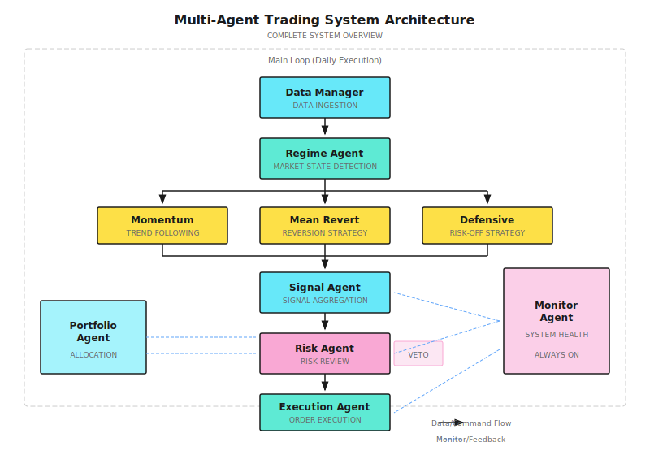

# Lesson 21: Project Implementation

> **Goal**: Integrate knowledge from the first 20 lessons to build a runnable multi-agent trading system prototype from scratch.

---

## Project Overview

This lesson will guide you through building an **end-to-end multi-agent trading system**. This is not a toy project, but a framework that can be extended into a real trading system.

### System Goals

| Dimension | Goal | Non-Goal |
|-----------|------|----------|
| **Function** | Identify market regime, generate signals, control risk, execute trades | High-frequency trading, complex derivatives |
| **Market** | US stock daily frequency strategy | Sub-minute strategies |
| **Scale** | Portfolio of 10-50 stocks | Stock selection from thousands |
| **Operation** | Local development environment + paper trading | Direct live trading |

### Final Deliverables

```
multi-agent-trading-system/
├── agents/
│   ├── regime_agent.py      # Market regime detection
│   ├── signal_agent.py      # Signal generation
│   ├── risk_agent.py        # Risk control
│   ├── execution_agent.py   # Order execution
│   └── monitor_agent.py     # System monitoring
├── core/
│   ├── data_manager.py      # Data management
│   ├── portfolio.py         # Portfolio management
│   └── order.py             # Order model
├── strategies/
│   ├── momentum.py          # Momentum strategy
│   └── mean_revert.py       # Mean reversion strategy
├── config/
│   └── settings.yaml        # Configuration file
├── tests/
│   └── ...                  # Test cases
└── main.py                  # Entry point
```

---

## 21.1 System Architecture

### Overall Architecture Diagram



### Data Flow

```
Market Data ---------> Data Manager ---------> All Agents
                         |
                         v
Positions/Balance <---- Portfolio <---------- Execution Agent
                         |
                         v
Logs/Metrics --------> Monitor Agent --------> Alerts
```

### Modular Monolith First

The architecture diagram above shows distinct agents with clean boundaries. A common mistake is to immediately deploy each agent as a separate microservice with its own process, message queue, and database. **Don't do this.**

> **Start with a modular monolith**: a single process with clean module boundaries and shared Protobuf contracts between modules.

The agents above are logical separations, not deployment boundaries. In your first version, `regime_agent.py`, `signal_agent.py`, `risk_agent.py`, and `execution_agent.py` all run in the same process, communicating through function calls with well-defined data contracts (dataclasses or Protobuf messages).

Extract to separate services **only when**:
- Scaling requires independent deployment (e.g., signal research needs GPU but execution does not)
- Different components have fundamentally different latency tiers (e.g., risk checks in Rust at sub-millisecond vs. research in Python at seconds)
- Team size requires independent release cycles

The key insight: **module boundaries are a design decision; service boundaries are an infrastructure decision.** Get the design right first. Splitting too early adds network latency, distributed debugging complexity, and operational overhead -- none of which help you validate whether your strategy works.

---

## 21.2 Step-by-Step Implementation

### Step 1: Data Manager

**Goal**: Fetch and manage market data.

```
Data Manager Responsibilities:
- Fetch historical quotes (for backtesting)
- Fetch real-time quotes (for live trading)
- Data cleaning and standardization
- Calculate technical indicators
```

**Paper Design: Data Interface**

| Method | Input | Output | Purpose |
|--------|-------|--------|---------|
| `get_history` | symbol, days | DataFrame | Fetch historical data |
| `get_latest` | symbols | Dict | Fetch latest prices |
| `calculate_indicators` | df | df with indicators | Calculate technical indicators |
| `validate` | df | bool, errors | Data quality check |

<details>
<summary>Code Framework (Engineer Reference)</summary>

```python
import yfinance as yf
import pandas as pd
import numpy as np
from typing import List, Dict, Optional

class DataManager:
    """Data Manager"""

    def __init__(self, cache_dir: str = "./data_cache"):
        self.cache_dir = cache_dir

    def get_history(
        self,
        symbol: str,
        days: int = 252,
        end_date: Optional[str] = None
    ) -> pd.DataFrame:
        """Fetch historical market data"""
        ticker = yf.Ticker(symbol)
        df = ticker.history(period=f"{days}d")

        # Standardize column names
        df = df.rename(columns={
            "Open": "open",
            "High": "high",
            "Low": "low",
            "Close": "close",
            "Volume": "volume"
        })

        return df[["open", "high", "low", "close", "volume"]]

    def calculate_indicators(self, df: pd.DataFrame) -> pd.DataFrame:
        """Calculate technical indicators"""
        # Moving averages
        df["sma_20"] = df["close"].rolling(20).mean()
        df["sma_50"] = df["close"].rolling(50).mean()

        # Volatility
        df["volatility"] = df["close"].pct_change().rolling(20).std() * np.sqrt(252)

        # RSI
        delta = df["close"].diff()
        gain = delta.where(delta > 0, 0).rolling(14).mean()
        loss = (-delta.where(delta < 0, 0)).rolling(14).mean()
        df["rsi"] = 100 - (100 / (1 + gain / loss))

        # ATR
        high_low = df["high"] - df["low"]
        high_close = (df["high"] - df["close"].shift()).abs()
        low_close = (df["low"] - df["close"].shift()).abs()
        tr = pd.concat([high_low, high_close, low_close], axis=1).max(axis=1)
        df["atr"] = tr.rolling(14).mean()

        return df

    def validate(self, df: pd.DataFrame) -> tuple:
        """Data quality check"""
        errors = []

        if df.empty:
            errors.append("DataFrame is empty")

        if df["close"].isnull().any():
            errors.append(f"Missing close prices: {df['close'].isnull().sum()}")

        if (df["close"] <= 0).any():
            errors.append("Invalid prices (<=0)")

        return len(errors) == 0, errors
```

</details>

### Step 2: Regime Agent

**Goal**: Identify current market regime.

```
Regime Agent Output:
- regime: "trending" | "mean_reverting" | "crisis" | "uncertain"
- confidence: 0.0 - 1.0
- regime_weights: {"trending": 0.6, "mean_reverting": 0.3, "crisis": 0.1}
```

**Paper Design: Regime Detection Rules**

| Condition | State | Weight Allocation |
|-----------|-------|-------------------|
| ADX > 25 and Vol < 25% | Trending | Trend 80%, Mean reversion 15%, Defensive 5% |
| ADX < 20 and Vol < 20% | Range-bound | Trend 20%, Mean reversion 70%, Defensive 10% |
| Vol > 30% and Corr > 0.7 | Crisis | Trend 10%, Mean reversion 10%, Defensive 80% |
| Other | Uncertain | 33% each |

<details>
<summary>Code Framework (Engineer Reference)</summary>

```python
from dataclasses import dataclass
from typing import Dict

@dataclass
class RegimeState:
    regime: str
    confidence: float
    weights: Dict[str, float]

class RegimeAgent:
    """Market Regime Detection Agent"""

    def __init__(self, config: dict = None):
        self.config = config or {}
        self.adx_threshold = self.config.get("adx_threshold", 25)
        self.vol_crisis = self.config.get("vol_crisis", 0.30)

    def detect(self, market_data: dict) -> RegimeState:
        """
        Detect market regime

        market_data: {
            "adx": float,
            "volatility": float,
            "correlation": float,
            "trend_strength": float
        }
        """
        adx = market_data.get("adx", 20)
        vol = market_data.get("volatility", 0.15)
        corr = market_data.get("correlation", 0.5)

        # Crisis detection takes priority
        if vol > self.vol_crisis and corr > 0.7:
            return RegimeState(
                regime="crisis",
                confidence=0.8,
                weights={"momentum": 0.1, "mean_revert": 0.1, "defensive": 0.8}
            )

        # Trend detection
        if adx > self.adx_threshold and vol < 0.25:
            return RegimeState(
                regime="trending",
                confidence=0.7,
                weights={"momentum": 0.7, "mean_revert": 0.2, "defensive": 0.1}
            )

        # Range-bound detection
        if adx < 20 and vol < 0.20:
            return RegimeState(
                regime="mean_reverting",
                confidence=0.6,
                weights={"momentum": 0.2, "mean_revert": 0.7, "defensive": 0.1}
            )

        # Uncertain
        return RegimeState(
            regime="uncertain",
            confidence=0.3,
            weights={"momentum": 0.33, "mean_revert": 0.33, "defensive": 0.34}
        )
```

</details>

### Step 3: Signal Agent

**Goal**: Generate trading signals based on strategies.

```
Signal Agent Output:
- signals: [
    {"symbol": "AAPL", "direction": "long", "strength": 0.7, "source": "momentum"},
    {"symbol": "MSFT", "direction": "short", "strength": 0.5, "source": "mean_revert"}
  ]
```

**Paper Design: Signal Aggregation Logic**

| Scenario | Handling |
|----------|----------|
| Single strategy signal | Direct output, strength = strategy signal x regime weight |
| Multiple strategies agree | Enhance signal strength, take weighted average |
| Multiple strategies conflict | Take higher-weighted strategy, or don't trade |

<details>
<summary>Code Framework (Engineer Reference)</summary>

```python
from dataclasses import dataclass
from typing import List, Optional

@dataclass
class Signal:
    symbol: str
    direction: str  # "long" | "short" | "close"
    strength: float  # 0.0 - 1.0
    source: str
    timestamp: str

class SignalAgent:
    """Signal Generation Agent"""

    def __init__(self, strategies: list):
        self.strategies = strategies

    def generate_signals(
        self,
        market_data: dict,
        regime_weights: dict
    ) -> List[Signal]:
        """Aggregate signals from all strategies"""
        all_signals = {}

        for strategy in self.strategies:
            strategy_name = strategy.name
            weight = regime_weights.get(strategy_name, 0.33)

            raw_signals = strategy.generate(market_data)

            for sig in raw_signals:
                key = (sig.symbol, sig.direction)
                weighted_strength = sig.strength * weight

                if key in all_signals:
                    # Same direction signals stack
                    all_signals[key].strength += weighted_strength
                else:
                    all_signals[key] = Signal(
                        symbol=sig.symbol,
                        direction=sig.direction,
                        strength=weighted_strength,
                        source=strategy_name,
                        timestamp=sig.timestamp
                    )

        # Filter weak signals
        return [s for s in all_signals.values() if s.strength > 0.3]
```

</details>

### Step 4: Risk Agent

**Goal**: Review signals, control risk.

```
Risk Agent Decisions:
- APPROVE: Pass, can execute
- REDUCE: Pass but reduce position size
- REJECT: Reject
```

**Paper Design: Review Rules**

| Rule | Check Content | Trigger Action |
|------|---------------|----------------|
| Single trade limit | Position > 10% | Reduce to 10% |
| Symbol limit | Same symbol > 20% | Reject or reduce |
| Total position limit | Total exposure > 80% | Reject |
| Drawdown control | Current drawdown > 10% | Reject all new positions |
| Circuit breaker | Drawdown > 15% | Force deleverage |

<details>
<summary>Code Framework (Engineer Reference)</summary>

```python
from enum import Enum
from dataclasses import dataclass
from typing import Optional

class Decision(Enum):
    APPROVE = "approve"
    REDUCE = "reduce"
    REJECT = "reject"

@dataclass
class RiskDecision:
    decision: Decision
    reason: str
    adjusted_size: Optional[float] = None

class RiskAgent:
    """Risk Control Agent"""

    def __init__(self, config: dict):
        self.max_single = config.get("max_single_position", 0.10)
        self.max_symbol = config.get("max_symbol_exposure", 0.20)
        self.max_total = config.get("max_total_exposure", 0.80)
        self.drawdown_stop = config.get("drawdown_stop", 0.10)
        self.drawdown_circuit = config.get("drawdown_circuit", 0.15)

    def check(
        self,
        signal: Signal,
        proposed_size: float,
        portfolio: dict,
        current_drawdown: float
    ) -> RiskDecision:
        """Review trading signal"""

        # Circuit breaker check
        if current_drawdown >= self.drawdown_circuit:
            return RiskDecision(Decision.REJECT, "Circuit breaker active")

        # Drawdown control
        if current_drawdown >= self.drawdown_stop:
            if signal.direction != "close":
                return RiskDecision(Decision.REJECT, "Drawdown limit reached")

        # Single trade limit
        if proposed_size > self.max_single:
            return RiskDecision(
                Decision.REDUCE,
                f"Size exceeds single limit",
                adjusted_size=self.max_single
            )

        # Symbol limit
        current_exposure = portfolio.get(signal.symbol, 0)
        if current_exposure + proposed_size > self.max_symbol:
            allowed = self.max_symbol - current_exposure
            if allowed <= 0:
                return RiskDecision(Decision.REJECT, "Symbol limit reached")
            return RiskDecision(
                Decision.REDUCE,
                "Symbol limit",
                adjusted_size=allowed
            )

        # Total exposure limit
        total_exposure = sum(portfolio.values()) + proposed_size
        if total_exposure > self.max_total:
            return RiskDecision(Decision.REJECT, "Total exposure limit")

        return RiskDecision(Decision.APPROVE, "Passed all checks")
```

</details>

### Step 5: Execution Agent

**Goal**: Execute trading orders.

```
Execution Agent Responsibilities:
- Convert signals to orders
- Select order type (market/limit)
- Manage order status
- Record execution results
```

<details>
<summary>Code Framework (Engineer Reference)</summary>

```python
from dataclasses import dataclass
from enum import Enum
from datetime import datetime
import uuid

class OrderStatus(Enum):
    PENDING = "pending"
    SUBMITTED = "submitted"
    FILLED = "filled"
    CANCELLED = "cancelled"
    REJECTED = "rejected"

@dataclass
class Order:
    order_id: str
    symbol: str
    side: str  # "buy" | "sell"
    quantity: int
    order_type: str  # "market" | "limit"
    limit_price: float = None
    status: OrderStatus = OrderStatus.PENDING
    filled_price: float = None
    filled_time: str = None

class ExecutionAgent:
    """Order Execution Agent"""

    def __init__(self, broker_client=None, is_paper: bool = True):
        self.broker = broker_client
        self.is_paper = is_paper
        self.orders = {}

    def create_order(
        self,
        symbol: str,
        direction: str,
        size: float,
        portfolio_value: float,
        current_price: float
    ) -> Order:
        """Create order"""
        # Calculate share count
        dollar_amount = portfolio_value * size
        quantity = int(dollar_amount / current_price)

        if quantity <= 0:
            return None

        side = "buy" if direction == "long" else "sell"

        order = Order(
            order_id=str(uuid.uuid4())[:8],
            symbol=symbol,
            side=side,
            quantity=quantity,
            order_type="market"
        )

        self.orders[order.order_id] = order
        return order

    def submit_order(self, order: Order) -> bool:
        """Submit order"""
        if self.is_paper:
            # Simulate fill
            order.status = OrderStatus.FILLED
            order.filled_time = datetime.now().isoformat()
            # Paper trading assumes fill at current price
            return True

        # Live trading calls broker API
        # response = self.broker.submit_order(order)
        # ...
        return True
```

</details>

### Step 6: Main Loop

**Goal**: Connect all Agents together.

```python
# Main loop pseudocode
def main_loop():
    # 1. Get data
    market_data = data_manager.get_latest(symbols)

    # 2. Detect regime
    regime_state = regime_agent.detect(market_data)

    # 3. Generate signals
    signals = signal_agent.generate(market_data, regime_state.weights)

    # 4. Risk review
    for signal in signals:
        proposed_size = calculate_position_size(signal)
        decision = risk_agent.check(signal, proposed_size, portfolio, drawdown)

        if decision.decision == Decision.APPROVE:
            size = proposed_size
        elif decision.decision == Decision.REDUCE:
            size = decision.adjusted_size
        else:
            continue

        # 5. Execute order
        order = execution_agent.create_order(
            signal.symbol, signal.direction, size, portfolio_value, current_price
        )
        execution_agent.submit_order(order)

    # 6. Update portfolio
    portfolio.update()

    # 7. Log
    monitor_agent.log_daily_summary()
```

> **From Teaching Code to Production Systems**
>
> This lesson implements all agents in Python for accessibility. In production, different components typically use different languages based on their latency requirements:
> - **Risk Engine** -- Rust (immutable hardcoded limits, nanosecond latency)
> - **Order Management** -- Go (high concurrency, goroutine model)
> - **Research/ML** -- Python (rich ML ecosystem)
>
> The key is not the language choice -- it is **clean module boundaries and standardized communication protocols** (e.g., gRPC + Protobuf). If your Python prototype has well-defined interfaces between agents, migrating performance-critical paths to Rust or Go later is a refactor, not a rewrite.

---

## 21.3 Backtest Validation

### Backtesting Framework

```
Backtesting is not to prove the strategy works, but to discover the strategy's problems.
```

**Backtest Checklist** (Reference Lesson 7 Quality Gate):

| Check Item | Pass Criteria |
|------------|---------------|
| No look-ahead bias | All data available at T+1 |
| Realistic cost modeling | Includes slippage, commission |
| Out-of-sample validation | OOS Sharpe > IS Sharpe x 0.7 |
| Parameter stability | Strategy doesn't collapse with parameters +/-20% |
| Extreme scenario testing | Test 2008, 2020 separately |

### Key Backtest Metrics

| Metric | Target | Warning Level |
|--------|--------|---------------|
| Annual Return | > 15% | < 10% |
| Sharpe Ratio | > 1.0 | < 0.5 |
| Max Drawdown | < 20% | > 30% |
| Win Rate | > 50% | < 40% |
| Profit/Loss Ratio | > 1.5 | < 1.0 |
| Turnover | < 500%/year | > 1000%/year |

---

## 21.4 From Paper to Live Trading

### Staged Validation

```
Stage 1: Historical Backtest (2-4 weeks)
├── Validate strategy logic is correct
├── Validate system can run completely
└── Goal: Backtest metrics meet standards

Stage 2: Paper Trading (2-4 weeks)
├── Use real quotes, fake trades
├── Validate real-time data processing
└── Goal: Execution error-free

Stage 3: Small Capital Live (4-8 weeks)
├── Deploy 5-10% of planned capital
├── Validate real execution
└── Goal: Live performance close to backtest

Stage 4: Gradual Scale-Up (Ongoing)
├── Monthly evaluation, gradually increase capital
├── Continuous monitoring and tuning
└── Goal: Stable profitability
```

### Pre-Live Checklist

```
[ ] System Check
  +-- All Agent processes stable running > 1 week
  +-- Alert system tested
  +-- Logging complete
  +-- Disaster recovery process verified

[ ] Strategy Check
  +-- Backtest passed Quality Gate
  +-- Paper trading > 2 weeks
  +-- Slippage estimates reasonable
  +-- Extreme scenario contingency plans

[ ] Operations Check
  +-- Pre/post-market checklists ready
  +-- Contact info updated
  +-- Backup plans prepared
  +-- Capital transfer confirmed

[ ] Mental Preparation
  +-- Clear on risk tolerance
  +-- Set clear stop-loss line
  +-- Ready to face drawdowns
```

---

## 21.5 Project Extension Directions

### Optional Enhancements

| Direction | Description | Complexity |
|-----------|-------------|------------|
| **Multi-market** | Support A-shares, HK stocks, crypto | Medium |
| **Multi-timeframe** | Support minute-level strategies | High |
| **LLM Integration** | News analysis, research report parsing | Medium |
| **Online Learning** | Strategy auto-evolution | High |
| **Web Interface** | Visual monitoring | Medium |
| **Distributed Deployment** | Multi-server operation | High |

### Continuous Improvement Cycle

```
+------------------------------------------------------------+
|                                                            |
|    Monitor ------> Discover Issues ------> Analyze Cause   |
|      ^                                          |          |
|      |                                          v          |
|    Deploy <------- Test Validate <------- Improvement Plan |
|                                                            |
+------------------------------------------------------------+
```

---

## Acceptance Criteria

### Project Acceptance Checklist

| Stage | Criterion | Pass Standard |
|-------|-----------|---------------|
| **Code** | System runs | `python main.py` no errors |
| | All Agents work | Logs show Agent outputs |
| | Config modifiable | Changes to settings.yaml take effect |
| **Backtest** | Backtest runs | Generates backtest report |
| | Metrics calculated correctly | Manually verify 2-3 trades |
| | No obvious bugs | Backtest curve reasonable |
| **Paper Trading** | Can get real-time data | Logs show latest prices |
| | Can generate signals | Signal list not empty |
| | Risk controls work | Over-limit orders rejected |
| **Documentation** | Has README | Others can understand how to run |
| | Has config documentation | Parameter meanings clear |

### Self-Assessment Questions

After completing the project, answer these questions:

1. In what market regime does your system perform best/worst?
2. What caused the largest drawdown?
3. If going live tomorrow, what worries you most?
4. What aspects of the system can still be improved?

---

## Lesson Deliverables

After completing this lesson, you will have:

1. **Complete Code Framework** - Runnable multi-agent system
2. **Backtest Validation Results** - Strategy performance evaluation
3. **Pre-Live Checklist** - Path from paper to live trading
4. **Extension Direction Guide** - Ideas for future improvements

---

## Key Takeaways

- [x] Understand overall multi-agent system architecture
- [x] Master each Agent's responsibilities and interface design
- [x] Can integrate knowledge from first 20 lessons into one system
- [x] Understand validation path from backtest to live trading

---

## Further Reading

- [Lesson 01: The Complete Landscape of Quantitative Trading](../Part1-Quick-Start/Lesson-01-Quantitative-Trading-Landscape.md) - Review the starting point
- [Lesson 07: Backtest System Pitfalls](../Part2-Quant-Fundamentals/Lesson-07-Backtest-System-Pitfalls.md) - Backtest quality gate
- [Lesson 20: Production Operations](Lesson-20-Production-Operations.md) - Operations best practices

---

## Next Lesson Preview

**Lesson 22: Summary and Advanced Directions**

This course is about to end. In the final lesson, we'll review the entire learning journey, summarize core insights, and look forward to advanced directions - from personal projects to career development, from technical depth to industry perspective.
